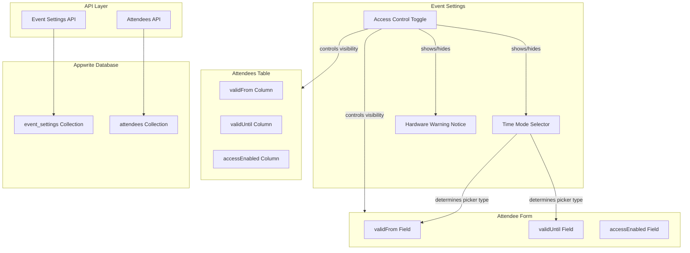

# Design Document: Access Control Feature

## Overview

This design document describes the implementation of configurable Access Control settings in Event Settings for credential.studio. The feature allows event administrators to enable/disable access control functionality per event and configure how badge validity dates are interpreted (date-only vs. date-time precision).

The implementation extends the existing event settings model with two new fields (`accessControlEnabled` and `accessControlTimeMode`) and conditionally displays access control fields (`validFrom`, `validUntil`, `accessEnabled`) in the attendee form and table based on the event configuration.

## Architecture



## Components and Interfaces

### 1. Event Settings Form - Access Control Tab

A new section in the Event Settings form for Access Control configuration.

```typescript
// New component: AccessControlTab.tsx
interface AccessControlTabProps {
  accessControlEnabled: boolean;
  accessControlTimeMode: 'date_only' | 'date_time';
  onAccessControlEnabledChange: (enabled: boolean) => void;
  onTimeModeChange: (mode: 'date_only' | 'date_time') => void;
}
```

**UI Elements:**
- Toggle switch for "Enable Access Control"
- Warning alert (visible when enabled) with hardware requirement notice
- Radio group for Time Mode selection (visible when enabled):
  - "Date only" - Badge validity interpreted as full days
  - "Date and time" - Badge validity with exact timestamps

### 2. Attendee Form - Access Control Fields

Conditional fields in the attendee form based on event settings.

```typescript
// Extended AttendeeForm props
interface AccessControlFieldsProps {
  accessControlEnabled: boolean;
  accessControlTimeMode: 'date_only' | 'date_time';
  validFrom: string | null;
  validUntil: string | null;
  accessEnabled: boolean;
  onValidFromChange: (date: string | null) => void;
  onValidUntilChange: (date: string | null) => void;
  onAccessEnabledChange: (enabled: boolean) => void;
  eventTimezone: string;
}
```

**UI Elements:**
- Date/DateTime picker for validFrom (type based on time mode)
- Date/DateTime picker for validUntil (type based on time mode)
- Select dropdown for accessEnabled (Active/Inactive)

### 3. Attendees Table - Access Control Columns

Conditional columns in the attendees table.

```typescript
// Column configuration
interface AccessControlColumnConfig {
  accessControlEnabled: boolean;
  accessControlTimeMode: 'date_only' | 'date_time';
}
```

**Columns (when enabled):**
- validFrom - Formatted date/datetime based on time mode
- validUntil - Formatted date/datetime based on time mode
- accessEnabled - Badge showing "Active" (green) or "Inactive" (red)

### 4. Date Interpretation Utility

Utility functions for handling date-only vs. date-time interpretation.

```typescript
// src/lib/accessControlDates.ts
interface DateInterpretation {
  startOfDay: (date: string, timezone: string) => string;
  endOfDay: (date: string, timezone: string) => string;
  formatForDisplay: (date: string, mode: 'date_only' | 'date_time', timezone: string) => string;
  parseForStorage: (date: string, mode: 'date_only' | 'date_time', timezone: string, isEndDate: boolean) => string;
}
```

## Data Models

### Event Settings Extension

```typescript
// Extended EventSettings interface
interface EventSettings {
  // ... existing fields ...
  
  // New Access Control fields
  accessControlEnabled: boolean;      // Default: false
  accessControlTimeMode: 'date_only' | 'date_time';  // Default: 'date_only'
}
```

### Database Schema Updates

Two new attributes need to be added to the `event_settings` collection in Appwrite:

```typescript
// scripts/add-access-control-settings.ts
await databases.createBooleanAttribute(
  databaseId,
  'event_settings',
  'accessControlEnabled',
  false,  // not required
  false   // default value
);

await databases.createEnumAttribute(
  databaseId,
  'event_settings',
  'accessControlTimeMode',
  ['date_only', 'date_time'],
  false,  // not required
  'date_only'  // default value
);
```

### Existing Attendee Fields (No Changes)

The following fields already exist in the attendees collection:
- `accessEnabled` (boolean) - Already exists
- `validFrom` (datetime) - Already exists
- `validUntil` (datetime) - Already exists

## Correctness Properties

*A property is a characteristic or behavior that should hold true across all valid executions of a system-essentially, a formal statement about what the system should do. Properties serve as the bridge between human-readable specifications and machine-verifiable correctness guarantees.*

### Property 1: Access Control Toggle State Persistence
*For any* toggle state (enabled or disabled), when the administrator changes the Access Control toggle, the stored `accessControlEnabled` value SHALL equal the toggle state.
**Validates: Requirements 1.2, 1.3**

### Property 2: Access Control Field Visibility
*For any* event settings configuration, the access control fields (validFrom, validUntil, accessEnabled) SHALL be visible in the attendee form if and only if `accessControlEnabled` is true.
**Validates: Requirements 1.4, 1.5**

### Property 3: Warning Notice Visibility
*For any* event settings configuration, the hardware warning notice SHALL be visible if and only if `accessControlEnabled` is true.
**Validates: Requirements 2.1, 2.4**

### Property 4: Time Mode Storage
*For any* time mode selection ("Date only" or "Date and time"), the stored `accessControlTimeMode` value SHALL equal 'date_only' or 'date_time' respectively.
**Validates: Requirements 3.2, 3.3**

### Property 5: Date Picker Type Based on Time Mode
*For any* event with Access Control enabled, the date picker type for validFrom and validUntil SHALL be date-only when `accessControlTimeMode` is 'date_only', and date-time when `accessControlTimeMode` is 'date_time'.
**Validates: Requirements 4.1, 4.2**

### Property 6: Date-Only Mode Interpretation
*For any* date value in date-only mode, validFrom SHALL be interpreted as 00:00:00 (midnight) and validUntil SHALL be interpreted as 23:59:59 in the event timezone.
**Validates: Requirements 4.3, 4.4**

### Property 7: Date-Time Mode Exact Storage
*For any* datetime value in date-time mode, the stored timestamp SHALL exactly match the input timestamp without modification.
**Validates: Requirements 4.5, 4.6**

### Property 8: Access Status Field Visibility
*For any* event settings configuration, the Access Status field SHALL be visible in the attendee form if and only if `accessControlEnabled` is true.
**Validates: Requirements 5.1, 5.3**

### Property 9: Table Column Visibility
*For any* event settings configuration, the validFrom, validUntil, and accessEnabled columns SHALL be visible in the attendees table if and only if `accessControlEnabled` is true.
**Validates: Requirements 6.1, 6.2**

### Property 10: Date Display Formatting
*For any* validity date displayed in the table, the format SHALL match the time mode setting (date-only shows date, date-time shows date and time).
**Validates: Requirements 6.3**

### Property 11: API Response Completeness
*For any* event settings API response, the response SHALL include both `accessControlEnabled` and `accessControlTimeMode` fields.
**Validates: Requirements 7.1**

### Property 12: Date Validation
*For any* attendee record where both validFrom and validUntil are set, if validFrom is after validUntil, the system SHALL reject the save operation with a validation error.
**Validates: Requirements 8.1**

### Property 13: Null Date Handling
*For any* attendee record, if validFrom is null the badge SHALL be treated as valid from creation, if validUntil is null the badge SHALL be treated as valid indefinitely, and if both are null the badge SHALL be treated as always valid (subject to accessEnabled).
**Validates: Requirements 8.2, 8.3, 8.4**

## Error Handling

### Validation Errors

| Error Condition | Error Message | User Action |
|----------------|---------------|-------------|
| validFrom > validUntil | "Valid From date must be before Valid Until date" | Correct the date range |
| Invalid date format | "Please enter a valid date" | Re-enter the date |
| API save failure | "Failed to save settings. Please try again." | Retry the operation |

### Edge Cases

1. **Enabling Access Control with existing attendees**: Existing attendees will have null values for validFrom/validUntil and accessEnabled=true by default (from database defaults).

2. **Changing Time Mode with existing dates**: When switching from date-time to date-only mode, existing datetime values are preserved in storage but displayed as date-only in the UI.

3. **Timezone handling**: All dates are stored in UTC. The event timezone is used for display and for interpreting date-only values.

## Testing Strategy

### Unit Tests

1. **Date interpretation utilities**
   - Test `startOfDay()` returns correct midnight timestamp
   - Test `endOfDay()` returns correct 23:59:59 timestamp
   - Test timezone conversion accuracy

2. **Validation functions**
   - Test date range validation (validFrom < validUntil)
   - Test null date handling

3. **Component rendering**
   - Test AccessControlTab renders toggle correctly
   - Test warning visibility based on toggle state
   - Test time mode selector visibility

### Property-Based Tests

The testing strategy uses **fast-check** for property-based testing in TypeScript/JavaScript.

Each property test should run a minimum of 100 iterations.

**Property tests to implement:**

1. **Toggle state persistence** (Property 1)
   - Generate random boolean states
   - Verify stored value matches input

2. **Date-only interpretation** (Property 6)
   - Generate random dates
   - Verify startOfDay returns 00:00:00
   - Verify endOfDay returns 23:59:59

3. **Date-time exact storage** (Property 7)
   - Generate random datetime values
   - Verify stored value equals input exactly

4. **Date validation** (Property 12)
   - Generate random date pairs
   - Verify validation rejects invalid ranges

5. **Null date handling** (Property 13)
   - Generate combinations of null/non-null dates
   - Verify correct validity interpretation

### Integration Tests

1. **Event Settings API**
   - Test saving accessControlEnabled and accessControlTimeMode
   - Test default values on new event creation
   - Test API response includes new fields

2. **Attendee Form Integration**
   - Test field visibility based on event settings
   - Test date picker type based on time mode
   - Test form submission with access control fields

3. **Attendees Table Integration**
   - Test column visibility based on event settings
   - Test date formatting based on time mode
