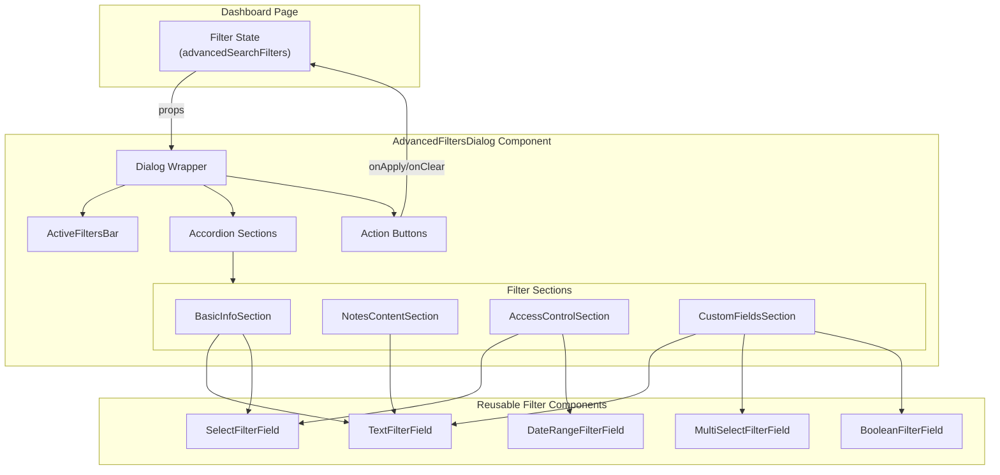

# Design Document: Advanced Filters Redesign

## Overview

This design document describes the technical implementation for redesigning the Advanced Filters dialog in credential.studio. The redesign transforms the current flat grid layout into an organized, scalable interface using collapsible accordion sections, an active filters summary bar, and simplified visual design.

The implementation extracts the Advanced Filters functionality from the monolithic `dashboard.tsx` file into a dedicated `AdvancedFiltersDialog.tsx` component, improving maintainability and testability while preserving all existing filter capabilities.

### Key Design Goals

1. **Progressive Disclosure**: Use collapsible accordions to reduce cognitive load
2. **Visual Clarity**: Remove colorful icon badges, use consistent muted styling
3. **Quick Filter Management**: Active filters bar with one-click removal
4. **Scalability**: Handle many custom fields without overwhelming the UI
5. **Maintainability**: Extract into a standalone, testable component

## Architecture

The redesigned Advanced Filters system follows a component-based architecture with clear separation of concerns:



### Data Flow

1. Dashboard maintains the filter state (`advancedSearchFilters`)
2. State is passed to `AdvancedFiltersDialog` via props
3. Filter changes emit through `onFiltersChange` callback
4. Apply/Clear actions trigger `onApply`/`onClear` callbacks
5. Dashboard updates state and re-filters attendees

## Components and Interfaces

### AdvancedFiltersDialog Component

The main component that orchestrates the filter dialog.

```typescript
interface AdvancedFiltersDialogProps {
  /** Event settings containing custom fields and access control config */
  eventSettings: EventSettings | null;
  /** Current filter state */
  filters: AdvancedSearchFilters;
  /** Callback when any filter value changes */
  onFiltersChange: (filters: AdvancedSearchFilters) => void;
  /** Callback when Apply Search is clicked */
  onApply: () => void;
  /** Callback when Clear All is clicked */
  onClear: () => void;
  /** Whether the dialog is open */
  open: boolean;
  /** Callback to control dialog open state */
  onOpenChange: (open: boolean) => void;
}

interface AdvancedSearchFilters {
  firstName: TextFilter;
  lastName: TextFilter;
  barcode: TextFilter;
  notes: NotesFilter;
  photoFilter: 'all' | 'with' | 'without';
  customFields: Record<string, CustomFieldFilter>;
  accessControl: AccessControlFilters;
}

interface TextFilter {
  value: string;
  operator: TextOperator;
}

type TextOperator = 'contains' | 'equals' | 'startsWith' | 'endsWith' | 'isEmpty' | 'isNotEmpty';

interface NotesFilter extends TextFilter {
  hasNotes: boolean;
}

interface CustomFieldFilter {
  value: string | string[];
  operator: string;
}

interface AccessControlFilters {
  accessStatus: 'all' | 'active' | 'inactive';
  validFromStart: string;
  validFromEnd: string;
  validUntilStart: string;
  validUntilEnd: string;
}
```

### ActiveFiltersBar Component

Displays active filters as removable chips.

```typescript
interface ActiveFiltersBarProps {
  /** Current filter state */
  filters: AdvancedSearchFilters;
  /** Event settings for custom field names */
  eventSettings: EventSettings | null;
  /** Callback to remove a specific filter */
  onRemoveFilter: (filterKey: string, customFieldId?: string) => void;
  /** Callback to clear all filters */
  onClearAll: () => void;
}

interface FilterChip {
  id: string;
  label: string;
  value: string;
  filterKey: string;
  customFieldId?: string;
}
```

### FilterSection Components

Each accordion section is a separate component for better organization:

```typescript
interface FilterSectionProps {
  /** Current filter state for this section */
  filters: Partial<AdvancedSearchFilters>;
  /** Callback when filter changes */
  onFilterChange: (key: string, value: any, property?: string) => void;
  /** Event settings (for custom fields section) */
  eventSettings?: EventSettings | null;
}

// Section-specific components
// - BasicInfoSection: First Name, Last Name, Barcode, Photo Status
// - NotesContentSection: Notes filter with hasNotes checkbox
// - AccessControlSection: Access status and date ranges
// - CustomFieldsSection: Dynamic custom fields
```

### Utility Functions

```typescript
/** Count active filters in a section */
function countSectionFilters(
  filters: AdvancedSearchFilters,
  section: 'basic' | 'notes' | 'access' | 'custom'
): number;

/** Convert filter state to display chips */
function filtersToChips(
  filters: AdvancedSearchFilters,
  eventSettings: EventSettings | null
): FilterChip[];

/** Check if any filters are active */
function hasActiveFilters(filters: AdvancedSearchFilters): boolean;

/** Format filter value for display in chip */
function formatFilterValue(
  value: string | string[],
  operator: string,
  fieldType?: string
): string;
```

## Data Models

### Filter State Structure

The filter state structure remains backward compatible with the existing implementation:

```typescript
// Existing structure (preserved for compatibility)
const advancedSearchFilters = {
  firstName: { value: '', operator: 'contains' },
  lastName: { value: '', operator: 'contains' },
  barcode: { value: '', operator: 'contains' },
  notes: { value: '', operator: 'contains', hasNotes: false },
  photoFilter: 'all',
  customFields: {
    [fieldId: string]: { value: string | string[], operator: string }
  },
  accessControl: {
    accessStatus: 'all',
    validFromStart: '',
    validFromEnd: '',
    validUntilStart: '',
    validUntilEnd: ''
  }
};
```

### Section Configuration

```typescript
interface SectionConfig {
  id: string;
  title: string;
  icon: LucideIcon;
  defaultExpanded: boolean;
  condition?: (eventSettings: EventSettings | null) => boolean;
}

const SECTION_CONFIG: SectionConfig[] = [
  {
    id: 'basic',
    title: 'Basic Information',
    icon: User,
    defaultExpanded: true
  },
  {
    id: 'notes',
    title: 'Notes & Content',
    icon: FileText,
    defaultExpanded: false
  },
  {
    id: 'access',
    title: 'Access Control',
    icon: Shield,
    defaultExpanded: false,
    condition: (settings) => settings?.accessControlEnabled === true
  },
  {
    id: 'custom',
    title: 'Custom Fields',
    icon: Settings,
    defaultExpanded: false
  }
];
```


## UI Component Structure

### Dialog Layout

```
┌─────────────────────────────────────────────────────────────────┐
│ Dialog Header                                                    │
│ ┌─────────────────────────────────────────────────────────────┐ │
│ │ 🔍 Advanced Filters                                         │ │
│ │ Search attendees using multiple criteria...                 │ │
│ └─────────────────────────────────────────────────────────────┘ │
├─────────────────────────────────────────────────────────────────┤
│ Active Filters Bar (conditional - only when filters active)     │
│ ┌─────────────────────────────────────────────────────────────┐ │
│ │ [First Name: John ×] [Photo: With ×] [Status: Active ×]     │ │
│ │                                              [Clear All]    │ │
│ └─────────────────────────────────────────────────────────────┘ │
├─────────────────────────────────────────────────────────────────┤
│ Accordion Sections (scrollable area)                            │
│ ┌─────────────────────────────────────────────────────────────┐ │
│ │ ▼ Basic Information                              (2 active) │ │
│ │ ┌─────────────────────────────────────────────────────────┐ │ │
│ │ │ ┌─────────────┐ ┌─────────────┐ ┌─────────────┐        │ │ │
│ │ │ │ First Name  │ │ Last Name   │ │ Barcode     │        │ │ │
│ │ │ │ [Contains▼] │ │ [Contains▼] │ │ [Contains▼] │        │ │ │
│ │ │ │ [________]  │ │ [________]  │ │ [________]  │        │ │ │
│ │ │ └─────────────┘ └─────────────┘ └─────────────┘        │ │ │
│ │ │ ┌─────────────┐                                        │ │ │
│ │ │ │ Photo Status│                                        │ │ │
│ │ │ │ [All ▼    ] │                                        │ │ │
│ │ │ └─────────────┘                                        │ │ │
│ │ └─────────────────────────────────────────────────────────┘ │ │
│ ├─────────────────────────────────────────────────────────────┤ │
│ │ ▶ Notes & Content                                (0 active) │ │
│ ├─────────────────────────────────────────────────────────────┤ │
│ │ ▶ Access Control                                 (1 active) │ │
│ ├─────────────────────────────────────────────────────────────┤ │
│ │ ▶ Custom Fields                                  (3 active) │ │
│ └─────────────────────────────────────────────────────────────┘ │
├─────────────────────────────────────────────────────────────────┤
│ Action Footer                                                    │
│ ┌─────────────────────────────────────────────────────────────┐ │
│ │ [Clear All Filters]              [Cancel] [Apply Search]    │ │
│ └─────────────────────────────────────────────────────────────┘ │
└─────────────────────────────────────────────────────────────────┘
```

### Accordion Section Styling

Each accordion section uses consistent styling:

```tsx
<AccordionItem value={section.id} className="border rounded-lg mb-2">
  <AccordionTrigger className="px-4 py-3 hover:bg-muted/50">
    <div className="flex items-center gap-3">
      <section.icon className="h-4 w-4 text-muted-foreground" />
      <span className="font-medium">{section.title}</span>
      {filterCount > 0 && (
        <Badge variant="secondary" className="ml-auto">
          {filterCount} active
        </Badge>
      )}
    </div>
  </AccordionTrigger>
  <AccordionContent className="px-4 pb-4">
    <div className="grid grid-cols-1 md:grid-cols-2 lg:grid-cols-3 gap-4">
      {/* Filter fields */}
    </div>
  </AccordionContent>
</AccordionItem>
```

### Filter Field Card Styling

Simplified card styling without colorful badges:

```tsx
<div className="space-y-2">
  <Label className="flex items-center gap-2 text-sm font-medium">
    <FieldIcon className="h-4 w-4 text-muted-foreground" />
    <span>{fieldName}</span>
  </Label>
  <div className="flex gap-2">
    <Select value={operator} onValueChange={onOperatorChange}>
      <SelectTrigger className="w-[120px]">
        <SelectValue />
      </SelectTrigger>
      <SelectContent>
        {/* Operator options */}
      </SelectContent>
    </Select>
    <Input
      value={value}
      onChange={onValueChange}
      disabled={isOperatorEmpty}
      placeholder="Value..."
    />
  </div>
</div>
```

### Active Filter Chip Styling

```tsx
<Badge
  variant="secondary"
  className="flex items-center gap-1 px-2 py-1"
>
  <span className="text-xs font-medium">{label}:</span>
  <span className="text-xs">{displayValue}</span>
  <button
    onClick={onRemove}
    className="ml-1 hover:bg-muted rounded-full p-0.5"
    aria-label={`Remove ${label} filter`}
  >
    <X className="h-3 w-3" />
  </button>
</Badge>
```

## Error Handling

### Validation Errors

| Scenario | Handling |
|----------|----------|
| Apply with no filters | Display error toast: "Please enter at least one search criterion" |
| Invalid date range | Highlight field, show inline error message |
| Custom field not found | Skip filter gracefully, log warning |

### Error States

```typescript
interface FilterValidationResult {
  isValid: boolean;
  errors: FilterError[];
}

interface FilterError {
  field: string;
  message: string;
}

function validateFilters(filters: AdvancedSearchFilters): FilterValidationResult {
  const errors: FilterError[] = [];
  
  // Validate date ranges
  if (filters.accessControl.validFromStart && filters.accessControl.validFromEnd) {
    if (new Date(filters.accessControl.validFromStart) > new Date(filters.accessControl.validFromEnd)) {
      errors.push({
        field: 'validFromRange',
        message: 'Start date must be before end date'
      });
    }
  }
  
  return {
    isValid: errors.length === 0,
    errors
  };
}
```


## Correctness Properties

*A property is a characteristic or behavior that should hold true across all valid executions of a system—essentially, a formal statement about what the system should do. Properties serve as the bridge between human-readable specifications and machine-verifiable correctness guarantees.*

The following properties are derived from the acceptance criteria and will be validated through property-based testing using a library like fast-check.

### Property 1: Section Filter Count Badge Accuracy

*For any* filter state and any accordion section, the badge count displayed in the section header SHALL equal the actual number of active filters within that section.

**Validates: Requirements 1.3**

This property ensures that the `countSectionFilters` function correctly counts active filters for any combination of filter values. We generate random filter states and verify the displayed count matches the computed count.

### Property 2: Custom Fields Section Completeness

*For any* set of custom fields defined in event settings, the Custom Fields accordion section SHALL render a filter field for each custom field.

**Validates: Requirements 1.9**

This property ensures that all custom fields are rendered regardless of their type, order, or configuration. We generate random custom field configurations and verify each has a corresponding filter component.

### Property 3: Active Filters Bar Chip Accuracy

*For any* filter state with one or more active filters, the Active_Filters_Bar SHALL display exactly one chip for each active filter, and each chip SHALL display the correct field name and formatted value.

**Validates: Requirements 2.1, 2.2, 2.4**

This property combines three related requirements into a single comprehensive test. We generate random filter states and verify:
1. The bar is visible when filters are active
2. The number of chips equals the number of active filters
3. Each chip contains the correct field name and value

### Property 4: Filter Change Reactivity

*For any* filter change operation (value change, operator change, or chip removal), the component SHALL emit the updated filter state through the onFiltersChange callback, and the Active_Filters_Bar SHALL immediately reflect the new state.

**Validates: Requirements 2.3, 2.7, 4.3**

This property ensures the component correctly propagates all filter changes. We generate random filter states, apply random changes, and verify:
1. The callback is invoked with the correct updated state
2. The Active_Filters_Bar updates to show the new state

### Property 5: Operator-Based Input State

*For any* text filter field, when the operator is set to "isEmpty" or "isNotEmpty", the value input SHALL be disabled; otherwise, it SHALL be enabled.

**Validates: Requirements 5.2**

This property ensures consistent behavior across all text filter fields. We test with all text filters (firstName, lastName, barcode, notes, text-type custom fields) and all operators.

### Property 6: Form Input Label Associations

*For any* form input rendered in the Advanced_Filters_Dialog, there SHALL exist an associated label element with a matching htmlFor/id attribute pair.

**Validates: Requirements 7.4**

This property ensures accessibility compliance for all form inputs. We render the dialog with various configurations and verify every input has a properly associated label.

## Testing Strategy

### Unit Tests

Unit tests will cover specific examples and edge cases:

1. **Component Rendering**
   - Dialog renders with all sections
   - Sections render in correct order
   - Access Control section conditionally renders based on settings
   - Basic Information section expanded by default

2. **Filter Interactions**
   - Clicking Apply with no filters shows error
   - Clear All button clears all filters
   - Individual chip removal clears specific filter
   - Operator change updates input disabled state

3. **Edge Cases**
   - Empty custom fields array
   - Custom field with no options (select type)
   - Very long filter values (truncation)
   - Special characters in filter values

### Property-Based Tests

Property tests will use fast-check to generate random inputs and verify properties hold:

```typescript
// Example property test structure
import * as fc from 'fast-check';

describe('AdvancedFiltersDialog Properties', () => {
  // Feature: advanced-filters-redesign, Property 1: Section Filter Count Badge Accuracy
  it('should display correct filter count badge for any filter state', () => {
    fc.assert(
      fc.property(
        arbitraryFilterState(),
        (filters) => {
          const basicCount = countSectionFilters(filters, 'basic');
          const actualBasicActive = countActualActiveFilters(filters, 'basic');
          return basicCount === actualBasicActive;
        }
      ),
      { numRuns: 100 }
    );
  });

  // Feature: advanced-filters-redesign, Property 3: Active Filters Bar Chip Accuracy
  it('should display correct chips for any active filter state', () => {
    fc.assert(
      fc.property(
        arbitraryActiveFilterState(),
        arbitraryEventSettings(),
        (filters, settings) => {
          const chips = filtersToChips(filters, settings);
          const activeCount = countAllActiveFilters(filters);
          return chips.length === activeCount &&
                 chips.every(chip => chip.label && chip.value);
        }
      ),
      { numRuns: 100 }
    );
  });
});
```

### Test Configuration

- **Test Runner**: Vitest
- **Property Testing Library**: fast-check
- **Component Testing**: @testing-library/react
- **Minimum Iterations**: 100 per property test
- **Test Location**: `src/__tests__/components/AdvancedFiltersDialog/`

### Test File Structure

```
src/__tests__/components/AdvancedFiltersDialog/
├── AdvancedFiltersDialog.test.tsx      # Unit tests
├── AdvancedFiltersDialog.property.test.tsx  # Property tests
├── ActiveFiltersBar.test.tsx           # Active filters bar tests
└── filterUtils.test.ts                 # Utility function tests
```

## Implementation Notes

### shadcn/ui Components Used

- `Dialog`, `DialogContent`, `DialogHeader`, `DialogTitle`, `DialogDescription` - Modal container
- `Accordion`, `AccordionItem`, `AccordionTrigger`, `AccordionContent` - Collapsible sections
- `Badge` - Filter count badges and filter chips
- `Button` - Action buttons
- `Input` - Text filter inputs
- `Select`, `SelectTrigger`, `SelectContent`, `SelectItem` - Dropdown selects
- `Checkbox` - Has Notes checkbox
- `Label` - Form labels
- `ScrollArea` - Scrollable content areas
- `Popover`, `Command` - Multi-select dropdowns

### Migration Strategy

1. Create new `AdvancedFiltersDialog.tsx` component
2. Implement all sections and functionality
3. Add comprehensive tests
4. Update `dashboard.tsx` to use new component
5. Remove old inline implementation
6. Verify backward compatibility with existing filter state

### File Changes

| File | Change |
|------|--------|
| `src/components/AdvancedFiltersDialog.tsx` | New file - main component |
| `src/components/AdvancedFiltersDialog/index.tsx` | New file - exports |
| `src/components/AdvancedFiltersDialog/ActiveFiltersBar.tsx` | New file - filter chips bar |
| `src/components/AdvancedFiltersDialog/sections/` | New directory - section components |
| `src/lib/filterUtils.ts` | New file - utility functions |
| `src/pages/dashboard.tsx` | Modified - use new component |
| `src/__tests__/components/AdvancedFiltersDialog/` | New directory - tests |
