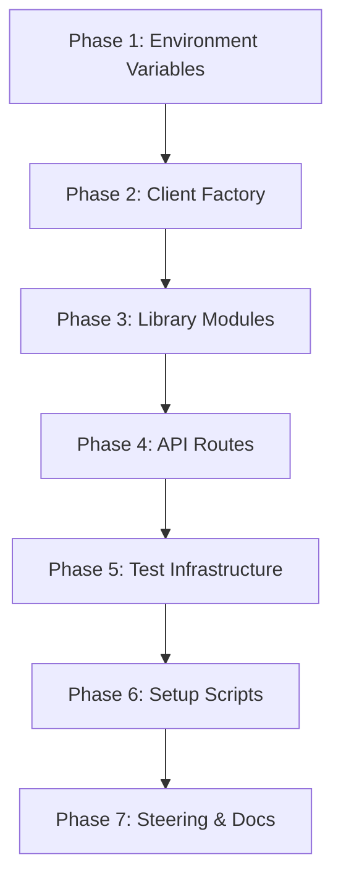

# Design Document: Appwrite TablesDB Migration

## Overview

This design covers the migration of credential.studio from Appwrite's legacy `Databases` API to the new `TablesDB` API. The migration is primarily a mechanical refactoring: replacing class imports, method calls, variable names, environment variables, and response property accesses across the entire codebase.

Key findings from SDK analysis:
- Both `appwrite` (client-side, v22.0.0) and `node-appwrite` (server-side) export `TablesDB`
- `TablesDB.listRows()` returns `Models.RowList` with a `.rows` property (vs `.documents` on `DocumentList`)
- `TablesDB` methods use `tableId` and `rowId` parameters instead of `collectionId` and `documentId`
- The `TablesDB` API supports both positional and object-style parameters (object-style preferred)
- `bulkOperations.ts` and `transactions.ts` already use `TablesDB`; `createSessionClient` and `createAdminClient` already expose `tablesDB`

### Migration Scope Summary

| Category | Estimated Files | Key Changes |
|----------|----------------|-------------|
| Client factory (`appwrite.ts`) | 1 | Remove `databases`, keep only `tablesDB` |
| API routes (`src/pages/api/`) | ~30 | Replace all `databases.*Document` calls with `tablesDB.*Row` |
| Client-side pages/contexts | 3 | `AuthContext.tsx`, `auth/callback.tsx`, `verify-email.tsx` — update `databases` → `tablesDB` |
| Library modules (`src/lib/`) | ~10 | Update imports, types, method calls |
| Type definitions (`src/types/`) | 1+ | Update `$collectionId` → `$tableId` in interfaces |
| Test mocks (`src/test/mocks/`) | 1 | Replace `mockDatabases` with `mockTablesDB` row methods |
| Test files (`src/__tests__/`) | ~25 | Update mock imports, assertions, and `$collectionId` in mock data |
| Environment variables | 3 files | Rename `*_COLLECTION_ID` to `*_TABLE_ID` |
| Setup scripts (`scripts/`) | ~3 | Update `createCollection` → `createTable`, attribute → column methods, positional → object-style params |
| Steering files (`.kiro/steering/`) | ~3 | Update terminology references |

## Architecture

The migration follows a bottom-up approach to minimize breakage:



### Migration Strategy

1. Rename environment variables first (all `COLLECTION_ID` → `TABLE_ID`) across `.env.local`, `.env.example`, and `sites/credential.studio/.env.local`
2. Update `src/lib/appwrite.ts` to remove `databases` from all client factories, using only `tablesDB`
3. Migrate library modules that accept `Databases` type parameters
4. Migrate API routes file-by-file, updating method calls and response property accesses
5. Update test mocks and test files to match the new API
6. Update setup/migration scripts
7. Update steering files and documentation

## Components and Interfaces

### Client Factory Changes (`src/lib/appwrite.ts`)

Current state:
```typescript
// Browser client
import { Client, Account, Databases, Storage, Functions } from 'appwrite';
// Server client
import { ..., Databases as AdminDatabases, ..., TablesDB } from 'node-appwrite';

// createBrowserClient returns: { databases: new Databases(client), ... }
// createSessionClient returns: { databases: new AdminDatabases(client), tablesDB: new TablesDB(client), ... }
// createAdminClient returns: { databases: new AdminDatabases(client), tablesDB: new TablesDB(client), ... }
```

Target state:
```typescript
// Browser client
import { Client, Account, TablesDB, Storage, Functions } from 'appwrite';
// Server client
import { ..., TablesDB, ... } from 'node-appwrite';

// createBrowserClient returns: { tablesDB: new TablesDB(client), ... }
// createSessionClient returns: { tablesDB: new TablesDB(client), ... }
// createAdminClient returns: { tablesDB: new TablesDB(client), ... }
```

Legacy default exports (`databases`) will be replaced with `tablesDB`.

### Method Mapping

| Old Method (Databases) | New Method (TablesDB) | Signature Change |
|------------------------|----------------------|------------------|
| `listDocuments(dbId, collId, queries)` | `listRows(dbId, tableId, queries)` | Response: `.documents` → `.rows` |
| `getDocument(dbId, collId, docId)` | `getRow(dbId, tableId, rowId)` | Metadata: `$collectionId` → `$tableId` |
| `createDocument(dbId, collId, docId, data)` | `createRow(dbId, tableId, rowId, data)` | Same shape return |
| `updateDocument(dbId, collId, docId, data)` | `updateRow(dbId, tableId, rowId, data)` | Same shape return |
| `deleteDocument(dbId, collId, docId)` | `deleteRow(dbId, tableId, rowId)` | Same shape return |
| `upsertDocument(dbId, collId, docId, data)` | `upsertRow(dbId, tableId, rowId, data)` | Same shape return (not currently used but available) |
| `incrementDocumentAttribute(...)` | `incrementRowColumn(...)` | Not currently used but available |
| `decrementDocumentAttribute(...)` | `decrementRowColumn(...)` | Not currently used but available |
| `createCollection(dbId, collId, name, perms)` | `createTable({ databaseId, tableId, name, permissions, columns?, indexes? })` | Object-style params; supports inline columns/indexes |
| `createStringAttribute(dbId, collId, key, size, req)` | `createStringColumn({ databaseId, tableId, key, size, required })` | Object-style params |
| `createBooleanAttribute(...)` | `createBooleanColumn(...)` | Object-style params |
| `createIndex(dbId, collId, key, type, attrs)` | `createIndex({ databaseId, tableId, key, type, attributes })` | Object-style params |

Note: Some call sites use the object-style parameter format (e.g., `databases.getDocument({ databaseId, collectionId, documentId })`). These must be updated to use `{ databaseId, tableId, rowId }`.

### Parameter Style Change (Important)

The server-side `node-appwrite` TablesDB methods use object-style parameters exclusively. The setup script currently uses positional parameters:
```typescript
// Old (positional)
databases.createCollection(databaseId, collectionId, name, permissions);
databases.createStringAttribute(databaseId, collectionId, key, size, required);

// New (object-style)
tablesDB.createTable({ databaseId, tableId, name, permissions });
tablesDB.createStringColumn({ databaseId, tableId, key, size, required });
```

### Inline Schema Definition (New Capability)

The TablesDB `createTable` method supports defining columns and indexes inline, eliminating the need for sequential attribute/index creation calls:
```typescript
// Old pattern: create collection, then add attributes one by one
await databases.createCollection(dbId, collId, 'Users', perms);
await databases.createStringAttribute(dbId, collId, 'email', 255, true);
await databases.createIndex(dbId, collId, 'email_idx', IndexType.Unique, ['email']);

// New pattern: create table with inline columns and indexes
await tablesDB.createTable({
  databaseId: dbId,
  tableId: tableId,
  name: 'Users',
  permissions: perms,
  columns: [
    { key: 'email', type: 'email', required: true },
    { key: 'name', type: 'varchar', size: 255, required: false }
  ],
  indexes: [
    { key: 'email_idx', type: 'unique', attributes: ['email'] }
  ]
});
```
This is optional but recommended for the setup script migration as it reduces API calls and simplifies the code.

### Response Shape Change

The critical structural difference:
```typescript
// Old: DocumentList
{ total: number; documents: Document[] }

// New: RowList
{ total: number; rows: Row[] }
```

Every place that accesses `.documents` on a list response must change to `.rows`.

### Row Metadata Field Change

Individual Row objects returned by the API have different metadata fields than Document objects:
```typescript
// Old: Document metadata
{ $id, $createdAt, $updatedAt, $permissions, $collectionId, $databaseId }

// New: Row metadata
{ $id, $createdAt, $updatedAt, $permissions, $tableId, $databaseId }
```

The `$collectionId` field becomes `$tableId`. This affects:
- `src/types/approvalProfile.ts` — the `ApprovalProfile` interface has `$collectionId: string`
- `src/lib/bulkOperations.ts` — destructures `$collectionId` when stripping metadata
- `src/pages/api/custom-fields/reorder.ts` — destructures `$collectionId` when stripping metadata
- `scripts/test-all-transactions.ts` — destructures `$collectionId` in multiple places
- `scripts/update-event-settings-id.ts` — destructures `$collectionId`
- `src/lib/__tests__/bulkOperations.unit.test.ts` — mock data includes `$collectionId`
- `src/__tests__/api/mobile/sync/attendees.test.ts` — mock data includes `$collectionId`

### Client-Side TablesDB Differences

The client-side `appwrite` package (v22) exports `TablesDB` but with a reduced method set compared to `node-appwrite`:
- Client-side methods: `createRow`, `getRow`, `updateRow`, `deleteRow`, `listRows`, `upsertRow`, `createTransaction`, `createOperations`, `updateTransaction`, `getTransaction`, `listTransactions`, `incrementRowColumn`, `decrementRowColumn`
- Server-side adds: `createTable`, `deleteTable`, `listTables`, `getTable`, `updateTable`, all column creation/update methods, index methods, bulk row methods (`createRows`, `updateRows`, `deleteRows`, `upsertRows`)

This means `createBrowserClient` can use client-side `TablesDB` for CRUD operations, but schema management (setup scripts) must use `node-appwrite`.

### Environment Variable Mapping

| Old Variable | New Variable |
|-------------|-------------|
| `NEXT_PUBLIC_APPWRITE_USERS_COLLECTION_ID` | `NEXT_PUBLIC_APPWRITE_USERS_TABLE_ID` |
| `NEXT_PUBLIC_APPWRITE_ROLES_COLLECTION_ID` | `NEXT_PUBLIC_APPWRITE_ROLES_TABLE_ID` |
| `NEXT_PUBLIC_APPWRITE_ATTENDEES_COLLECTION_ID` | `NEXT_PUBLIC_APPWRITE_ATTENDEES_TABLE_ID` |
| `NEXT_PUBLIC_APPWRITE_CUSTOM_FIELDS_COLLECTION_ID` | `NEXT_PUBLIC_APPWRITE_CUSTOM_FIELDS_TABLE_ID` |
| `NEXT_PUBLIC_APPWRITE_EVENT_SETTINGS_COLLECTION_ID` | `NEXT_PUBLIC_APPWRITE_EVENT_SETTINGS_TABLE_ID` |
| `NEXT_PUBLIC_APPWRITE_LOGS_COLLECTION_ID` | `NEXT_PUBLIC_APPWRITE_LOGS_TABLE_ID` |
| `NEXT_PUBLIC_APPWRITE_LOG_SETTINGS_COLLECTION_ID` | `NEXT_PUBLIC_APPWRITE_LOG_SETTINGS_TABLE_ID` |
| `NEXT_PUBLIC_APPWRITE_REPORTS_COLLECTION_ID` | `NEXT_PUBLIC_APPWRITE_REPORTS_TABLE_ID` |
| `NEXT_PUBLIC_APPWRITE_ACCESS_CONTROL_COLLECTION_ID` | `NEXT_PUBLIC_APPWRITE_ACCESS_CONTROL_TABLE_ID` |
| `NEXT_PUBLIC_APPWRITE_APPROVAL_PROFILES_COLLECTION_ID` | `NEXT_PUBLIC_APPWRITE_APPROVAL_PROFILES_TABLE_ID` |
| `NEXT_PUBLIC_APPWRITE_SCAN_LOGS_COLLECTION_ID` | `NEXT_PUBLIC_APPWRITE_SCAN_LOGS_TABLE_ID` |
| `NEXT_PUBLIC_APPWRITE_CLOUDINARY_COLLECTION_ID` | `NEXT_PUBLIC_APPWRITE_CLOUDINARY_TABLE_ID` |
| `NEXT_PUBLIC_APPWRITE_SWITCHBOARD_COLLECTION_ID` | `NEXT_PUBLIC_APPWRITE_SWITCHBOARD_TABLE_ID` |
| `NEXT_PUBLIC_APPWRITE_ONESIMPLEAPI_COLLECTION_ID` | `NEXT_PUBLIC_APPWRITE_ONESIMPLEAPI_TABLE_ID` |

### Test Mock Changes (`src/test/mocks/appwrite.ts`)

Current `mockDatabases`:
```typescript
export const mockDatabases = {
  listDocuments: vi.fn(),
  getDocument: vi.fn(),
  createDocument: vi.fn(),
  updateDocument: vi.fn(),
  deleteDocument: vi.fn(),
  listCollections: vi.fn(),
  getCollection: vi.fn(),
};
```

New `mockTablesDB` (merging existing `mockTablesDB` transaction methods with row methods):
```typescript
export const mockTablesDB = {
  // Row CRUD methods
  listRows: vi.fn(),
  getRow: vi.fn(),
  createRow: vi.fn(),
  updateRow: vi.fn(),
  deleteRow: vi.fn(),
  // Bulk operations (already exist)
  createRows: vi.fn(),
  updateRows: vi.fn(),
  deleteRows: vi.fn(),
  upsertRows: vi.fn(),
  upsertRow: vi.fn(),
  // Transaction methods (already exist)
  createTransaction: vi.fn(),
  createOperations: vi.fn(),
  updateTransaction: vi.fn(),
  getTransaction: vi.fn(),
  listTransactions: vi.fn(),
  // Table management
  listTables: vi.fn(),
  getTable: vi.fn(),
};
```

The `vi.mock('appwrite')` block must also be updated to export `TablesDB` constructor pointing to `mockTablesDB`.

## Data Models

No data model changes are required at the Appwrite database level. The underlying schema remains the same — only the SDK API layer and terminology change. The `$id`, `$createdAt`, `$updatedAt`, `$permissions` metadata fields remain identical on `Row` objects as they were on `Document` objects.

However, the `$collectionId` metadata field on returned objects becomes `$tableId` in the new API. This requires updating:

1. **Type definitions**: `src/types/approvalProfile.ts` has `$collectionId: string` in the `ApprovalProfile` interface — must change to `$tableId: string`
2. **Metadata stripping patterns**: Several files destructure `{ $collectionId, ... }` when removing Appwrite metadata before upserts — must change to `{ $tableId, ... }`:
   - `src/lib/bulkOperations.ts`
   - `src/pages/api/custom-fields/reorder.ts`
   - `scripts/test-all-transactions.ts`
   - `scripts/update-event-settings-id.ts`
3. **Test mock data**: Test files that include `$collectionId` in mock objects must update to `$tableId`:
   - `src/lib/__tests__/bulkOperations.unit.test.ts`
   - `src/__tests__/api/mobile/sync/attendees.test.ts`

## Correctness Properties

*A property is a characteristic or behavior that should hold true across all valid executions of a system — essentially, a formal statement about what the system should do. Properties serve as the bridge between human-readable specifications and machine-verifiable correctness guarantees.*


Property 1: Client factories return tablesDB, not databases
*For any* client factory function (`createBrowserClient`, `createSessionClient`, `createAdminClient`), the returned object SHALL have a `tablesDB` property and SHALL NOT have a `databases` property.
**Validates: Requirements 1.1, 1.2, 1.3**

Property 2: No COLLECTION_ID variables in environment files
*For any* environment file (`.env.local`, `.env.example`, `sites/credential.studio/.env.local`), there SHALL be zero environment variable names containing `COLLECTION_ID`.
**Validates: Requirements 4.1**

Property 3: Environment file TABLE_ID consistency
*For any* `TABLE_ID` environment variable defined in `.env.local`, the same variable name SHALL exist in `.env.example` and `sites/credential.studio/.env.local`.
**Validates: Requirements 4.2, 4.3**

Property 4: No COLLECTION_ID references in source code
*For any* TypeScript source file in `src/` (excluding `scripts/archive/`), there SHALL be zero references to `process.env.NEXT_PUBLIC_APPWRITE_*_COLLECTION_ID`.
**Validates: Requirements 4.4**

Property 5: No Databases class usage for data operations
*For any* TypeScript source file in `src/` and `scripts/` (excluding `scripts/archive/`), there SHALL be zero imports of `Databases` from `appwrite` or `node-appwrite` for data operations, and zero calls to `databases.listDocuments`, `databases.getDocument`, `databases.createDocument`, `databases.updateDocument`, or `databases.deleteDocument`.
**Validates: Requirements 9.4**

Property 6: No $collectionId metadata field references
*For any* TypeScript source file in `src/` and `scripts/` (excluding `scripts/archive/`), there SHALL be zero references to `$collectionId` in type definitions, destructuring patterns, or mock data objects.
**Validates: Requirements 5.5, 5.6**

## Error Handling

This migration is a mechanical refactoring. The primary error risks are:

1. **Missed references**: A `databases.*Document` call or `COLLECTION_ID` reference is missed, causing a runtime error. Mitigated by Property 4 and Property 5 (codebase-wide grep verification).

2. **Response shape mismatch**: Code accesses `.documents` on a `RowList` response (which uses `.rows`). This would cause `undefined` errors at runtime. Mitigated by updating every `.documents` access to `.rows` and verifying through existing test suite.

3. **Object-style parameter mismatch**: Some call sites use `{ databaseId, collectionId, documentId }` object parameters. These must be updated to `{ databaseId, tableId, rowId }`. TypeScript compilation will catch type mismatches.

4. **Environment variable mismatch**: If env files are updated but source code references are not (or vice versa), the app will fail to read configuration. Mitigated by Property 2, 3, and 4.

5. **Test mock mismatch**: If test mocks still use old method names, tests will pass vacuously (mocking methods that are never called). Mitigated by updating all test mocks and verifying tests still pass.

No new error handling code is needed — the migration preserves existing error handling patterns.

## Testing Strategy

### Dual Testing Approach

This migration uses both unit tests and property-based tests:

- **Unit tests**: Verify specific API routes and library functions work correctly after migration (existing tests, updated to use new mocks)
- **Property tests**: Verify codebase-wide invariants (no old references remain)

### Property-Based Testing

Library: `fast-check` (already installed in the project)
Configuration: Minimum 100 iterations per property test

The property tests for this migration are primarily codebase scanning properties rather than input-generation properties. They verify that the migration is complete by scanning files for old patterns.

- **Feature: appwrite-tablesdb-migration, Property 1**: Client factories return tablesDB, not databases
- **Feature: appwrite-tablesdb-migration, Property 2**: No COLLECTION_ID variables in environment files
- **Feature: appwrite-tablesdb-migration, Property 3**: Environment file TABLE_ID consistency
- **Feature: appwrite-tablesdb-migration, Property 4**: No COLLECTION_ID references in source code
- **Feature: appwrite-tablesdb-migration, Property 5**: No Databases class usage for data operations
- **Feature: appwrite-tablesdb-migration, Property 6**: No $collectionId metadata field references in source code

### Unit Testing

Existing tests (~25 test files) will be updated to use the new `mockTablesDB` mock and verify:
- API routes call `tablesDB.listRows` / `createRow` / etc. instead of old methods
- Response handling correctly accesses `.rows` instead of `.documents`
- Client factory functions return the expected shape

### Verification Strategy

After migration is complete:
1. Run `npx vitest --run` to verify all existing tests pass with updated mocks
2. Run property tests to verify no old references remain
3. TypeScript compilation (`npm run build`) to catch type mismatches
