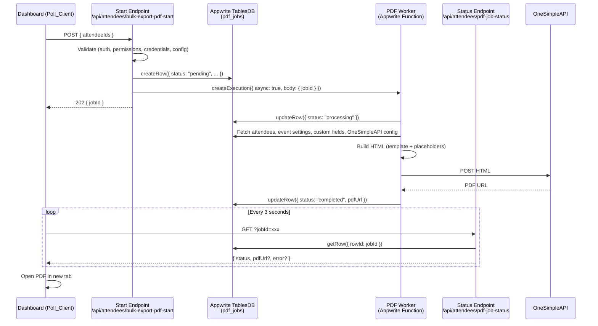
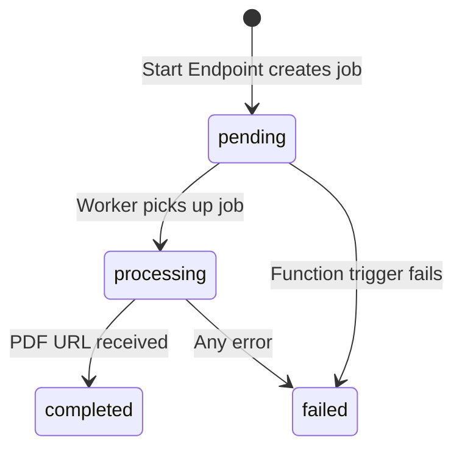

# Design Document: Async PDF Generation

## Overview

This design moves the bulk PDF export from a single synchronous Next.js API route into an asynchronous job pattern. The current `bulk-export-pdf.ts` route does everything — validation, HTML template building, OneSimpleAPI call, and response — in one request. For large exports, the OneSimpleAPI call alone can take 60–120+ seconds, exceeding Netlify's ~26s function timeout.

The new architecture splits this into three parts:

1. A thin Start Endpoint that validates, creates a job record, and triggers an Appwrite Function — completing in under 10 seconds.
2. An Appwrite Function (PDF Worker) that runs the long work (fetch attendees, build HTML, call OneSimpleAPI) with up to 15 minutes of execution time.
3. A Status Endpoint that reads the job record so the client can poll for completion.

The client replaces its single `fetch` call with a start-then-poll pattern using a progress modal.

## Architecture



### Key Design Decisions

1. **Start Endpoint does all validation** — The worker trusts that attendees are valid. This keeps user-facing error feedback fast (validation errors return immediately) and avoids duplicating validation logic in the Appwrite Function.

2. **Job state lives in TablesDB, not function execution status** — Appwrite's `getExecution` could tell us if the function finished, but it doesn't carry our domain state (PDF URL, error messages). Using a `pdf_jobs` table gives us full control over the job lifecycle and makes the status endpoint a simple row read.

3. **Polling over Realtime** — Appwrite supports Realtime subscriptions, but polling every 3 seconds is simpler, more reliable across hosting platforms, and sufficient for a job that takes 30–120 seconds. The polling interval is configurable.

4. **HTML template logic extracted into a shared module** — The placeholder replacement, HTML escaping, URL absolutization, and template composition logic currently lives inline in `bulk-export-pdf.ts`. This will be extracted into `src/lib/pdfTemplateBuilder.ts` so both the existing sync route (if kept for backward compatibility) and the Appwrite Function can use the same code. The Appwrite Function will bundle this module.

5. **Appwrite Function uses `node-appwrite` server SDK** — The function runs independently of Next.js and needs its own Appwrite client initialized with an API key (not a user session). Environment variables are configured in the Appwrite Console.

## Components and Interfaces

### 1. Start Endpoint — `src/pages/api/attendees/bulk-export-pdf-start.ts`

Thin API route that validates and kicks off the job.

```typescript
// POST /api/attendees/bulk-export-pdf-start
// Request body:
interface StartRequest {
  attendeeIds: string[];
}

// Response (202 Accepted):
interface StartResponse {
  jobId: string;
}

// Error responses use existing patterns:
// 400 — validation errors (missing credentials, outdated credentials, bad config)
// 401 — unauthenticated
// 403 — insufficient permissions
// 500 — internal error
```

Responsibilities:
- Uses `withAuth` middleware for authentication
- Checks `bulkGeneratePDFs` permission
- Validates attendeeIds non-empty
- Fetches and validates OneSimpleAPI integration (enabled, configured, record template present)
- Fetches all attendees, checks for missing credentials and outdated credentials
- Creates `pdf_jobs` row with status `pending` using named object parameters:
  ```typescript
  await tablesDB.createRow({
    databaseId: dbId,
    tableId: pdfJobsTableId,
    rowId: ID.unique(),
    data: { status: 'pending', attendeeIds: JSON.stringify(attendeeIds), ... }
  });
  ```
- Calls `functions.createExecution({ functionId, body: JSON.stringify({ jobId, eventSettingsId }), async: true })`
- If `createExecution` fails, updates job to `failed` and returns error
- Returns `{ jobId }` with HTTP 202

### 2. Status Endpoint — `src/pages/api/attendees/pdf-job-status.ts`

Simple read-only endpoint.

```typescript
// GET /api/attendees/pdf-job-status?jobId=xxx
// Response:
interface StatusResponse {
  status: 'pending' | 'processing' | 'completed' | 'failed';
  pdfUrl: string | null;
  error: string | null;
  attendeeCount: number;
}
```

Responsibilities:
- Uses `withAuth` middleware for authentication
- Reads single row from `pdf_jobs` using named object parameters:
  ```typescript
  await tablesDB.getRow({
    databaseId: dbId,
    tableId: pdfJobsTableId,
    rowId: jobId
  });
  ```
- Returns 404 if job not found
- Returns job status fields

### 3. PDF Worker — Appwrite Function (`functions/pdf-worker/`)

Node.js Appwrite Function that does the heavy lifting.

```typescript
// Function receives execution body:
interface WorkerInput {
  jobId: string;
  eventSettingsId: string;
}
```

Responsibilities:
- Initializes `node-appwrite` client with API key from function environment variables
- Reads job record to get `attendeeIds`, `eventSettingsId`
- Updates job status to `processing`
- Fetches event settings, OneSimpleAPI config, custom fields, and all attendees using named object parameters
- Uses `buildPdfHtml()` from shared template builder to generate final HTML
- POSTs HTML to OneSimpleAPI
- Parses response (JSON with `url` field, or plain text URL)
- Updates job to `completed` with `pdfUrl`, or `failed` with error message
- Wraps entire execution in try/catch — any unhandled error updates job to `failed`

All TablesDB operations in the worker use named object parameters:
```typescript
// Example: fetch attendees in the worker
const attendee = await tablesDB.getRow({
  databaseId: databaseId,
  tableId: attendeesTableId,
  rowId: attendeeId
});

// Example: update job status
await tablesDB.updateRow({
  databaseId: databaseId,
  tableId: pdfJobsTableId,
  rowId: jobId,
  data: { status: 'completed', pdfUrl: url }
});
```

### 4. PDF Template Builder — `src/lib/pdfTemplateBuilder.ts`

Shared module extracted from `bulk-export-pdf.ts`.

```typescript
interface TemplateContext {
  attendees: any[];
  eventSettings: any;
  customFieldsMap: Map<string, any>;
  recordTemplate: string;
  mainTemplate: string;
  siteUrl: string;
}

// Builds the complete HTML string ready to send to OneSimpleAPI
function buildPdfHtml(context: TemplateContext): string;

// Exported helpers for testing
function escapeHtml(str: string): string;
function absolutizeUrl(url: string, baseUrl: string): string;
function replacePlaceholders(template: string, placeholders: Record<string, string>): string;
```

This module contains:
- `escapeHtml()` — HTML entity escaping for `& < > " '`
- `absolutizeUrl()` — Prepends base URL to relative paths
- `replacePlaceholders()` — Replaces `{{placeholder}}` and HTML-escaped variants
- `buildRecordHtml()` — Builds HTML for a single attendee record
- `buildPdfHtml()` — Composes all record HTMLs into the main template

### 5. Poll Client — Dashboard modifications in `src/pages/dashboard.tsx`

Replaces the current synchronous fetch with a start-then-poll pattern.

```typescript
// New function replacing the current handleBulkExportPdf logic:
async function handleBulkExportPdf() {
  // 1. Call Start Endpoint -> get jobId
  // 2. Show progress modal with "Generating PDF for N attendees..."
  // 3. Poll Status Endpoint every 3s
  // 4. On completed -> open PDF URL, show success
  // 5. On failed -> show error
  // 6. On modal close -> stop polling
  // 7. After 10 minutes -> stop polling, show timeout
}
```

The progress modal reuses the existing `showProgressModal` / `closeProgressModal` from `src/lib/sweetalert-progress.ts`. The modal shows an indeterminate progress state (since we don't have per-attendee progress from the worker).


## Data Models

### `pdf_jobs` Table

New Appwrite TablesDB table for tracking PDF generation jobs.

| Column | Type | Required | Default | Description |
|--------|------|----------|---------|-------------|
| `status` | varchar(20) | yes | `'pending'` | Job status: `pending`, `processing`, `completed`, `failed` |
| `pdfUrl` | varchar(2048) | no | `null` | URL of the generated PDF (set on completion) |
| `error` | varchar(2048) | no | `null` | Human-readable error message (set on failure) |
| `attendeeIds` | text | yes | — | JSON-serialized array of attendee IDs |
| `attendeeCount` | integer | yes | — | Number of attendees in the job |
| `requestedBy` | varchar(255) | yes | — | User ID of the person who initiated the export |
| `eventSettingsId` | varchar(255) | yes | — | ID of the event settings row |

Appwrite automatically provides `$id`, `$createdAt`, and `$updatedAt` on every row.

Table creation (in setup script):
```typescript
await tablesDB.createVarcharColumn({
  databaseId: dbId,
  tableId: pdfJobsTableId,
  key: 'status',
  size: 20,
  required: true,
  xdefault: 'pending'
});

await tablesDB.createVarcharColumn({
  databaseId: dbId,
  tableId: pdfJobsTableId,
  key: 'pdfUrl',
  size: 2048,
  required: false
});

await tablesDB.createVarcharColumn({
  databaseId: dbId,
  tableId: pdfJobsTableId,
  key: 'error',
  size: 2048,
  required: false
});

// attendeeIds stored as JSON string (text column for large arrays)
await tablesDB.createVarcharColumn({
  databaseId: dbId,
  tableId: pdfJobsTableId,
  key: 'attendeeIds',
  size: 65535,
  required: true
});

await tablesDB.createIntegerColumn({
  databaseId: dbId,
  tableId: pdfJobsTableId,
  key: 'attendeeCount',
  required: true,
  xdefault: 0
});

await tablesDB.createVarcharColumn({
  databaseId: dbId,
  tableId: pdfJobsTableId,
  key: 'requestedBy',
  size: 255,
  required: true
});

await tablesDB.createVarcharColumn({
  databaseId: dbId,
  tableId: pdfJobsTableId,
  key: 'eventSettingsId',
  size: 255,
  required: true
});
```

### Environment Variables

New variables needed:

| Variable | Where | Description |
|----------|-------|-------------|
| `NEXT_PUBLIC_APPWRITE_PDF_JOBS_TABLE_ID` | Next.js `.env` | Table ID for `pdf_jobs` |
| `NEXT_PUBLIC_APPWRITE_PDF_WORKER_FUNCTION_ID` | Next.js `.env` | Appwrite Function ID for the PDF worker |
| `APPWRITE_ENDPOINT` | Appwrite Function env | Appwrite API endpoint |
| `APPWRITE_PROJECT_ID` | Appwrite Function env | Appwrite project ID |
| `APPWRITE_API_KEY` | Appwrite Function env | API key for server SDK |
| `DATABASE_ID` | Appwrite Function env | Database ID |
| `ATTENDEES_TABLE_ID` | Appwrite Function env | Attendees table ID |
| `EVENT_SETTINGS_TABLE_ID` | Appwrite Function env | Event settings table ID |
| `ONESIMPLEAPI_TABLE_ID` | Appwrite Function env | OneSimpleAPI integrations table ID |
| `CUSTOM_FIELDS_TABLE_ID` | Appwrite Function env | Custom fields table ID |
| `PDF_JOBS_TABLE_ID` | Appwrite Function env | PDF jobs table ID |
| `SITE_URL` | Appwrite Function env | Base URL for absolutizing relative URLs |

### Job Status State Machine



Valid transitions:
- `pending` → `processing` (worker starts)
- `pending` → `failed` (function trigger error)
- `processing` → `completed` (success)
- `processing` → `failed` (any error during generation)

No other transitions are valid. A job never goes backward.


## Correctness Properties

*A property is a characteristic or behavior that should hold true across all valid executions of a system — essentially, a formal statement about what the system should do. Properties serve as the bridge between human-readable specifications and machine-verifiable correctness guarantees.*

### Property 1: New job record integrity

*For any* valid set of job inputs (attendeeIds, requestedBy, eventSettingsId), creating a new job record should produce a record where: `status` is `"pending"`, `attendeeCount` equals the length of the attendeeIds array, `attendeeIds` is a valid JSON string that round-trips back to the original array, `requestedBy` and `eventSettingsId` match the inputs, and `pdfUrl` and `error` are null.

**Validates: Requirements 1.1, 1.2**

### Property 2: Completed jobs have a PDF URL

*For any* job that transitions to `"completed"` status, the `pdfUrl` field must be a non-empty string starting with `"http://"` or `"https://"`.

**Validates: Requirements 1.4**

### Property 3: Failed jobs have an error message

*For any* job that transitions to `"failed"` status, the `error` field must be a non-empty string.

**Validates: Requirements 1.5**

### Property 4: Invalid inputs produce errors without job creation

*For any* invalid request to the Start Endpoint (empty attendeeIds, missing permissions, disabled OneSimpleAPI, missing credentials, outdated credentials, missing record template), the endpoint should return an HTTP error status (400/403) and no `pdf_jobs` record should be created.

**Validates: Requirements 2.1, 2.4**

### Property 5: Valid inputs produce a pending job and HTTP 202

*For any* valid request to the Start Endpoint (authenticated user with `bulkGeneratePDFs` permission, non-empty attendeeIds where all attendees have current credentials, OneSimpleAPI enabled and configured), the endpoint should return HTTP 202 with a `jobId`, and a corresponding `pdf_jobs` record should exist with status `"pending"`.

**Validates: Requirements 2.2, 2.3**

### Property 6: HTML template placeholder replacement

*For any* attendee record with arbitrary field values (firstName, lastName, barcodeNumber, custom fields) and any record template containing `{{placeholder}}` tokens, the `buildRecordHtml` function should produce output where none of the original `{{placeholder}}` tokens remain, and all attendee field values appear in the output (HTML-escaped where appropriate).

**Validates: Requirements 3.4**

### Property 7: HTML escaping correctness

*For any* string containing HTML special characters (`& < > " '`), the `escapeHtml` function should produce output where all special characters are replaced with their HTML entity equivalents, and applying `escapeHtml` twice should not double-escape (idempotence of the escaped form — i.e., the escaped output contains no raw special characters).

**Validates: Requirements 3.4**

### Property 8: URL absolutization

*For any* relative URL path and any base URL, `absolutizeUrl` should produce a URL starting with the base URL. *For any* URL that already starts with `"http://"` or `"https://"`, `absolutizeUrl` should return it unchanged.

**Validates: Requirements 3.4**

### Property 9: OneSimpleAPI response parsing

*For any* valid JSON string containing a `url` field with an HTTP(S) URL, the response parser should extract that URL. *For any* plain text string that is a valid HTTP(S) URL, the response parser should return it as-is. *For any* response that is neither valid JSON with a `url` field nor a valid URL, the parser should indicate failure.

**Validates: Requirements 3.6, 3.8**

### Property 10: Worker error handling — all failures mark job as failed

*For any* error that occurs during PDF Worker execution (database fetch failure, template build error, OneSimpleAPI network error, OneSimpleAPI non-200 response, invalid response format), the job record should end up with status `"failed"` and a non-empty `error` message.

**Validates: Requirements 3.7, 7.2, 7.3**

### Property 11: Status endpoint returns correct job fields

*For any* existing job record in any state (`pending`, `processing`, `completed`, `failed`), the Status Endpoint should return a response containing `status`, `pdfUrl`, `error`, and `attendeeCount` fields that match the values stored in the database.

**Validates: Requirements 4.1**

### Property 12: attendeeIds JSON round-trip

*For any* array of string IDs, serializing it to JSON for storage in the `attendeeIds` field and then deserializing it back should produce the original array.

**Validates: Requirements 1.1, 3.2**

## Error Handling

### Start Endpoint Errors

| Condition | HTTP Status | Error Response | Job Created? |
|-----------|-------------|----------------|--------------|
| Not authenticated | 401 | `{ error: "Unauthorized" }` | No |
| Missing `bulkGeneratePDFs` permission | 403 | `{ error: "Access denied: ..." }` | No |
| Empty or missing `attendeeIds` | 400 | `{ error: "Attendee IDs are required" }` | No |
| Event settings not configured | 400 | `{ error: "Event settings not configured" }` | No |
| OneSimpleAPI not enabled | 400 | `{ error: "OneSimpleAPI integration is not enabled" }` | No |
| OneSimpleAPI not properly configured | 400 | `{ error: "OneSimpleAPI is not properly configured" }` | No |
| Record template not configured | 400 | `{ error: "OneSimpleAPI record template is not configured" }` | No |
| Attendees without credentials | 400 | `{ error: "...", errorType: "missing_credentials", attendeesWithoutCredentials: [...] }` | No |
| Attendees with outdated credentials | 400 | `{ error: "...", errorType: "outdated_credentials", attendeesWithOutdatedCredentials: [...] }` | No |
| Function trigger fails | 500 | `{ error: "Failed to start PDF generation" }` | Yes (marked `failed`) |
| Unexpected error | 500 | `{ error: "Failed to start PDF export", details: "..." }` | No |

### Status Endpoint Errors

| Condition | HTTP Status | Error Response |
|-----------|-------------|----------------|
| Not authenticated | 401 | `{ error: "Unauthorized" }` |
| Missing `jobId` parameter | 400 | `{ error: "jobId is required" }` |
| Job not found | 404 | `{ error: "Job not found" }` |
| Unexpected error | 500 | `{ error: "Failed to fetch job status" }` |

### PDF Worker Errors

The worker wraps its entire execution in a try/catch. Any error updates the job to `failed`:

| Condition | Error Message Stored |
|-----------|---------------------|
| Job record not found | `"Job record not found"` |
| Failed to fetch attendees | `"Failed to fetch attendee data"` |
| Failed to fetch event settings | `"Failed to fetch event settings"` |
| OneSimpleAPI not configured | `"OneSimpleAPI integration not found or disabled"` |
| Empty HTML generated | `"Generated HTML is empty"` |
| OneSimpleAPI network error | `"Failed to reach OneSimpleAPI: {message}"` |
| OneSimpleAPI non-200 response | `"OneSimpleAPI returned error: {status} {text}"` |
| Invalid response (no URL) | `"OneSimpleAPI response is not a valid URL"` |
| Unhandled exception | `"Unexpected error: {message}"` |

### Client-Side Error Handling

- Validation errors (400) from Start Endpoint: Display the same error dialogs as the current implementation (missing credentials list, outdated credentials list).
- Network errors calling Start Endpoint: Display generic error toast.
- Polling timeout (10 minutes): Stop polling, close modal, display timeout message.
- Job failed status: Display the error message from the job record.

## Testing Strategy

### Testing Framework

- Test runner: Vitest (as configured in the project)
- Property-based testing library: `fast-check` (compatible with Vitest, well-maintained, TypeScript-native)
- Test file location: `src/__tests__/` directory (never in `src/pages/`)
- Configuration: Each property test runs a minimum of 100 iterations

### Unit Tests

Unit tests cover specific examples, edge cases, and integration points:

| Test File | What It Tests |
|-----------|---------------|
| `src/__tests__/lib/pdfTemplateBuilder.test.ts` | `escapeHtml`, `absolutizeUrl`, `replacePlaceholders`, `buildRecordHtml`, `buildPdfHtml` — specific examples and edge cases |
| `src/__tests__/api/attendees/bulk-export-pdf-start.test.ts` | Start Endpoint — auth, permissions, validation errors, happy path, function trigger failure |
| `src/__tests__/api/attendees/pdf-job-status.test.ts` | Status Endpoint — auth, missing jobId, not found, all job states |
| `src/__tests__/functions/pdf-worker.test.ts` | PDF Worker — status transitions, error handling, OneSimpleAPI response parsing |

### Property-Based Tests

Each property test references its design document property and runs 100+ iterations using `fast-check`.

| Test File | Properties Covered |
|-----------|-------------------|
| `src/__tests__/lib/pdfTemplateBuilder.property.test.ts` | Property 6 (placeholder replacement), Property 7 (HTML escaping), Property 8 (URL absolutization), Property 9 (response parsing), Property 12 (attendeeIds round-trip) |
| `src/__tests__/api/attendees/bulk-export-pdf-start.property.test.ts` | Property 4 (invalid inputs produce no job), Property 5 (valid inputs produce pending job) |
| `src/__tests__/functions/pdf-worker.property.test.ts` | Property 1 (job record integrity), Property 2 (completed has pdfUrl), Property 3 (failed has error), Property 10 (all failures mark failed), Property 11 (status endpoint fields) |

Each test is tagged with a comment:
```typescript
// Feature: async-pdf-generation, Property 6: HTML template placeholder replacement
```

### Test Approach Summary

- Pure functions (`escapeHtml`, `absolutizeUrl`, `replacePlaceholders`, `buildPdfHtml`) get the heaviest property-based testing since they are deterministic and easy to generate inputs for.
- API routes are tested with mocked Appwrite SDK calls. Property tests generate random valid/invalid inputs to verify the validation logic comprehensively.
- PDF Worker is tested with mocked TablesDB and fetch calls. Property tests verify state transitions and error handling across many failure scenarios.
- Client-side polling is tested with unit tests using fake timers and mocked fetch — property testing is not practical for UI polling logic.
