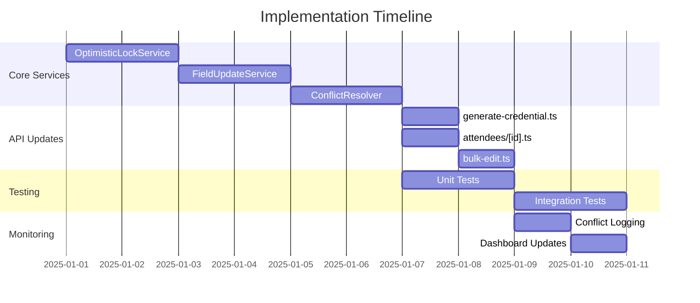

# Design Document: Bulk Credential & Photo Upload Concurrency

## Overview

This design addresses the concurrency issue where bulk credential generation conflicts with photo uploads from different sessions. The solution implements optimistic locking, field-specific updates, and automatic conflict resolution to ensure data integrity without blocking concurrent operations.

### Key Design Principles

1. **Non-blocking**: Operations should not block each other; conflicts are resolved through retries
2. **Field Isolation**: Different operation types only modify their specific fields
3. **Automatic Resolution**: Most conflicts should resolve automatically without user intervention
4. **Backward Compatible**: Works with existing data without migrations

## Architecture

```mermaid
flowchart TB
    subgraph "Client Sessions"
        A[Session A: Bulk Credentials]
        B[Session B: Photo Upload]
    end
    
    subgraph "API Layer"
        C[generate-credential.ts]
        D[attendees/[id].ts PUT]
    end
    
    subgraph "Concurrency Layer"
        E[OptimisticLockService]
        F[FieldUpdateService]
        G[ConflictResolver]
    end
    
    subgraph "Data Layer"
        H[(Appwrite Database)]
        I[Attendee Collection]
    end
    
    A --> C
    B --> D
    C --> E
    D --> E
    E --> F
    F --> G
    G --> H
    H --> I
```

## Components and Interfaces

### 1. OptimisticLockService (`src/lib/optimisticLock.ts`)

Handles version-based locking for attendee records.

```typescript
interface OptimisticLockConfig {
  maxRetries: number;        // Default: 3
  baseDelayMs: number;       // Default: 100
  maxDelayMs: number;        // Default: 2000
}

interface LockResult<T> {
  success: boolean;
  data?: T;
  version?: number;
  conflictDetected?: boolean;
  retriesUsed?: number;
  error?: OptimisticLockError;
}

interface OptimisticLockError {
  type: 'VERSION_MISMATCH' | 'MAX_RETRIES_EXCEEDED' | 'RECORD_NOT_FOUND';
  message: string;
  expectedVersion?: number;
  actualVersion?: number;
}

// Main service interface
interface OptimisticLockService {
  /**
   * Read a document with its current version
   */
  readWithVersion(
    databaseId: string,
    collectionId: string,
    documentId: string
  ): Promise<{ document: any; version: number }>;

  /**
   * Update a document with version check and automatic retry
   */
  updateWithLock<T>(
    databaseId: string,
    collectionId: string,
    documentId: string,
    updateFn: (current: T, version: number) => Partial<T>,
    config?: Partial<OptimisticLockConfig>
  ): Promise<LockResult<T>>;

  /**
   * Partial update that only modifies specified fields
   */
  partialUpdateWithLock(
    databaseId: string,
    collectionId: string,
    documentId: string,
    fields: Record<string, any>,
    expectedVersion?: number
  ): Promise<LockResult<any>>;
}
```

### 2. FieldUpdateService (`src/lib/fieldUpdate.ts`)

Manages field-specific updates to prevent cross-operation interference.

```typescript
// Field groups that should be updated atomically together
const FIELD_GROUPS = {
  credential: ['credentialUrl', 'credentialGeneratedAt', 'credentialCount', 'lastCredentialGenerated'],
  photo: ['photoUrl', 'photoUploadCount', 'lastPhotoUploaded'],
  profile: ['firstName', 'lastName', 'barcodeNumber', 'notes'],
  customFields: ['customFieldValues'],
  accessControl: ['accessEnabled', 'validFrom', 'validUntil'],
  tracking: ['lastSignificantUpdate', 'version']
} as const;

interface FieldUpdateOptions {
  /** Only update these specific fields */
  fields: string[];
  /** Preserve all other fields (merge mode) */
  preserveOthers: boolean;
  /** Update version field */
  incrementVersion: boolean;
}

interface FieldUpdateService {
  /**
   * Update only credential-related fields
   */
  updateCredentialFields(
    databases: Databases,
    attendeeId: string,
    data: {
      credentialUrl: string;
      credentialGeneratedAt?: string;
    }
  ): Promise<LockResult<any>>;

  /**
   * Update only photo-related fields
   */
  updatePhotoFields(
    databases: Databases,
    attendeeId: string,
    data: {
      photoUrl: string | null;
      photoUploadCount?: number;
      lastPhotoUploaded?: string;
    }
  ): Promise<LockResult<any>>;

  /**
   * Generic field-specific update
   */
  updateFields(
    databases: Databases,
    attendeeId: string,
    data: Record<string, any>,
    options: FieldUpdateOptions
  ): Promise<LockResult<any>>;
}
```

### 3. ConflictResolver (`src/lib/conflictResolver.ts`)

Handles conflict detection and automatic resolution.

```typescript
interface ConflictInfo {
  documentId: string;
  operationType: 'credential_generation' | 'photo_upload' | 'profile_update' | 'bulk_edit';
  expectedVersion: number;
  actualVersion: number;
  conflictingFields: string[];
  timestamp: string;
}

interface ResolutionStrategy {
  type: 'MERGE' | 'LATEST_WINS' | 'RETRY' | 'FAIL';
  mergedData?: Record<string, any>;
  reason: string;
}

interface ConflictResolver {
  /**
   * Detect if there's a conflict between current and expected state
   */
  detectConflict(
    current: any,
    expected: { version: number; fields: string[] }
  ): ConflictInfo | null;

  /**
   * Determine the best resolution strategy
   */
  determineStrategy(
    conflict: ConflictInfo,
    incomingData: Record<string, any>,
    currentData: Record<string, any>
  ): ResolutionStrategy;

  /**
   * Apply the resolution strategy
   */
  resolve(
    databases: Databases,
    documentId: string,
    strategy: ResolutionStrategy,
    incomingData: Record<string, any>
  ): Promise<LockResult<any>>;

  /**
   * Log conflict for monitoring
   */
  logConflict(conflict: ConflictInfo, resolution: ResolutionStrategy): void;
}
```

### 4. Updated API Endpoints

#### generate-credential.ts Changes

```typescript
// Before: Full document update in fallback path
await databases.updateDocument(dbId, attendeesCollectionId, id, {
  credentialUrl,
  credentialGeneratedAt: now,
  credentialCount: currentCount + 1,
  lastCredentialGenerated: now
});

// After: Field-specific update with optimistic locking
const result = await fieldUpdateService.updateCredentialFields(
  databases,
  id,
  {
    credentialUrl,
    credentialGeneratedAt: new Date().toISOString()
  }
);

if (!result.success && result.conflictDetected) {
  // Retry with latest version
  const retryResult = await optimisticLockService.updateWithLock(
    dbId,
    attendeesCollectionId,
    id,
    (current) => ({
      credentialUrl,
      credentialGeneratedAt: new Date().toISOString(),
      credentialCount: (current.credentialCount || 0) + 1,
      lastCredentialGenerated: new Date().toISOString()
    })
  );
}
```

#### attendees/[id].ts PUT Changes

```typescript
// Photo upload path - use field-specific update
if (photoUrl !== undefined) {
  const photoResult = await fieldUpdateService.updatePhotoFields(
    databases,
    id,
    {
      photoUrl,
      photoUploadCount: hasPhoto && !hadPhoto ? createIncrement(1) : undefined,
      lastPhotoUploaded: hasPhoto && !hadPhoto ? new Date().toISOString() : undefined
    }
  );
  
  if (!photoResult.success) {
    // Handle conflict with retry
    return handlePhotoConflict(photoResult, res);
  }
}
```

## Data Models

### Attendee Document Schema Update

```typescript
interface AttendeeDocument {
  // Existing fields
  $id: string;
  firstName: string;
  lastName: string;
  barcodeNumber: string;
  notes?: string;
  photoUrl?: string | null;
  credentialUrl?: string | null;
  credentialGeneratedAt?: string | null;
  customFieldValues?: string; // JSON string
  
  // NEW: Version field for optimistic locking
  version: number; // Starts at 0, incremented on each update
  
  // Existing tracking fields
  photoUploadCount?: number;
  credentialCount?: number;
  lastPhotoUploaded?: string | null;
  lastCredentialGenerated?: string | null;
  lastSignificantUpdate?: string | null;
  
  // Appwrite metadata
  $createdAt: string;
  $updatedAt: string;
}
```

### Conflict Log Schema

```typescript
interface ConflictLogEntry {
  $id: string;
  timestamp: string;
  attendeeId: string;
  operationType: string;
  conflictType: 'VERSION_MISMATCH' | 'FIELD_COLLISION';
  expectedVersion: number;
  actualVersion: number;
  conflictingFields: string[]; // JSON array
  resolutionStrategy: string;
  resolutionSuccess: boolean;
  retriesUsed: number;
  sessionInfo?: string; // Anonymized session identifier
}
```

## Error Handling

### Error Types

```typescript
enum ConcurrencyErrorCode {
  VERSION_MISMATCH = 'CONCURRENCY_VERSION_MISMATCH',
  MAX_RETRIES_EXCEEDED = 'CONCURRENCY_MAX_RETRIES',
  MERGE_FAILED = 'CONCURRENCY_MERGE_FAILED',
  LOCK_TIMEOUT = 'CONCURRENCY_LOCK_TIMEOUT'
}

interface ConcurrencyError extends Error {
  code: ConcurrencyErrorCode;
  documentId: string;
  operationType: string;
  retryable: boolean;
  userMessage: string;
}
```

### Error Response Format

```typescript
// API error response for concurrency issues
interface ConcurrencyErrorResponse {
  error: string;
  code: ConcurrencyErrorCode;
  message: string; // User-friendly message
  retryable: boolean;
  details: {
    documentId: string;
    conflictType: string;
    suggestion: string;
  };
}

// Example response
{
  "error": "Concurrent modification detected",
  "code": "CONCURRENCY_VERSION_MISMATCH",
  "message": "This record was updated by another user. Your changes have been saved after merging.",
  "retryable": false,
  "details": {
    "documentId": "attendee-123",
    "conflictType": "VERSION_MISMATCH",
    "suggestion": "Refresh the page to see the latest data."
  }
}
```

### Retry Logic

```typescript
async function withRetry<T>(
  operation: () => Promise<T>,
  config: OptimisticLockConfig
): Promise<LockResult<T>> {
  let lastError: Error | null = null;
  
  for (let attempt = 0; attempt < config.maxRetries; attempt++) {
    try {
      const result = await operation();
      return { success: true, data: result, retriesUsed: attempt };
    } catch (error) {
      lastError = error as Error;
      
      // Only retry on version mismatch errors
      if (!isVersionMismatchError(error)) {
        throw error;
      }
      
      // Exponential backoff
      const delay = Math.min(
        config.baseDelayMs * Math.pow(2, attempt),
        config.maxDelayMs
      );
      await sleep(delay);
    }
  }
  
  return {
    success: false,
    conflictDetected: true,
    retriesUsed: config.maxRetries,
    error: {
      type: 'MAX_RETRIES_EXCEEDED',
      message: `Failed after ${config.maxRetries} retries: ${lastError?.message}`
    }
  };
}
```

## Testing Strategy

### Unit Tests

1. **OptimisticLockService Tests**
   - Test version increment on update
   - Test conflict detection with stale version
   - Test retry logic with exponential backoff
   - Test max retries exceeded behavior

2. **FieldUpdateService Tests**
   - Test credential-only field updates
   - Test photo-only field updates
   - Test that unrelated fields are preserved
   - Test field group isolation

3. **ConflictResolver Tests**
   - Test merge strategy for non-overlapping fields
   - Test latest-wins strategy for overlapping fields
   - Test conflict logging

### Integration Tests

1. **Concurrent Operation Simulation**
   ```typescript
   it('should handle concurrent credential generation and photo upload', async () => {
     // Create test attendee
     const attendee = await createTestAttendee();
     
     // Simulate concurrent operations
     const [credentialResult, photoResult] = await Promise.all([
       generateCredential(attendee.id),
       uploadPhoto(attendee.id, 'https://example.com/photo.jpg')
     ]);
     
     // Both should succeed
     expect(credentialResult.success).toBe(true);
     expect(photoResult.success).toBe(true);
     
     // Verify both changes persisted
     const updated = await getAttendee(attendee.id);
     expect(updated.credentialUrl).toBeDefined();
     expect(updated.photoUrl).toBe('https://example.com/photo.jpg');
   });
   ```

2. **Bulk Operation Isolation Test**
   ```typescript
   it('should not overwrite photos during bulk credential generation', async () => {
     // Create attendees with photos
     const attendees = await createAttendeesWithPhotos(10);
     const originalPhotos = attendees.map(a => a.photoUrl);
     
     // Run bulk credential generation
     await bulkGenerateCredentials(attendees.map(a => a.id));
     
     // Verify photos unchanged
     const updated = await getAttendees(attendees.map(a => a.id));
     updated.forEach((a, i) => {
       expect(a.photoUrl).toBe(originalPhotos[i]);
       expect(a.credentialUrl).toBeDefined();
     });
   });
   ```

### Load Tests

1. **High Concurrency Test**
   - Simulate 10 concurrent photo uploads while bulk generating 100 credentials
   - Measure conflict rate and resolution success rate
   - Verify no data loss

2. **Stress Test**
   - Run continuous operations for 5 minutes
   - Monitor memory usage and response times
   - Verify system stability

## Implementation Sequence



## Monitoring and Observability

### Metrics to Track

1. **Conflict Metrics**
   - `concurrency.conflicts.total` - Total conflicts detected
   - `concurrency.conflicts.by_type` - Conflicts by operation type
   - `concurrency.resolution.success_rate` - Successful resolutions
   - `concurrency.retries.average` - Average retries per operation

2. **Performance Metrics**
   - `attendee.update.latency` - Update operation latency
   - `credential.generation.latency` - Credential generation latency
   - `photo.upload.latency` - Photo upload latency

### Logging Format

```typescript
// Conflict log entry
logger.warn('[Concurrency] Conflict detected', {
  attendeeId: 'abc123',
  operationType: 'photo_upload',
  expectedVersion: 5,
  actualVersion: 6,
  conflictingFields: ['credentialUrl'],
  resolution: 'MERGE',
  retriesUsed: 1
});

// Resolution success log
logger.info('[Concurrency] Conflict resolved', {
  attendeeId: 'abc123',
  strategy: 'MERGE',
  mergedFields: ['photoUrl', 'credentialUrl'],
  totalLatencyMs: 250
});
```

## Backward Compatibility

### Version Field Migration

The `version` field will be added lazily:

1. **On Read**: If `version` is undefined, treat as version 0
2. **On Write**: Always set/increment `version` field
3. **No Migration Required**: Existing records work immediately

```typescript
function getVersion(document: any): number {
  return typeof document.version === 'number' ? document.version : 0;
}

function prepareUpdate(data: any, currentVersion: number): any {
  return {
    ...data,
    version: currentVersion + 1
  };
}
```

### API Compatibility

- All existing API contracts remain unchanged
- New error codes are additive (existing error handling still works)
- Conflict resolution is transparent to clients unless they opt-in to detailed responses
