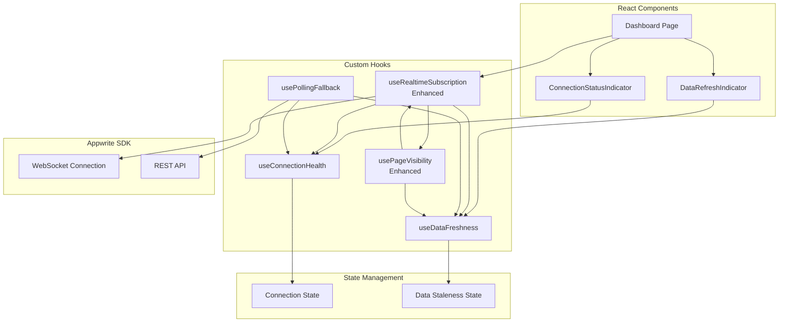
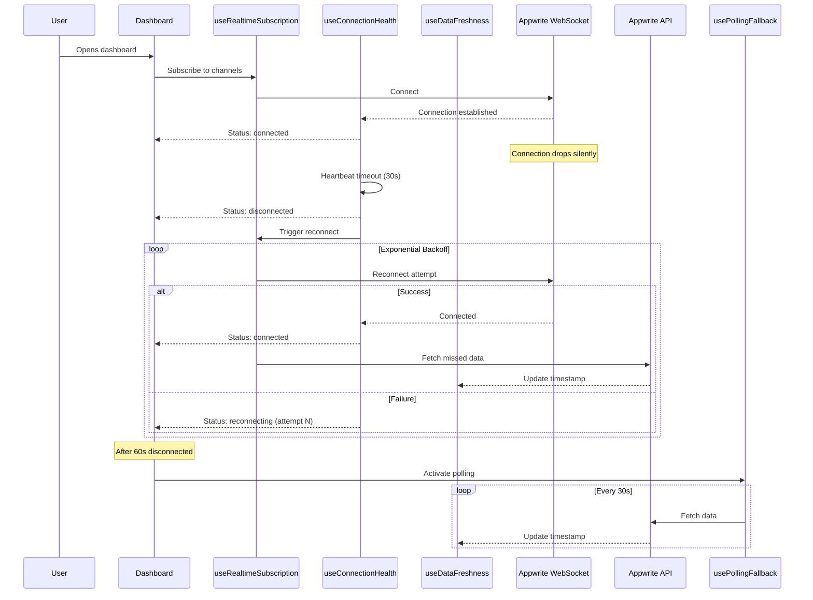

# Design Document: Data Refresh Monitoring

## Overview

This design document describes the architecture and implementation approach for robust data refresh monitoring in credential.studio. The system addresses silent real-time connection failures by implementing connection health monitoring, automatic reconnection with exponential backoff, data staleness tracking, and user-facing status indicators.

The solution enhances the existing `useRealtimeSubscription` hook and introduces new hooks and components that integrate seamlessly with the current dashboard architecture. All UI components follow the visual design system using shadcn/ui, Tailwind CSS, and Lucide React icons.

### Key Design Decisions

1. **Hook-based Architecture**: All monitoring logic is encapsulated in reusable React hooks that can be composed together
2. **Event-driven Updates**: Connection and staleness state changes emit events that UI components subscribe to
3. **Graceful Degradation**: When real-time fails, the system falls back to polling without user intervention
4. **Non-intrusive UI**: Status indicators are compact and only demand attention when issues occur

## Architecture



### Data Flow



## Components and Interfaces

### Hook: useConnectionHealth

Monitors WebSocket connection health and manages reconnection state.

```typescript
interface ConnectionState {
  status: 'connected' | 'connecting' | 'disconnected' | 'reconnecting';
  lastConnectedAt: Date | null;
  lastDisconnectedAt: Date | null;
  reconnectAttempt: number;
  nextReconnectAt: Date | null;
  error: Error | null;
}

interface UseConnectionHealthOptions {
  heartbeatInterval?: number;      // Default: 30000ms
  maxReconnectAttempts?: number;   // Default: 10
  initialBackoff?: number;         // Default: 1000ms
  maxBackoff?: number;             // Default: 30000ms
  onStatusChange?: (status: ConnectionState['status']) => void;
  onReconnectSuccess?: () => void;
  onReconnectFailure?: (error: Error) => void;
}

interface UseConnectionHealthReturn {
  state: ConnectionState;
  reconnect: () => void;           // Manual reconnect trigger
  resetBackoff: () => void;        // Reset backoff counter
  isHealthy: boolean;              // Convenience: status === 'connected'
}

function useConnectionHealth(options?: UseConnectionHealthOptions): UseConnectionHealthReturn;
```

### Hook: useDataFreshness

Tracks data staleness for different data types.

```typescript
type DataType = 'attendees' | 'users' | 'roles' | 'settings' | 'logs';

interface FreshnessState {
  lastUpdatedAt: Date | null;
  isStale: boolean;
  staleDuration: number | null;    // ms since became stale
}

interface UseDataFreshnessOptions {
  dataType: DataType;
  stalenessThreshold?: number;     // Default: 30000ms
  onBecomeStale?: () => void;
  onRefresh?: () => void;
}

interface UseDataFreshnessReturn {
  state: FreshnessState;
  markFresh: () => void;           // Called after successful data fetch
  getRelativeTime: () => string;   // "5 seconds ago", "2 minutes ago"
  refresh: () => Promise<void>;    // Trigger manual refresh
  isRefreshing: boolean;
}

function useDataFreshness(
  options: UseDataFreshnessOptions,
  refreshFn: () => Promise<void>
): UseDataFreshnessReturn;
```

### Hook: usePollingFallback

Provides polling fallback when real-time connection fails.

```typescript
interface UsePollingFallbackOptions {
  enabled: boolean;                 // Typically: connectionState.status === 'disconnected'
  interval?: number;                // Default: 30000ms
  dataType: DataType;
  onPoll?: () => Promise<void>;
  onError?: (error: Error) => void;
}

interface UsePollingFallbackReturn {
  isPolling: boolean;
  lastPollAt: Date | null;
  pollNow: () => Promise<void>;
}

function usePollingFallback(options: UsePollingFallbackOptions): UsePollingFallbackReturn;
```

### Hook: useRealtimeSubscription (Enhanced)

Enhanced version of existing hook with connection health integration.

```typescript
interface EnhancedRealtimeSubscriptionOptions<T> extends RealtimeSubscriptionOptions<T> {
  // Existing options...
  channels: string[];
  callback: (payload: RealtimeResponseEvent<T>) => void;
  onError?: (error: Error) => void;
  enabled?: boolean;
  
  // New options
  connectionHealth?: UseConnectionHealthReturn;
  dataFreshness?: UseDataFreshnessReturn;
  autoReconnect?: boolean;         // Default: true
  refreshOnReconnect?: boolean;    // Default: true
}
```

### Component: ConnectionStatusIndicator

Visual indicator for connection status in dashboard header.

```typescript
interface ConnectionStatusIndicatorProps {
  connectionState: ConnectionState;
  onReconnect: () => void;
  className?: string;
}

function ConnectionStatusIndicator(props: ConnectionStatusIndicatorProps): JSX.Element;
```

**Visual States:**
- Connected: Green dot + "Connected" tooltip
- Connecting: Amber dot + spinning icon + "Connecting..." tooltip
- Reconnecting: Amber dot + spinning icon + "Reconnecting (attempt N)..." tooltip + next retry time
- Disconnected: Red dot + "Disconnected" text + "Reconnect" button

### Component: DataRefreshIndicator

Shows data freshness and provides manual refresh.

```typescript
interface DataRefreshIndicatorProps {
  freshnessState: FreshnessState;
  isRefreshing: boolean;
  onRefresh: () => void;
  relativeTime: string;
  className?: string;
}

function DataRefreshIndicator(props: DataRefreshIndicatorProps): JSX.Element;
```

**Visual States:**
- Fresh: Muted text showing relative time + refresh button
- Stale: Amber text showing relative time + highlighted refresh button
- Refreshing: Spinning icon on refresh button

## Data Models

### Connection State Store

```typescript
// Stored in React state via useConnectionHealth hook
interface ConnectionStateStore {
  status: 'connected' | 'connecting' | 'disconnected' | 'reconnecting';
  lastConnectedAt: number | null;      // Unix timestamp
  lastDisconnectedAt: number | null;   // Unix timestamp
  reconnectAttempt: number;
  nextReconnectAt: number | null;      // Unix timestamp
  errorMessage: string | null;
}
```

### Data Freshness Store

```typescript
// Stored in React state via useDataFreshness hook
// One instance per data type
interface DataFreshnessStore {
  dataType: DataType;
  lastUpdatedAt: number | null;        // Unix timestamp
  stalenessThreshold: number;          // ms
}
```

### Configuration Constants

```typescript
// src/lib/constants.ts additions
export const CONNECTION_HEALTH = {
  HEARTBEAT_INTERVAL: 30000,           // 30 seconds
  MAX_RECONNECT_ATTEMPTS: 10,
  INITIAL_BACKOFF: 1000,               // 1 second
  MAX_BACKOFF: 30000,                  // 30 seconds
  BACKOFF_MULTIPLIER: 2,
} as const;

export const DATA_FRESHNESS = {
  STALENESS_THRESHOLD: 30000,          // 30 seconds
  POLLING_INTERVAL: 30000,             // 30 seconds
  POLLING_ACTIVATION_DELAY: 60000,     // 60 seconds after disconnect
  BRIEF_DISCONNECT_THRESHOLD: 5000,    // 5 seconds - don't notify
} as const;
```


## Correctness Properties

*A property is a characteristic or behavior that should hold true across all valid executions of a system—essentially, a formal statement about what the system should do. Properties serve as the bridge between human-readable specifications and machine-verifiable correctness guarantees.*

### Property 1: Connection State Transitions on Establishment

*For any* WebSocket connection establishment event, the Connection_Health_Monitor SHALL update the status to "connected" and record the connection timestamp as a non-null Date value.

**Validates: Requirements 1.1**

### Property 2: Connection State Transitions on Termination

*For any* connection termination event (whether unexpected close or error), the Connection_Health_Monitor SHALL immediately update the status to "disconnected" and record the disconnection timestamp.

**Validates: Requirements 1.3, 1.5**

### Property 3: Event Emission on Connection Status Change

*For any* connection status transition (from any status to any different status), the Connection_Health_Monitor SHALL emit exactly one status change event containing the new status value.

**Validates: Requirements 1.4**

### Property 4: Automatic Reconnection Initiation

*For any* transition to "disconnected" status, the Realtime_Subscription_Manager SHALL initiate a reconnection attempt within 1 second (the initial backoff delay).

**Validates: Requirements 2.1**

### Property 5: Exponential Backoff Calculation

*For any* reconnection attempt number N (where 1 ≤ N ≤ 10), the delay before that attempt SHALL equal `min(1000 * 2^(N-1), 30000)` milliseconds.

**Validates: Requirements 2.2**

### Property 6: Manual Reconnect Resets Backoff

*For any* manual reconnection trigger, the backoff counter SHALL reset to 0 and the next reconnection attempt SHALL occur immediately (within 100ms).

**Validates: Requirements 2.6**

### Property 7: Data Freshness Timestamp Recording

*For any* successful data fetch or real-time update for a given data type, the Data_Freshness_Tracker SHALL update the lastUpdatedAt timestamp to the current time for that specific data type.

**Validates: Requirements 3.1**

### Property 8: Staleness Calculation Independence

*For any* combination of data types with different lastUpdatedAt timestamps, each data type's staleness SHALL be calculated independently based on its own timestamp and the staleness threshold, such that `isStale = (currentTime - lastUpdatedAt) > stalenessThreshold`.

**Validates: Requirements 3.2, 3.4**

### Property 9: Visibility Change Triggers Reconnection When Disconnected

*For any* page visibility transition from hidden to visible while connection status is "disconnected", the Visibility_Recovery system SHALL trigger a reconnection attempt.

**Validates: Requirements 4.2**

### Property 10: Visibility Change Triggers Active Tab Refresh

*For any* page visibility transition from hidden to visible, the Visibility_Recovery system SHALL trigger a data refresh for the currently active tab's data type, regardless of staleness status.

**Validates: Requirements 4.4**

### Property 11: Visibility Change Debouncing

*For any* sequence of visibility changes occurring within a 500ms window, the Visibility_Recovery system SHALL execute at most one refresh operation.

**Validates: Requirements 4.5**

### Property 12: Polling Interval Adherence

*For any* active polling state, data fetches SHALL occur at intervals within ±100ms of the configured polling interval (default 30 seconds).

**Validates: Requirements 5.2**

### Property 13: Polling Deactivation on Reconnect

*For any* transition from "disconnected" to "connected" status while polling is active, the Polling_Fallback SHALL deactivate polling within 100ms.

**Validates: Requirements 5.3**

### Property 14: Selective Polling by Active Tab

*For any* polling fetch while a specific tab is active, only the data type corresponding to that active tab SHALL be fetched.

**Validates: Requirements 5.4**

### Property 15: Connection Status Indicator Color Mapping

*For any* connection status value, the ConnectionStatusIndicator SHALL render with the correct semantic color class: "connected" → emerald/green classes, "connecting"/"reconnecting" → amber/yellow classes, "disconnected" → red/destructive classes.

**Validates: Requirements 6.1**

### Property 16: Relative Time Formatting

*For any* timestamp within the last hour, the getRelativeTime function SHALL return a human-readable string in the format "X seconds ago" or "X minutes ago" that accurately reflects the time difference.

**Validates: Requirements 7.1**

### Property 17: Stale Data Visual Indication

*For any* data freshness state where isStale is true, the DataRefreshIndicator SHALL include amber/warning color classes in its rendered output.

**Validates: Requirements 7.2**

### Property 18: Notification on Connection Loss

*For any* connection loss event (transition to "disconnected"), the system SHALL invoke the notification system to display a warning toast, unless the disconnection duration is less than 5 seconds and auto-recovers.

**Validates: Requirements 8.1, 8.5**

## Error Handling

### Connection Errors

| Error Type | Handling Strategy | User Feedback |
|------------|-------------------|---------------|
| WebSocket close (unexpected) | Trigger reconnection with backoff | Toast after 5s if not recovered |
| WebSocket error event | Log error, trigger reconnection | Toast with error details |
| Network offline | Pause reconnection, wait for online | "You're offline" indicator |
| Max reconnect attempts | Stop auto-reconnect, enable manual | Persistent alert with button |

### Data Fetch Errors

| Error Type | Handling Strategy | User Feedback |
|------------|-------------------|---------------|
| API 4xx error | Log, don't retry automatically | Error toast with details |
| API 5xx error | Retry with backoff (max 3) | Error toast after retries fail |
| Network error | Retry with backoff | Error toast with retry button |
| Timeout | Retry once, then fail | Error toast with retry button |

### Error State Recovery

```typescript
// Error recovery flow
interface ErrorRecoveryState {
  hasError: boolean;
  errorType: 'connection' | 'fetch' | 'unknown';
  errorMessage: string;
  retryCount: number;
  canRetry: boolean;
  lastErrorAt: Date;
}

// Recovery actions
const recoverFromError = (state: ErrorRecoveryState) => {
  if (state.errorType === 'connection') {
    // Connection errors: use reconnection logic
    return { action: 'reconnect', delay: calculateBackoff(state.retryCount) };
  }
  if (state.errorType === 'fetch' && state.retryCount < 3) {
    // Fetch errors: retry with backoff
    return { action: 'retry', delay: calculateBackoff(state.retryCount) };
  }
  // Max retries reached: require manual intervention
  return { action: 'manual', showAlert: true };
};
```

## Testing Strategy

### Unit Tests

Unit tests focus on specific examples, edge cases, and error conditions:

1. **useConnectionHealth hook**
   - Initial state is "connecting"
   - Handles connection establishment correctly
   - Handles unexpected close events
   - Handles error events
   - Calculates backoff delays correctly for attempts 1-10
   - Respects max backoff limit (30s)
   - Resets backoff on manual reconnect
   - Stops reconnection after max attempts

2. **useDataFreshness hook**
   - Initial state has null timestamp
   - Updates timestamp on markFresh()
   - Calculates staleness correctly at threshold boundary
   - Formats relative time correctly (seconds, minutes)
   - Handles edge case of null timestamp

3. **usePollingFallback hook**
   - Activates when enabled becomes true
   - Deactivates when enabled becomes false
   - Respects polling interval
   - Handles fetch errors with retry

4. **ConnectionStatusIndicator component**
   - Renders correct color for each status
   - Shows reconnect button when disconnected
   - Shows attempt count when reconnecting
   - Tooltip shows correct information

5. **DataRefreshIndicator component**
   - Shows relative time correctly
   - Shows amber styling when stale
   - Shows spinner when refreshing
   - Calls onRefresh when button clicked

### Property-Based Tests

Property tests verify universal properties across all inputs using Vitest with fast-check:

```typescript
// Test configuration
// Minimum 100 iterations per property test
// Tag format: Feature: data-refresh-monitoring, Property N: description
```

**Property tests to implement:**

1. **Property 5: Exponential Backoff Calculation**
   - Generate random attempt numbers 1-10
   - Verify delay = min(1000 * 2^(N-1), 30000)

2. **Property 8: Staleness Calculation Independence**
   - Generate random timestamps for multiple data types
   - Verify each calculates staleness independently

3. **Property 11: Visibility Change Debouncing**
   - Generate rapid sequences of visibility changes
   - Verify at most one refresh per debounce window

4. **Property 16: Relative Time Formatting**
   - Generate random timestamps within valid range
   - Verify formatted string matches expected pattern

5. **Property 18: Notification Suppression**
   - Generate random disconnection durations
   - Verify notifications only for durations > 5 seconds

### Integration Tests

1. **Full reconnection flow**
   - Simulate connection drop
   - Verify reconnection attempts with correct backoff
   - Verify subscriptions restored on success

2. **Visibility recovery flow**
   - Simulate page hidden then visible
   - Verify data refresh triggered
   - Verify reconnection if disconnected

3. **Polling fallback flow**
   - Simulate extended disconnection (>60s)
   - Verify polling activates
   - Verify polling stops on reconnection

### Test File Locations

Following project conventions:
- `src/__tests__/hooks/useConnectionHealth.test.ts`
- `src/__tests__/hooks/useDataFreshness.test.ts`
- `src/__tests__/hooks/usePollingFallback.test.ts`
- `src/__tests__/components/ConnectionStatusIndicator.test.tsx`
- `src/__tests__/components/DataRefreshIndicator.test.tsx`
