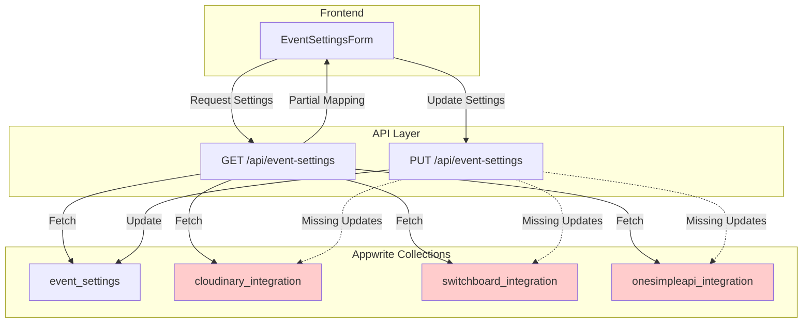
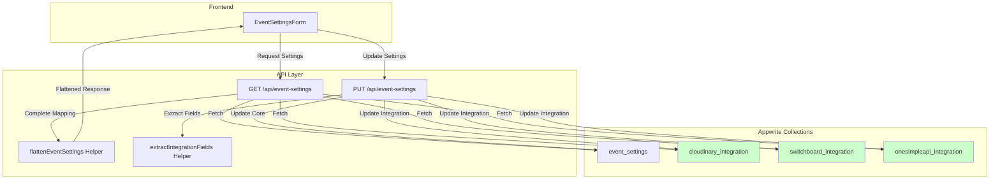

# Design Document

## Overview

This design document outlines the solution for fixing incomplete integration field mapping in the event settings API. The core issue is that while the Appwrite migration successfully created separate integration collections (Cloudinary, Switchboard, OneSimpleAPI), the GET endpoint only maps a subset of fields back to the flattened format expected by the frontend. This causes several configuration options to appear blank or incorrect in the UI.

### Issues Identified

**Cloudinary Integration** - Missing 5 fields:
- ❌ `cloudinaryApiSecret` - Not mapped (exists in collection)
- ❌ `cloudinaryAutoOptimize` - Not mapped (exists in collection)
- ❌ `cloudinaryGenerateThumbnails` - Not mapped (exists in collection)
- ❌ `cloudinaryDisableSkipCrop` - Not mapped (exists in collection)
- ❌ `cloudinaryCropAspectRatio` - Not mapped (exists in collection)

**Switchboard Integration** - Missing 3 fields:
- ❌ `switchboardAuthHeaderType` - Not mapped (exists in collection)
- ❌ `switchboardRequestBody` - Not mapped (exists in collection)
- ❌ `switchboardTemplateId` - Not mapped (exists in collection)

**OneSimpleAPI Integration** - Wrong field names + missing fields:
- ❌ `oneSimpleApiUrl` - Mapped to wrong field `apiUrl` (should be `url`)
- ❌ `oneSimpleApiKey` - Wrong field, doesn't exist in collection
- ❌ `oneSimpleApiFormDataKey` - Not mapped (exists in collection)
- ❌ `oneSimpleApiFormDataValue` - Not mapped (exists in collection)
- ❌ `oneSimpleApiRecordTemplate` - Not mapped (exists in collection)

The solution involves updating the event settings API endpoint to properly map all integration fields in both directions (read and write), ensuring backward compatibility with the existing frontend code while leveraging the normalized integration collections.

## Architecture

### Current State



### Target State



## Components and Interfaces

### 1. Enhanced GET Endpoint Mapping

**Location**: `src/pages/api/event-settings/index.ts` (GET handler)

**Current Issue**: The GET handler only maps a subset of integration fields for all three integrations:

```typescript
// Current incomplete mapping - Cloudinary
...(cloudinaryData && {
  cloudinaryEnabled: cloudinaryData.enabled,
  cloudinaryCloudName: cloudinaryData.cloudName,
  cloudinaryApiKey: cloudinaryData.apiKey,
  cloudinaryUploadPreset: cloudinaryData.uploadPreset
  // Missing: apiSecret, autoOptimize, generateThumbnails, disableSkipCrop, cropAspectRatio
}),

// Current incomplete mapping - Switchboard
...(switchboardData && {
  switchboardEnabled: switchboardData.enabled,
  switchboardApiEndpoint: switchboardData.apiEndpoint,
  switchboardApiKey: switchboardData.apiKey,
  switchboardFieldMappings: switchboardData.fieldMappings
  // Missing: authHeaderType, requestBody, templateId
}),

// Current incomplete mapping - OneSimpleAPI
...(oneSimpleApiData && {
  oneSimpleApiEnabled: oneSimpleApiData.enabled,
  oneSimpleApiUrl: oneSimpleApiData.apiUrl,  // Wrong field name! Should be 'url'
  oneSimpleApiKey: oneSimpleApiData.apiKey   // Wrong field! Should be formDataKey, formDataValue, recordTemplate
  // Missing: formDataKey, formDataValue, recordTemplate
}),
```

**Solution**: Use the existing `flattenEventSettings` helper from `appwrite-integrations.ts`:

```typescript
import { 
  getEventSettingsWithIntegrations,
  flattenEventSettings 
} from '@/lib/appwrite-integrations';

// In GET handler, after fetching all data:
const eventSettingsWithIntegrations = {
  ...eventSettings,
  cloudinary: cloudinaryData || undefined,
  switchboard: switchboardData || undefined,
  oneSimpleApi: oneSimpleApiData || undefined
};

// Use the helper to flatten all fields correctly
const flattenedSettings = flattenEventSettings(eventSettingsWithIntegrations);

// Add custom fields
const response = {
  ...flattenedSettings,
  customFields: parsedCustomFields
};
```

### 2. Enhanced PUT Endpoint Integration Updates

**Location**: `src/pages/api/event-settings/index.ts` (PUT handler)

**Current Issue**: The PUT handler doesn't extract and update integration-specific fields to their respective collections.

**Solution**: Create a helper function to extract integration fields and update them:

```typescript
/**
 * Extract integration fields from the update payload
 */
function extractIntegrationFields(updateData: any) {
  const cloudinaryFields = {
    enabled: updateData.cloudinaryEnabled,
    cloudName: updateData.cloudinaryCloudName,
    apiKey: updateData.cloudinaryApiKey,
    apiSecret: updateData.cloudinaryApiSecret,
    uploadPreset: updateData.cloudinaryUploadPreset,
    autoOptimize: updateData.cloudinaryAutoOptimize,
    generateThumbnails: updateData.cloudinaryGenerateThumbnails,
    disableSkipCrop: updateData.cloudinaryDisableSkipCrop,
    cropAspectRatio: updateData.cloudinaryCropAspectRatio
  };

  const switchboardFields = {
    enabled: updateData.switchboardEnabled,
    apiEndpoint: updateData.switchboardApiEndpoint,
    authHeaderType: updateData.switchboardAuthHeaderType,
    apiKey: updateData.switchboardApiKey,
    requestBody: updateData.switchboardRequestBody,
    templateId: updateData.switchboardTemplateId,
    fieldMappings: typeof updateData.switchboardFieldMappings === 'string' 
      ? updateData.switchboardFieldMappings 
      : JSON.stringify(updateData.switchboardFieldMappings || [])
  };

  const oneSimpleApiFields = {
    enabled: updateData.oneSimpleApiEnabled,
    url: updateData.oneSimpleApiUrl,
    formDataKey: updateData.oneSimpleApiFormDataKey,
    formDataValue: updateData.oneSimpleApiFormDataValue,
    recordTemplate: updateData.oneSimpleApiRecordTemplate
  };

  // Filter out undefined values
  const filterUndefined = (obj: any) => {
    return Object.fromEntries(
      Object.entries(obj).filter(([_, v]) => v !== undefined)
    );
  };

  return {
    cloudinary: filterUndefined(cloudinaryFields),
    switchboard: filterUndefined(switchboardFields),
    oneSimpleApi: filterUndefined(oneSimpleApiFields)
  };
}

/**
 * Get core event settings fields (non-integration)
 */
function getCoreEventSettingsFields(updateData: any) {
  const {
    // Exclude integration fields
    cloudinaryEnabled, cloudinaryCloudName, cloudinaryApiKey, cloudinaryApiSecret,
    cloudinaryUploadPreset, cloudinaryAutoOptimize, cloudinaryGenerateThumbnails,
    cloudinaryDisableSkipCrop, cloudinaryCropAspectRatio,
    switchboardEnabled, switchboardApiEndpoint, switchboardAuthHeaderType,
    switchboardApiKey, switchboardRequestBody, switchboardTemplateId,
    switchboardFieldMappings,
    oneSimpleApiEnabled, oneSimpleApiUrl, oneSimpleApiFormDataKey,
    oneSimpleApiFormDataValue, oneSimpleApiRecordTemplate,
    customFields, // Also exclude custom fields
    ...coreFields
  } = updateData;

  return coreFields;
}
```

**Integration Update Flow**:

```typescript
// In PUT handler, after updating core event settings:

// Extract integration fields from the request
const integrationFields = extractIntegrationFields(updateData);

// Update each integration if fields are present
const integrationUpdates = [];

if (Object.keys(integrationFields.cloudinary).length > 0) {
  integrationUpdates.push(
    updateCloudinaryIntegration(
      databases,
      currentSettings.$id,
      integrationFields.cloudinary
    ).catch(error => {
      console.error('Failed to update Cloudinary integration:', error);
      return { error: 'cloudinary', message: error.message };
    })
  );
}

if (Object.keys(integrationFields.switchboard).length > 0) {
  integrationUpdates.push(
    updateSwitchboardIntegration(
      databases,
      currentSettings.$id,
      integrationFields.switchboard
    ).catch(error => {
      console.error('Failed to update Switchboard integration:', error);
      return { error: 'switchboard', message: error.message };
    })
  );
}

if (Object.keys(integrationFields.oneSimpleApi).length > 0) {
  integrationUpdates.push(
    updateOneSimpleApiIntegration(
      databases,
      currentSettings.$id,
      integrationFields.oneSimpleApi
    ).catch(error => {
      console.error('Failed to update OneSimpleAPI integration:', error);
      return { error: 'onesimpleapi', message: error.message };
    })
  );
}

// Wait for all integration updates to complete
const integrationResults = await Promise.all(integrationUpdates);

// Check for errors
const integrationErrors = integrationResults.filter(r => r && 'error' in r);
if (integrationErrors.length > 0) {
  console.warn('Some integration updates failed:', integrationErrors);
  // Continue anyway - partial success is acceptable
}
```

### 3. Field Mapping Reference

**IMPORTANT**: The OneSimpleAPI integration has incorrect field names in the current GET mapping. The collection uses `url`, `formDataKey`, `formDataValue`, and `recordTemplate`, but the GET endpoint is trying to map `apiUrl` and `apiKey` which don't exist.

**Cloudinary Integration Fields**:

| Flattened Field Name | Integration Collection Field | Type | Default |
|---------------------|------------------------------|------|---------|
| cloudinaryEnabled | enabled | boolean | false |
| cloudinaryCloudName | cloudName | string | '' |
| cloudinaryApiKey | apiKey | string | '' |
| cloudinaryApiSecret | apiSecret | string | '' |
| cloudinaryUploadPreset | uploadPreset | string | '' |
| cloudinaryAutoOptimize | autoOptimize | boolean | false |
| cloudinaryGenerateThumbnails | generateThumbnails | boolean | false |
| cloudinaryDisableSkipCrop | disableSkipCrop | boolean | false |
| cloudinaryCropAspectRatio | cropAspectRatio | string | '1' |

**Switchboard Integration Fields**:

| Flattened Field Name | Integration Collection Field | Type | Default |
|---------------------|------------------------------|------|---------|
| switchboardEnabled | enabled | boolean | false |
| switchboardApiEndpoint | apiEndpoint | string | '' |
| switchboardAuthHeaderType | authHeaderType | string | '' |
| switchboardApiKey | apiKey | string | '' |
| switchboardRequestBody | requestBody | string | '' |
| switchboardTemplateId | templateId | string | '' |
| switchboardFieldMappings | fieldMappings | string (JSON) | '[]' |

**OneSimpleAPI Integration Fields**:

| Flattened Field Name | Integration Collection Field | Type | Default |
|---------------------|------------------------------|------|---------|
| oneSimpleApiEnabled | enabled | boolean | false |
| oneSimpleApiUrl | url | string | '' |
| oneSimpleApiFormDataKey | formDataKey | string | '' |
| oneSimpleApiFormDataValue | formDataValue | string | '' |
| oneSimpleApiRecordTemplate | recordTemplate | string | '' |

### 4. Enhanced flattenEventSettings Helper

**Location**: `src/lib/appwrite-integrations.ts`

**Current Implementation**: Already correct and complete. No changes needed.

The existing helper already maps all fields correctly:

```typescript
export function flattenEventSettings(settings: EventSettingsWithIntegrations): any {
  const { cloudinary, switchboard, oneSimpleApi, ...coreSettings } = settings;
  
  return {
    ...coreSettings,
    // Cloudinary fields - ALL fields mapped
    cloudinaryEnabled: cloudinary?.enabled || false,
    cloudinaryCloudName: cloudinary?.cloudName || '',
    cloudinaryApiKey: cloudinary?.apiKey || '',
    cloudinaryApiSecret: cloudinary?.apiSecret || '',
    cloudinaryUploadPreset: cloudinary?.uploadPreset || '',
    cloudinaryAutoOptimize: cloudinary?.autoOptimize || false,
    cloudinaryGenerateThumbnails: cloudinary?.generateThumbnails || false,
    cloudinaryDisableSkipCrop: cloudinary?.disableSkipCrop || false,
    cloudinaryCropAspectRatio: cloudinary?.cropAspectRatio || '1',
    // ... other integrations
  };
}
```

## Data Models

### Integration Collection Schemas

The integration collections already have the correct schema. No changes needed:

**Cloudinary Collection**:
```typescript
{
  $id: string;
  eventSettingsId: string;
  version: number;
  enabled: boolean;
  cloudName: string;
  apiKey: string;
  apiSecret: string;
  uploadPreset: string;
  autoOptimize: boolean;        // ✓ Exists
  generateThumbnails: boolean;  // ✓ Exists
  disableSkipCrop: boolean;     // ✓ Exists
  cropAspectRatio: string;      // ✓ Exists
}
```

**Switchboard Collection**:
```typescript
{
  $id: string;
  eventSettingsId: string;
  version: number;
  enabled: boolean;
  apiEndpoint: string;
  authHeaderType: string;       // ✓ Exists
  apiKey: string;
  requestBody: string;          // ✓ Exists
  templateId: string;           // ✓ Exists
  fieldMappings: string;        // ✓ Exists (JSON string)
}
```

**OneSimpleAPI Collection**:
```typescript
{
  $id: string;
  eventSettingsId: string;
  version: number;
  enabled: boolean;
  url: string;
  formDataKey: string;          // ✓ Exists
  formDataValue: string;        // ✓ Exists
  recordTemplate: string;       // ✓ Exists
}
```

## Error Handling

### Integration Fetch Errors

**Current Behavior**: The GET endpoint uses `Promise.allSettled` to fetch integrations, which is correct. It logs errors but continues with null values.

**Enhancement**: Ensure all integration fields have appropriate defaults when integration data is null:

```typescript
// When integration fetch fails or returns null
const defaultCloudinary = {
  enabled: false,
  cloudName: '',
  apiKey: '',
  apiSecret: '',
  uploadPreset: '',
  autoOptimize: false,
  generateThumbnails: false,
  disableSkipCrop: false,
  cropAspectRatio: '1'
};

// Use defaults when flattening
const flattenedSettings = flattenEventSettings({
  ...eventSettings,
  cloudinary: cloudinaryData || defaultCloudinary,
  switchboard: switchboardData || defaultSwitchboard,
  oneSimpleApi: oneSimpleApiData || defaultOneSimpleApi
});
```

### Integration Update Errors

**Strategy**: Use Promise.all with individual error handling to allow partial success:

```typescript
// Each integration update catches its own errors
const results = await Promise.all([
  updateCloudinaryIntegration(...).catch(e => ({ error: 'cloudinary', message: e.message })),
  updateSwitchboardIntegration(...).catch(e => ({ error: 'switchboard', message: e.message })),
  updateOneSimpleApiIntegration(...).catch(e => ({ error: 'onesimpleapi', message: e.message }))
]);

// Check for errors but don't fail the entire request
const errors = results.filter(r => 'error' in r);
if (errors.length > 0) {
  console.warn('Integration update errors:', errors);
  // Could add a warning to the response
}
```

### Optimistic Locking Conflicts

**Existing Handling**: The `updateIntegrationWithLocking` functions already handle version conflicts by throwing `IntegrationConflictError`.

**Enhancement**: Catch and handle these errors gracefully in the PUT endpoint:

```typescript
try {
  await updateCloudinaryIntegration(databases, eventSettingsId, data);
} catch (error) {
  if (error instanceof IntegrationConflictError) {
    return res.status(409).json({
      error: 'Integration conflict',
      message: error.message,
      integration: error.integrationType
    });
  }
  throw error;
}
```

## Testing Strategy

### Unit Tests

1. **Test flattenEventSettings helper**
   - Test with complete integration data
   - Test with null/undefined integration data
   - Test with partial integration data
   - Verify all fields are mapped correctly
   - Verify default values are applied

2. **Test extractIntegrationFields helper**
   - Test with complete update data
   - Test with partial update data
   - Test with undefined fields
   - Verify correct field extraction
   - Verify undefined filtering

3. **Test getCoreEventSettingsFields helper**
   - Test that integration fields are excluded
   - Test that custom fields are excluded
   - Test that core fields are preserved

### Integration Tests

1. **Test GET endpoint with complete integration data**
   - Create event settings with all integration fields
   - Fetch via GET endpoint
   - Verify all fields are present in response
   - Verify correct data types and values

2. **Test GET endpoint with missing integration data**
   - Create event settings without integration documents
   - Fetch via GET endpoint
   - Verify default values are returned
   - Verify no errors occur

3. **Test PUT endpoint with integration updates**
   - Update Cloudinary fields (all fields including booleans)
   - Update Switchboard fields (including authHeaderType, requestBody)
   - Update OneSimpleAPI fields (all fields)
   - Verify updates are saved to correct collections
   - Verify version numbers increment

4. **Test PUT endpoint with partial integration updates**
   - Update only some Cloudinary fields
   - Verify unchanged fields remain the same
   - Verify only updated fields change

5. **Test cache invalidation**
   - Fetch event settings (cache miss)
   - Fetch again (cache hit)
   - Update event settings
   - Fetch again (cache miss, fresh data)
   - Verify updated fields are reflected

### Manual Testing

1. **Cloudinary Settings**
   - Toggle "Auto-optimize images" switch
   - Toggle "Generate thumbnails" switch
   - Toggle "Disable Skip Crop button" switch
   - Change "Crop Aspect Ratio" dropdown
   - Save and reload page
   - Verify all settings persist

2. **Switchboard Settings**
   - Change "Auth Header Type"
   - Update "Request Body" template
   - Change "Template ID"
   - Update field mappings
   - Save and reload page
   - Verify all settings persist

3. **OneSimpleAPI Settings**
   - Update URL
   - Change form data key/value
   - Update record template
   - Save and reload page
   - Verify all settings persist

## Performance Considerations

### Caching Strategy

**Current**: Event settings are cached with a 5-minute TTL.

**Enhancement**: Ensure cache includes all integration fields:

```typescript
// Cache the complete flattened response
const responseData = {
  ...flattenedSettings,
  customFields: parsedCustomFields
};

eventSettingsCache.set(cacheKey, responseData);
```

### Query Optimization

**Current**: Integration data is fetched in parallel using `Promise.allSettled`, which is optimal.

**No changes needed**: The current approach is already efficient.

### Update Optimization

**Strategy**: Update integrations in parallel to minimize latency:

```typescript
// Parallel updates
await Promise.all([
  updateCloudinaryIntegration(...),
  updateSwitchboardIntegration(...),
  updateOneSimpleApiIntegration(...)
]);
```

## Migration Considerations

### Existing Data

**Issue**: Existing integration documents may not have all fields populated.

**Solution**: The `flattenEventSettings` helper already provides defaults for missing fields using the `||` operator:

```typescript
cloudinaryAutoOptimize: cloudinary?.autoOptimize || false
```

This ensures backward compatibility without requiring data migration.

### Frontend Compatibility

**No Changes Required**: The frontend already expects the flattened field format. By properly mapping all fields in the GET endpoint, the UI will automatically display the correct values.

## Security Considerations

### API Key Exposure

**Current**: API keys (cloudinaryApiSecret, switchboardApiKey) are returned in GET responses.

**Consideration**: These are only returned to authenticated users with appropriate permissions. No changes needed.

### Permission Checks

**Current**: The PUT endpoint requires authentication and checks user permissions.

**No changes needed**: Existing permission checks are sufficient.

## Rollback Plan

### If Issues Occur

1. **Immediate**: The changes are isolated to the event-settings API endpoint. Reverting the file will restore previous behavior.

2. **Data Safety**: No database schema changes are required. All integration collections already have the correct structure.

3. **Cache**: Clear the event settings cache to ensure fresh data:
   ```typescript
   eventSettingsCache.invalidate('event-settings');
   ```

4. **Testing**: The existing integration tests will catch any regressions.
