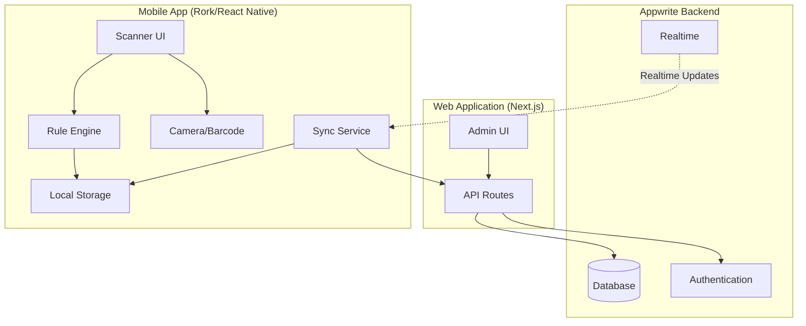
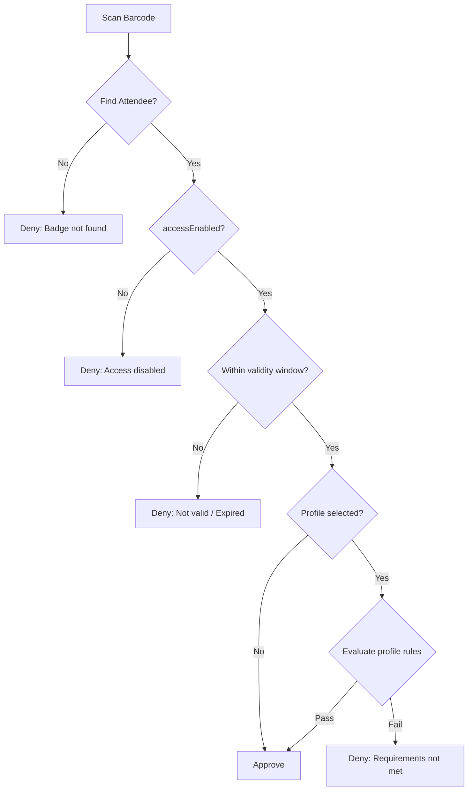

# Design Document: Mobile Access Control

## Overview

This design describes a mobile access control system that extends the existing credential.studio platform. The system enables event staff to scan attendee badges using a Rork-based mobile application (React Native/Expo) and determine entry approval based on configurable rule sets.

The architecture follows an offline-first approach where:
1. The web app manages access control settings and approval profiles
2. The mobile app syncs data locally and evaluates rules on-device
3. Scan logs are stored locally and uploaded when connectivity is available

## Architecture



### Key Design Decisions

1. **Separate Access Control Collection**: Access control fields are stored in a dedicated `access_control` collection linked to attendees by `attendeeId`, keeping the attendees collection clean.

2. **JSON Rule Definitions**: Approval profiles use a JSON-based rule structure that can be serialized, versioned, and evaluated offline.

3. **Offline-First Mobile**: The mobile app caches all necessary data locally and operates independently of network connectivity.

4. **Separate Scan Logs**: Scanner logs are stored in a dedicated `scan_logs` collection, separate from the existing system logs.

## Components and Interfaces

### Web Application Components

#### AccessControlForm Component
Extends the attendee form with access control fields:
- `validFrom` datetime picker
- `validUntil` datetime picker  
- `accessEnabled` toggle switch

#### ApprovalProfileManager Component
CRUD interface for approval profiles:
- Profile list with search/filter
- Profile editor with rule builder
- Rule condition builder (field, operator, value)
- AND/OR logic grouping

#### ScanLogsViewer Component
Dedicated view for scanner activity:
- Filterable log table
- Export functionality
- Device/operator filtering

### Mobile Application Components (Rork)

#### ScannerScreen
Main scanning interface:
- Camera viewfinder with barcode overlay
- Profile selector dropdown
- Sync status indicator

#### ResultScreen
Approval/denial display:
- Green/red full-screen result
- Attendee photo and name
- Denial reason (if applicable)
- Quick return to scanner

#### SyncService
Background data synchronization:
- Initial full sync on login
- Delta sync on reconnection
- Photo caching
- Log upload queue

#### RuleEngine
Local rule evaluation:
- Profile rule parsing
- Field value extraction
- Operator evaluation
- AND/OR logic processing

### API Endpoints

#### Access Control APIs

```typescript
// GET /api/access-control/[attendeeId]
// Returns access control record for an attendee

// PUT /api/access-control/[attendeeId]
// Updates access control settings

// POST /api/access-control/bulk
// Bulk update access control for multiple attendees
```

#### Approval Profile APIs

```typescript
// GET /api/approval-profiles
// Returns all profiles with version info

// GET /api/approval-profiles/[id]
// Returns single profile with full rule structure

// POST /api/approval-profiles
// Creates new profile

// PUT /api/approval-profiles/[id]
// Updates profile (increments version)

// DELETE /api/approval-profiles/[id]
// Soft deletes profile
```

#### Mobile Sync APIs

```typescript
// GET /api/mobile/sync/attendees?since={timestamp}
// Returns attendees modified since timestamp
// Includes access control data and photo URLs

// GET /api/mobile/sync/profiles?versions={json}
// Returns profiles newer than provided versions

// POST /api/mobile/scan-logs
// Uploads batch of scan logs
```

## Data Models

### Access Control Collection

```typescript
interface AccessControl {
  $id: string;
  attendeeId: string;        // Reference to attendee
  accessEnabled: boolean;    // Default: true
  validFrom: string | null;  // ISO datetime, null = always valid
  validUntil: string | null; // ISO datetime, null = never expires
  $createdAt: string;
  $updatedAt: string;
}
```

### Approval Profile Collection

```typescript
interface ApprovalProfile {
  $id: string;
  name: string;              // Unique name
  description: string | null;
  version: number;           // Increments on each save
  rules: string;             // JSON-serialized RuleGroup
  isDeleted: boolean;        // Soft delete flag
  $createdAt: string;
  $updatedAt: string;
}

// Rule structure (serialized to JSON)
interface RuleGroup {
  logic: 'AND' | 'OR';
  conditions: (Rule | RuleGroup)[];
}

interface Rule {
  field: string;             // Field path (e.g., "firstName", "customFields.vipStatus")
  operator: RuleOperator;
  value: any;                // Comparison value(s)
}

type RuleOperator = 
  | 'equals' 
  | 'not_equals'
  | 'in_list'
  | 'not_in_list'
  | 'greater_than'
  | 'less_than'
  | 'between'
  | 'is_true'
  | 'is_false'
  | 'is_empty'
  | 'is_not_empty';
```

### Scan Logs Collection

```typescript
interface ScanLog {
  $id: string;
  attendeeId: string | null;  // Null if barcode not found
  barcodeScanned: string;
  result: 'approved' | 'denied';
  denialReason: string | null;
  profileId: string | null;   // Profile used for evaluation
  profileVersion: number | null;
  deviceId: string;           // Unique device identifier
  operatorId: string;         // User who performed scan
  scannedAt: string;          // ISO datetime
  uploadedAt: string | null;  // When synced to server
  $createdAt: string;
}
```

### Mobile Local Data Models

```typescript
// Cached attendee with access control
interface CachedAttendee {
  id: string;
  firstName: string;
  lastName: string;
  barcodeNumber: string;
  photoUrl: string | null;
  photoLocalPath: string | null;  // Local cached photo
  customFieldValues: Record<string, any>;
  accessEnabled: boolean;
  validFrom: string | null;
  validUntil: string | null;
  lastSynced: string;
}

// Pending scan log for upload
interface PendingScanLog {
  localId: string;
  attendeeId: string | null;
  barcodeScanned: string;
  result: 'approved' | 'denied';
  denialReason: string | null;
  profileId: string | null;
  profileVersion: number | null;
  scannedAt: string;
}
```

## Rule Engine Design

### Evaluation Flow



### Operator Implementations

```typescript
function evaluateRule(rule: Rule, attendee: CachedAttendee): boolean {
  const value = getFieldValue(attendee, rule.field);
  
  switch (rule.operator) {
    case 'equals':
      return value === rule.value;
    case 'not_equals':
      return value !== rule.value;
    case 'in_list':
      return rule.value.some(v => 
        String(v).toLowerCase() === String(value).toLowerCase()
      );
    case 'not_in_list':
      return !rule.value.some(v => 
        String(v).toLowerCase() === String(value).toLowerCase()
      );
    case 'greater_than':
      return value > rule.value;
    case 'less_than':
      return value < rule.value;
    case 'between':
      return value >= rule.value[0] && value <= rule.value[1];
    case 'is_true':
      return value === true;
    case 'is_false':
      return value === false;
    case 'is_empty':
      return value === null || value === undefined || value === '';
    case 'is_not_empty':
      return value !== null && value !== undefined && value !== '';
  }
}

function evaluateRuleGroup(group: RuleGroup, attendee: CachedAttendee): boolean {
  const results = group.conditions.map(condition => {
    if ('logic' in condition) {
      return evaluateRuleGroup(condition, attendee);
    }
    return evaluateRule(condition, attendee);
  });
  
  if (group.logic === 'AND') {
    return results.every(r => r);
  }
  return results.some(r => r);
}
```

### Date/Time Handling

All datetime values are stored and compared in UTC:

```typescript
function isWithinValidityWindow(
  validFrom: string | null,
  validUntil: string | null
): boolean {
  const now = new Date();
  
  if (validFrom) {
    const from = new Date(validFrom);
    if (now < from) return false;
  }
  
  if (validUntil) {
    const until = new Date(validUntil);
    if (now > until) return false;
  }
  
  return true;
}
```

## Correctness Properties

*A property is a characteristic or behavior that should hold true across all valid executions of a system-essentially, a formal statement about what the system should do. Properties serve as the bridge between human-readable specifications and machine-verifiable correctness guarantees.*

Based on the prework analysis, the following properties must be verified through property-based testing:

### Property 1: UTC datetime storage
*For any* datetime input for validFrom or validUntil, the stored value SHALL be in UTC format.
**Validates: Requirements 1.2, 1.3**

### Property 2: Date validation constraint
*For any* pair of validFrom and validUntil dates where validFrom > validUntil, validation SHALL fail.
**Validates: Requirements 1.6**

### Property 3: Disabled access denial
*For any* attendee with accessEnabled=false, regardless of validFrom, validUntil, or profile rules, the scan result SHALL be denied with reason "Access disabled".
**Validates: Requirements 2.3, 2.4**

### Property 4: Profile name uniqueness
*For any* profile creation attempt with a name that already exists, the operation SHALL fail with a uniqueness error.
**Validates: Requirements 3.2**

### Property 5: Profile version increment
*For any* profile save operation, the resulting version number SHALL be greater than the previous version.
**Validates: Requirements 3.6, 4.1**

### Property 6: Profile sync version comparison
*For any* server profile version greater than local version, sync SHALL update the local profile.
**Validates: Requirements 4.2, 4.3**

### Property 7: Barcode lookup performance
*For any* barcode scan, the attendee lookup SHALL complete within 500 milliseconds.
**Validates: Requirements 7.2**

### Property 8: Approval evaluation completeness
*For any* attendee where accessEnabled=true AND current time is within validity window AND all profile rules pass, the result SHALL be approved.
**Validates: Requirements 7.4**

### Property 9: Denial reason priority
*For any* scan with multiple failure conditions, the denial reason SHALL follow priority order: accessEnabled, validity dates, profile rules.
**Validates: Requirements 8.5**

### Property 10: Default validation without profile
*For any* scan without a selected profile, only accessEnabled and validity dates SHALL be evaluated.
**Validates: Requirements 9.4**

### Property 11: Scan log completeness
*For any* badge scan, a log record SHALL be created containing timestamp, barcode, result, profile used, and denial reason if applicable.
**Validates: Requirements 10.1**

### Property 12: AND logic evaluation
*For any* rule group with AND logic, the result SHALL be true only if all conditions are true.
**Validates: Requirements 11.1**

### Property 13: OR logic evaluation
*For any* rule group with OR logic, the result SHALL be true if at least one condition is true.
**Validates: Requirements 11.2**

### Property 14: Nested rule evaluation order
*For any* nested rule groups, inner groups SHALL be evaluated before outer logic is applied.
**Validates: Requirements 11.3**

### Property 15: Null field handling
*For any* null or missing field value, equality checks SHALL fail and is_empty checks SHALL pass.
**Validates: Requirements 11.4**

### Property 16: UTC date comparison
*For any* date comparison in rules, both values SHALL be converted to UTC before comparison.
**Validates: Requirements 11.5**

### Property 17: Case-insensitive list matching
*For any* in_list rule evaluation, string matching SHALL be case-insensitive.
**Validates: Requirements 11.6**

### Property 18: Profile serialization round-trip
*For any* valid approval profile, serializing to JSON then deserializing SHALL produce an equivalent rule structure.
**Validates: Requirements 12.5**

## Error Handling

### Web Application Errors

| Error Scenario | Handling |
|----------------|----------|
| Invalid date range | Display validation error, prevent save |
| Duplicate profile name | Display error message with existing profile name |
| Profile in use (delete) | Soft delete only, show warning |
| API timeout | Retry with exponential backoff, show error toast |

### Mobile Application Errors

| Error Scenario | Handling |
|----------------|----------|
| Barcode not found | Red screen with "Badge not found" |
| Network unavailable | Continue with cached data, show offline indicator |
| Sync failure | Retry in background, show last sync time |
| Camera permission denied | Show permission request dialog |
| Storage full | Alert user, prevent new photo caching |

### Denial Reason Messages

```typescript
const DENIAL_MESSAGES = {
  ACCESS_DISABLED: 'Access disabled',
  NOT_YET_VALID: 'Badge not yet valid (valid from: {date})',
  EXPIRED: 'Badge has expired (expired: {date})',
  REQUIREMENTS_NOT_MET: 'Access requirements not met: {rule}',
  NOT_FOUND: 'Badge not found',
};
```

## Testing Strategy

### Dual Testing Approach

This feature requires both unit tests and property-based tests:

- **Unit tests**: Verify specific examples, edge cases, and integration points
- **Property-based tests**: Verify universal properties across all valid inputs

### Property-Based Testing Framework

Use **fast-check** for TypeScript property-based testing. Each property test should run a minimum of 100 iterations.

### Unit Test Coverage

1. **API Routes**
   - Access control CRUD operations
   - Profile CRUD with version increment
   - Sync endpoints with delta logic
   - Scan log upload

2. **Rule Engine**
   - Each operator implementation
   - AND/OR logic combinations
   - Nested rule groups
   - Edge cases (null values, empty strings)

3. **Components**
   - AccessControlForm validation
   - ApprovalProfileManager rule builder
   - ScanLogsViewer filtering

### Property-Based Test Coverage

Each correctness property from the design must have a corresponding property-based test:

```typescript
// Example: Property 12 - AND logic evaluation
// **Feature: mobile-access-control, Property 12: AND logic evaluation**
test.prop([ruleGroupArb, attendeeArb])('AND logic requires all conditions true', 
  (ruleGroup, attendee) => {
    if (ruleGroup.logic !== 'AND') return true;
    
    const result = evaluateRuleGroup(ruleGroup, attendee);
    const individualResults = ruleGroup.conditions.map(c => 
      'logic' in c ? evaluateRuleGroup(c, attendee) : evaluateRule(c, attendee)
    );
    
    return result === individualResults.every(r => r);
  }
);
```

### Integration Tests

1. **Full scan flow**: Barcode → lookup → evaluate → result
2. **Sync flow**: Login → full sync → delta sync → offline operation
3. **Profile lifecycle**: Create → edit → version increment → sync to mobile


## Mobile Integration Guide

This section provides complete API specifications for mobile app developers to integrate with the access control system.

### Authentication

The mobile app authenticates using Appwrite's authentication system. The web portal uses the same Appwrite project, so mobile apps can authenticate directly with Appwrite.

#### Authentication Flow

1. **Initial Login**: User enters email/password credentials
2. **Create Session**: Call Appwrite's `account.createEmailPasswordSession()`
3. **Store Session**: Appwrite SDK handles session token storage
4. **Refresh**: Appwrite SDK automatically refreshes sessions

```typescript
// Appwrite Configuration (same project as web app)
const APPWRITE_ENDPOINT = 'https://cloud.appwrite.io/v1';
const APPWRITE_PROJECT_ID = '<project-id>';  // Same as web app

// Initialize Appwrite Client
import { Client, Account, Databases } from 'appwrite';

const client = new Client()
  .setEndpoint(APPWRITE_ENDPOINT)
  .setProject(APPWRITE_PROJECT_ID);

const account = new Account(client);
const databases = new Databases(client);

// Login
async function login(email: string, password: string) {
  const session = await account.createEmailPasswordSession(email, password);
  return session;
}

// Check if logged in
async function getCurrentUser() {
  try {
    return await account.get();
  } catch {
    return null;
  }
}

// Logout
async function logout() {
  await account.deleteSession('current');
}
```

#### Authorization

Users must have appropriate role permissions to access scanner functionality. The mobile app should verify the user has scanner permissions after login.

### API Endpoints

All endpoints are Next.js API routes. Base URL: `https://<your-domain>/api`

---

#### 1. Get Attendees for Sync

Downloads attendee data including access control fields for local caching.

**Endpoint**: `GET /api/mobile/sync/attendees`

**Query Parameters**:
| Parameter | Type | Required | Description |
|-----------|------|----------|-------------|
| `since` | ISO 8601 datetime | No | Only return records modified after this timestamp. Omit for full sync. |
| `limit` | number | No | Max records to return (default: 1000, max: 5000) |
| `offset` | number | No | Pagination offset (default: 0) |

**Request Headers**:
```
Authorization: Bearer <appwrite-session-token>
Content-Type: application/json
```

**Response** (200 OK):
```json
{
  "success": true,
  "data": {
    "attendees": [
      {
        "id": "att_abc123",
        "firstName": "John",
        "lastName": "Doe",
        "barcodeNumber": "1234567890",
        "photoUrl": "https://res.cloudinary.com/.../photo.jpg",
        "customFieldValues": {
          "credentialType": "VIP",
          "company": "Acme Corp",
          "backstageAccess": true
        },
        "accessControl": {
          "accessEnabled": true,
          "validFrom": "2025-01-15T08:00:00.000Z",
          "validUntil": "2025-01-17T23:59:59.000Z"
        },
        "updatedAt": "2025-01-10T14:30:00.000Z"
      }
    ],
    "pagination": {
      "total": 1500,
      "limit": 1000,
      "offset": 0,
      "hasMore": true
    },
    "syncTimestamp": "2025-01-10T15:00:00.000Z"
  }
}
```

**Response Fields**:
| Field | Type | Description |
|-------|------|-------------|
| `id` | string | Unique attendee identifier |
| `firstName` | string | Attendee first name |
| `lastName` | string | Attendee last name |
| `barcodeNumber` | string | Unique barcode value printed on badge |
| `photoUrl` | string \| null | URL to attendee photo (Cloudinary) |
| `customFieldValues` | object | Key-value pairs of custom field data |
| `accessControl.accessEnabled` | boolean | Whether access is enabled |
| `accessControl.validFrom` | string \| null | ISO datetime when badge becomes valid |
| `accessControl.validUntil` | string \| null | ISO datetime when badge expires |
| `updatedAt` | string | Last modification timestamp |

**Error Responses**:
- `401 Unauthorized`: Invalid or expired session
- `403 Forbidden`: User lacks scanner permissions
- `500 Internal Server Error`: Server error

---

#### 2. Get Approval Profiles

Downloads approval profiles for local rule evaluation.

**Endpoint**: `GET /api/mobile/sync/profiles`

**Query Parameters**:
| Parameter | Type | Required | Description |
|-----------|------|----------|-------------|
| `versions` | JSON string | No | Object mapping profile IDs to local versions. Returns only profiles with newer versions. |

**Example Request**:
```
GET /api/mobile/sync/profiles?versions={"prof_123":2,"prof_456":1}
```

**Response** (200 OK):
```json
{
  "success": true,
  "data": {
    "profiles": [
      {
        "id": "prof_abc123",
        "name": "General Admission",
        "description": "Standard entry for all attendees",
        "version": 3,
        "rules": {
          "logic": "AND",
          "conditions": [
            {
              "field": "customFieldValues.credentialType",
              "operator": "in_list",
              "value": ["General", "VIP", "Staff"]
            }
          ]
        },
        "isDeleted": false,
        "updatedAt": "2025-01-10T12:00:00.000Z"
      },
      {
        "id": "prof_def456",
        "name": "VIP Backstage",
        "description": "VIP access to backstage areas",
        "version": 2,
        "rules": {
          "logic": "AND",
          "conditions": [
            {
              "field": "customFieldValues.credentialType",
              "operator": "equals",
              "value": "VIP"
            },
            {
              "field": "customFieldValues.backstageAccess",
              "operator": "is_true",
              "value": null
            }
          ]
        },
        "isDeleted": false,
        "updatedAt": "2025-01-09T16:30:00.000Z"
      }
    ],
    "syncTimestamp": "2025-01-10T15:00:00.000Z"
  }
}
```

**Rule Structure**:
```typescript
interface RuleGroup {
  logic: 'AND' | 'OR';
  conditions: (Rule | RuleGroup)[];
}

interface Rule {
  field: string;      // Dot notation for nested fields
  operator: string;   // See operator list below
  value: any;         // Comparison value(s)
}
```

**Supported Operators**:
| Operator | Value Type | Description |
|----------|------------|-------------|
| `equals` | any | Field equals value |
| `not_equals` | any | Field does not equal value |
| `in_list` | array | Field value is in the list (case-insensitive for strings) |
| `not_in_list` | array | Field value is not in the list |
| `greater_than` | number/date | Field is greater than value |
| `less_than` | number/date | Field is less than value |
| `between` | [min, max] | Field is between min and max (inclusive) |
| `is_true` | null | Field is boolean true |
| `is_false` | null | Field is boolean false |
| `is_empty` | null | Field is null, undefined, or empty string |
| `is_not_empty` | null | Field has a value |

**Field Path Examples**:
- `firstName` - Core attendee field
- `lastName` - Core attendee field
- `customFieldValues.credentialType` - Custom field
- `customFieldValues.backstageAccess` - Custom boolean field

---

#### 3. Upload Scan Logs

Uploads scan log records from the mobile device.

**Endpoint**: `POST /api/mobile/scan-logs`

**Request Body**:
```json
{
  "logs": [
    {
      "localId": "local_uuid_123",
      "attendeeId": "att_abc123",
      "barcodeScanned": "1234567890",
      "result": "approved",
      "denialReason": null,
      "profileId": "prof_abc123",
      "profileVersion": 3,
      "deviceId": "device_xyz789",
      "scannedAt": "2025-01-15T09:30:45.000Z"
    },
    {
      "localId": "local_uuid_124",
      "attendeeId": "att_def456",
      "barcodeScanned": "0987654321",
      "result": "denied",
      "denialReason": "Access disabled",
      "profileId": "prof_abc123",
      "profileVersion": 3,
      "deviceId": "device_xyz789",
      "scannedAt": "2025-01-15T09:31:12.000Z"
    }
  ]
}
```

**Request Fields**:
| Field | Type | Required | Description |
|-------|------|----------|-------------|
| `localId` | string | Yes | Unique ID generated on device (for deduplication) |
| `attendeeId` | string \| null | Yes | Attendee ID if found, null if barcode not found |
| `barcodeScanned` | string | Yes | The barcode value that was scanned |
| `result` | 'approved' \| 'denied' | Yes | Scan result |
| `denialReason` | string \| null | Yes | Reason for denial, null if approved |
| `profileId` | string \| null | Yes | Profile used for evaluation, null if none |
| `profileVersion` | number \| null | Yes | Version of profile used |
| `deviceId` | string | Yes | Unique device identifier |
| `scannedAt` | string | Yes | ISO datetime when scan occurred |

**Response** (200 OK):
```json
{
  "success": true,
  "data": {
    "received": 2,
    "duplicates": 0,
    "errors": []
  }
}
```

**Error Response** (400 Bad Request):
```json
{
  "success": false,
  "error": {
    "code": "VALIDATION_ERROR",
    "message": "Invalid log format",
    "details": [
      { "index": 1, "field": "scannedAt", "message": "Invalid datetime format" }
    ]
  }
}
```

---

#### 4. Get Custom Fields Definition

Returns the custom field definitions for the event, so the mobile app knows what fields exist.

**Endpoint**: `GET /api/mobile/custom-fields`

**Response** (200 OK):
```json
{
  "success": true,
  "data": {
    "fields": [
      {
        "id": "cf_123",
        "fieldName": "Credential Type",
        "internalFieldName": "credentialType",
        "fieldType": "select",
        "fieldOptions": ["General", "VIP", "Staff", "Press"],
        "required": true
      },
      {
        "id": "cf_456",
        "fieldName": "Backstage Access",
        "internalFieldName": "backstageAccess",
        "fieldType": "boolean",
        "fieldOptions": null,
        "required": false
      },
      {
        "id": "cf_789",
        "fieldName": "Company",
        "internalFieldName": "company",
        "fieldType": "text",
        "fieldOptions": null,
        "required": false
      }
    ]
  }
}
```

---

### Data Format Assumptions

The mobile app can assume the following:

1. **Datetime Format**: All datetime values are ISO 8601 strings in UTC timezone (e.g., `2025-01-15T08:00:00.000Z`)

2. **Null Handling**: 
   - `null` values are explicitly returned (not omitted)
   - Empty strings are returned as `""`, not `null`

3. **Barcode Uniqueness**: Each `barcodeNumber` is unique across all attendees

4. **Photo URLs**: Photo URLs are Cloudinary URLs that support transformations. Append `/w_200,h_200,c_fill` for thumbnails.

5. **Custom Field Values**: Always stored as an object with string keys. Values can be strings, numbers, booleans, or arrays.

### Error Code Reference

| Code | HTTP Status | Description |
|------|-------------|-------------|
| `UNAUTHORIZED` | 401 | Session invalid or expired |
| `FORBIDDEN` | 403 | User lacks required permissions |
| `NOT_FOUND` | 404 | Resource not found |
| `VALIDATION_ERROR` | 400 | Request validation failed |
| `RATE_LIMITED` | 429 | Too many requests |
| `SERVER_ERROR` | 500 | Internal server error |

### Caching and Refresh Strategy

**Recommended Mobile Implementation**:

1. **Initial Sync**: On first login, perform full sync of all attendees and profiles

2. **Delta Sync**: On subsequent syncs, use `since` parameter with last sync timestamp

3. **Background Sync**: Sync every 5 minutes when online, or immediately on reconnection

4. **Stale Data Warning**: Show warning if last sync > 1 hour ago

5. **Photo Caching**: Download photos to local storage. Use Cloudinary thumbnail URLs for faster downloads.

6. **Log Upload**: Upload scan logs immediately when online, queue when offline

7. **Conflict Resolution**: Server data always wins. If local attendee data differs from server, replace with server version.

### Mobile Rule Evaluation Algorithm

```typescript
interface EvaluationResult {
  approved: boolean;
  denialReason: string | null;
}

function evaluateScan(
  barcode: string,
  attendees: Map<string, CachedAttendee>,
  profile: ApprovalProfile | null
): EvaluationResult {
  // Step 1: Find attendee by barcode
  const attendee = findAttendeeByBarcode(barcode, attendees);
  if (!attendee) {
    return { approved: false, denialReason: 'Badge not found' };
  }

  // Step 2: Check accessEnabled (highest priority)
  if (!attendee.accessEnabled) {
    return { approved: false, denialReason: 'Access disabled' };
  }

  // Step 3: Check validity window
  const now = new Date();
  
  if (attendee.validFrom) {
    const validFrom = new Date(attendee.validFrom);
    if (now < validFrom) {
      return { 
        approved: false, 
        denialReason: `Badge not yet valid (valid from: ${formatDate(validFrom)})` 
      };
    }
  }
  
  if (attendee.validUntil) {
    const validUntil = new Date(attendee.validUntil);
    if (now > validUntil) {
      return { 
        approved: false, 
        denialReason: `Badge has expired (expired: ${formatDate(validUntil)})` 
      };
    }
  }

  // Step 4: Evaluate profile rules (if profile selected)
  if (profile && profile.rules) {
    const rulesPass = evaluateRuleGroup(profile.rules, attendee);
    if (!rulesPass) {
      return { 
        approved: false, 
        denialReason: 'Access requirements not met' 
      };
    }
  }

  // All checks passed
  return { approved: true, denialReason: null };
}

function evaluateRuleGroup(group: RuleGroup, attendee: CachedAttendee): boolean {
  const results = group.conditions.map(condition => {
    if ('logic' in condition) {
      // Nested group - evaluate recursively
      return evaluateRuleGroup(condition as RuleGroup, attendee);
    }
    // Single rule
    return evaluateRule(condition as Rule, attendee);
  });

  if (group.logic === 'AND') {
    return results.every(r => r);
  }
  return results.some(r => r);
}

function evaluateRule(rule: Rule, attendee: CachedAttendee): boolean {
  const value = getFieldValue(attendee, rule.field);
  
  switch (rule.operator) {
    case 'equals':
      return value === rule.value;
    case 'not_equals':
      return value !== rule.value;
    case 'in_list':
      if (value === null || value === undefined) return false;
      return (rule.value as any[]).some(v => 
        String(v).toLowerCase() === String(value).toLowerCase()
      );
    case 'not_in_list':
      if (value === null || value === undefined) return true;
      return !(rule.value as any[]).some(v => 
        String(v).toLowerCase() === String(value).toLowerCase()
      );
    case 'greater_than':
      return value > rule.value;
    case 'less_than':
      return value < rule.value;
    case 'between':
      const [min, max] = rule.value as [any, any];
      return value >= min && value <= max;
    case 'is_true':
      return value === true;
    case 'is_false':
      return value === false;
    case 'is_empty':
      return value === null || value === undefined || value === '';
    case 'is_not_empty':
      return value !== null && value !== undefined && value !== '';
    default:
      return false;
  }
}

function getFieldValue(attendee: CachedAttendee, fieldPath: string): any {
  const parts = fieldPath.split('.');
  let value: any = attendee;
  
  for (const part of parts) {
    if (value === null || value === undefined) return null;
    value = value[part];
  }
  
  return value;
}
```

### Example Rork/React Native Prompts

Use these prompts when building the mobile app:

**Scanner Screen**:
> "Create a React Native screen with Expo Camera that scans barcodes. When a barcode is detected, look up the attendee in local SQLite storage, evaluate access rules, and navigate to either a green ApprovedScreen or red DeniedScreen based on the result."

**Sync Service**:
> "Create a sync service that fetches attendees from /api/mobile/sync/attendees and stores them in SQLite. Support delta sync using the 'since' parameter. Download attendee photos to local file storage."

**Rule Engine**:
> "Implement a rule evaluation engine that takes a RuleGroup JSON structure and an attendee object, and returns whether the attendee passes all rules. Support AND/OR logic, nested groups, and operators: equals, in_list, is_true, is_empty, etc."

**Offline Queue**:
> "Create a scan log queue that stores logs in SQLite when offline and uploads them to /api/mobile/scan-logs when connectivity returns. Handle duplicates using localId."
