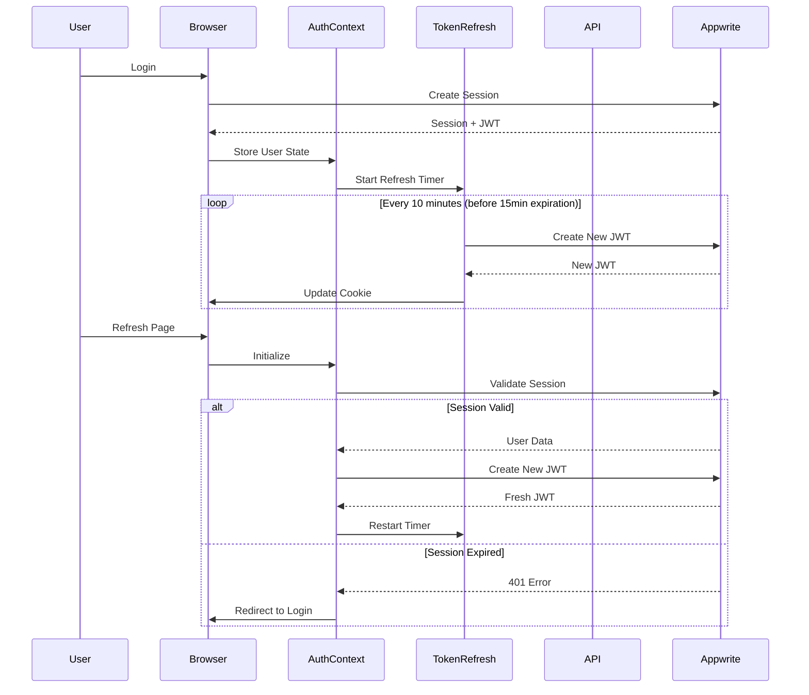
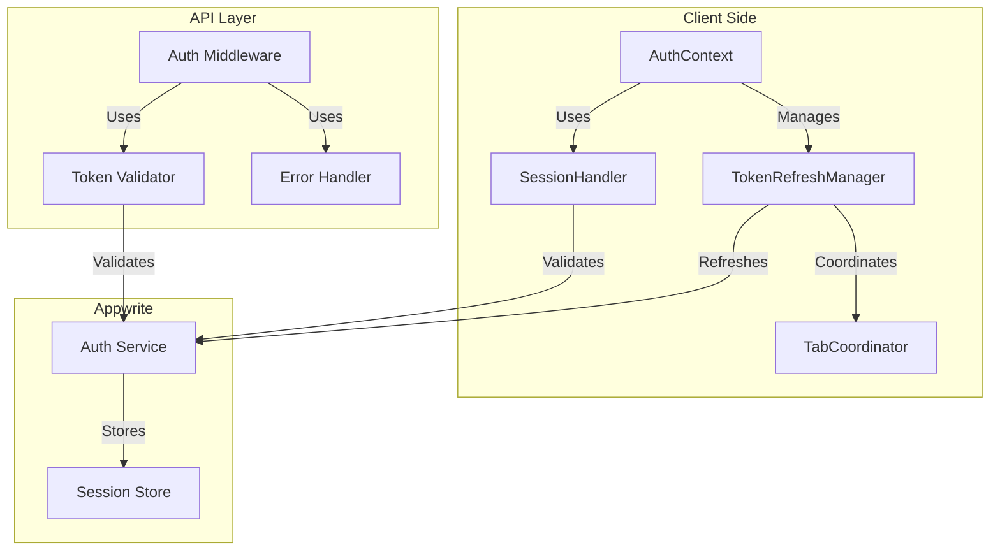

# Design Document

## Overview

This design implements a comprehensive session management solution for CredentialStudio to address JWT token expiration issues. The solution introduces automatic token refresh, session persistence, and graceful error handling while maintaining support for multiple concurrent sessions across different devices and browsers.

The core approach uses a combination of:
- **Client-side token refresh timer** that proactively refreshes JWT tokens before expiration
- **Session restoration logic** that validates and refreshes tokens on page load
- **API-level token validation** with consistent error handling
- **Cross-tab coordination** to prevent redundant refresh requests
- **Graceful degradation** with user notifications and session recovery

## Architecture

### High-Level Flow



### Component Architecture



## Components and Interfaces

### 1. TokenRefreshManager

A new utility class that manages automatic JWT token refresh.

**Location:** `src/lib/tokenRefresh.ts`

**Responsibilities:**
- Monitor JWT token expiration time
- Automatically refresh tokens before expiration
- Handle refresh failures with retry logic
- Coordinate with other browser tabs to prevent duplicate refreshes
- Emit events for token refresh success/failure

**Interface:**
```typescript
interface TokenRefreshConfig {
  refreshBeforeExpiry: number; // milliseconds before expiry to refresh (default: 5 minutes)
  retryAttempts: number; // number of retry attempts (default: 3)
  retryDelay: number; // base delay between retries in ms (default: 1000)
}

interface TokenRefreshManager {
  // Start the automatic refresh timer
  start(jwtExpiry: number): void;
  
  // Stop the refresh timer
  stop(): void;
  
  // Manually trigger a token refresh
  refresh(): Promise<boolean>;
  
  // Check if refresh is currently in progress
  isRefreshing(): boolean;
  
  // Get time until next refresh
  getTimeUntilRefresh(): number;
  
  // Register callback for refresh events
  onRefresh(callback: (success: boolean, error?: Error) => void): void;
}
```

**Key Methods:**

```typescript
class TokenRefreshManagerImpl implements TokenRefreshManager {
  private refreshTimer: NodeJS.Timeout | null = null;
  private isRefreshingFlag: boolean = false;
  private config: TokenRefreshConfig;
  private callbacks: Array<(success: boolean, error?: Error) => void> = [];
  
  constructor(config?: Partial<TokenRefreshConfig>) {
    this.config = {
      refreshBeforeExpiry: 5 * 60 * 1000, // 5 minutes
      retryAttempts: 3,
      retryDelay: 1000,
      ...config
    };
  }
  
  start(jwtExpiry: number): void {
    // Calculate when to refresh (5 minutes before expiry)
    const now = Date.now();
    const expiryTime = jwtExpiry * 1000; // Convert to milliseconds
    const refreshTime = expiryTime - this.config.refreshBeforeExpiry;
    const delay = Math.max(0, refreshTime - now);
    
    // Clear any existing timer
    this.stop();
    
    // Set new timer
    this.refreshTimer = setTimeout(() => {
      this.refresh();
    }, delay);
  }
  
  async refresh(): Promise<boolean> {
    if (this.isRefreshingFlag) {
      return false; // Already refreshing
    }
    
    this.isRefreshingFlag = true;
    
    for (let attempt = 0; attempt < this.config.retryAttempts; attempt++) {
      try {
        const { account } = createBrowserClient();
        const jwt = await account.createJWT();
        
        // Update cookie
        document.cookie = `appwrite-session=${jwt.jwt}; path=/; max-age=${60 * 60 * 24 * 7}; SameSite=Lax`;
        
        // Restart timer with new expiry
        this.start(Math.floor(Date.now() / 1000) + (15 * 60)); // 15 minutes from now
        
        // Notify callbacks
        this.callbacks.forEach(cb => cb(true));
        
        this.isRefreshingFlag = false;
        return true;
      } catch (error) {
        console.error(`Token refresh attempt ${attempt + 1} failed:`, error);
        
        if (attempt < this.config.retryAttempts - 1) {
          // Wait before retrying (exponential backoff)
          await new Promise(resolve => 
            setTimeout(resolve, this.config.retryDelay * Math.pow(2, attempt))
          );
        }
      }
    }
    
    // All attempts failed
    this.isRefreshingFlag = false;
    this.callbacks.forEach(cb => cb(false, new Error('Token refresh failed after all retries')));
    return false;
  }
  
  stop(): void {
    if (this.refreshTimer) {
      clearTimeout(this.refreshTimer);
      this.refreshTimer = null;
    }
  }
  
  isRefreshing(): boolean {
    return this.isRefreshingFlag;
  }
  
  getTimeUntilRefresh(): number {
    // Implementation to calculate time until next refresh
    return 0;
  }
  
  onRefresh(callback: (success: boolean, error?: Error) => void): void {
    this.callbacks.push(callback);
  }
}
```

### 2. TabCoordinator

Coordinates token refresh across multiple browser tabs to prevent duplicate requests.

**Location:** `src/lib/tabCoordinator.ts`

**Responsibilities:**
- Use BroadcastChannel API to communicate between tabs
- Ensure only one tab performs token refresh at a time
- Notify other tabs when refresh completes
- Handle tab closure and cleanup

**Interface:**
```typescript
interface TabCoordinator {
  // Request permission to refresh token
  requestRefresh(): Promise<boolean>;
  
  // Notify other tabs that refresh completed
  notifyRefreshComplete(success: boolean): void;
  
  // Listen for refresh events from other tabs
  onRefreshComplete(callback: (success: boolean) => void): void;
  
  // Cleanup resources
  cleanup(): void;
}
```

**Implementation:**
```typescript
class TabCoordinatorImpl implements TabCoordinator {
  private channel: BroadcastChannel;
  private isRefreshLeader: boolean = false;
  private callbacks: Array<(success: boolean) => void> = [];
  
  constructor() {
    this.channel = new BroadcastChannel('token-refresh');
    
    this.channel.onmessage = (event) => {
      if (event.data.type === 'refresh-complete') {
        this.callbacks.forEach(cb => cb(event.data.success));
      } else if (event.data.type === 'refresh-request') {
        // Another tab is requesting to refresh
        if (this.isRefreshLeader) {
          this.channel.postMessage({ type: 'refresh-denied' });
        }
      }
    };
  }
  
  async requestRefresh(): Promise<boolean> {
    return new Promise((resolve) => {
      const timeout = setTimeout(() => {
        // No response, assume we can proceed
        this.isRefreshLeader = true;
        resolve(true);
      }, 100);
      
      const handler = (event: MessageEvent) => {
        if (event.data.type === 'refresh-denied') {
          clearTimeout(timeout);
          this.channel.removeEventListener('message', handler);
          resolve(false);
        }
      };
      
      this.channel.addEventListener('message', handler);
      this.channel.postMessage({ type: 'refresh-request' });
    });
  }
  
  notifyRefreshComplete(success: boolean): void {
    this.channel.postMessage({ type: 'refresh-complete', success });
    this.isRefreshLeader = false;
  }
  
  onRefreshComplete(callback: (success: boolean) => void): void {
    this.callbacks.push(callback);
  }
  
  cleanup(): void {
    this.channel.close();
  }
}
```

### 3. Enhanced AuthContext

Update the existing AuthContext to integrate token refresh functionality.

**Location:** `src/contexts/AuthContext.tsx`

**Changes:**
- Add TokenRefreshManager instance
- Start token refresh on successful login
- Stop token refresh on logout
- Handle token refresh failures
- Restore session on page load with token refresh

**New Methods:**
```typescript
interface AuthContextType {
  // ... existing methods ...
  
  // New methods
  refreshToken(): Promise<boolean>;
  isTokenRefreshing(): boolean;
}
```

**Implementation Changes:**
```typescript
export const AuthProvider: React.FC<{ children: ReactNode }> = ({ children }) => {
  // ... existing state ...
  
  const [tokenRefreshManager] = useState(() => new TokenRefreshManagerImpl());
  const [tabCoordinator] = useState(() => new TabCoordinatorImpl());
  
  // Setup token refresh callbacks
  useEffect(() => {
    tokenRefreshManager.onRefresh((success, error) => {
      if (!success) {
        toast({
          variant: "destructive",
          title: "Session Expired",
          description: "Your session has expired. Please log in again.",
        });
        signOut();
      }
    });
    
    tabCoordinator.onRefreshComplete((success) => {
      if (!success) {
        signOut();
      }
    });
    
    return () => {
      tokenRefreshManager.stop();
      tabCoordinator.cleanup();
    };
  }, []);
  
  // Enhanced session initialization
  React.useEffect(() => {
    const fetchSession = async () => {
      try {
        const currentUser = await account.get();
        setUser(currentUser);
        
        // Fetch user profile
        const profile = await fetchUserProfile(currentUser.$id);
        setUserProfile(profile);
        
        // Create fresh JWT and start refresh timer
        const jwt = await account.createJWT();
        document.cookie = `appwrite-session=${jwt.jwt}; path=/; max-age=${60 * 60 * 24 * 7}; SameSite=Lax`;
        
        // Start token refresh (JWT expires in 15 minutes)
        const expiryTime = Math.floor(Date.now() / 1000) + (15 * 60);
        tokenRefreshManager.start(expiryTime);
        
      } catch (error) {
        // User not authenticated or session expired
        setUser(null);
        setUserProfile(null);
        tokenRefreshManager.stop();
      } finally {
        setInitializing(false);
      }
    };

    fetchSession();
  }, []);
  
  // Enhanced signIn
  const signIn = async (email: string, password: string) => {
    try {
      const session = await account.createEmailPasswordSession(email, password);
      const jwt = await account.createJWT();
      
      document.cookie = `appwrite-session=${jwt.jwt}; path=/; max-age=${60 * 60 * 24 * 7}; SameSite=Lax`;
      
      const currentUser = await account.get();
      setUser(currentUser);
      
      await createUserProfile(currentUser.$id, currentUser.email, currentUser.name);
      const profile = await fetchUserProfile(currentUser.$id);
      setUserProfile(profile);
      
      // Start token refresh
      const expiryTime = Math.floor(Date.now() / 1000) + (15 * 60);
      tokenRefreshManager.start(expiryTime);
      
      await logAuthEvent('auth_login', currentUser.$id, {
        email: currentUser.email,
        loginMethod: 'password',
        timestamp: new Date().toISOString()
      });
      
      toast({
        title: "Success",
        description: "You have successfully signed in",
      });
    } catch (error: any) {
      console.error('Sign in error:', error);
      toast({
        variant: "destructive",
        title: "Error",
        description: error.message || "Failed to sign in",
      });
      throw error;
    }
  };
  
  // Enhanced signOut
  const signOut = async () => {
    const currentUser = user;
    
    try {
      // Stop token refresh
      tokenRefreshManager.stop();
      
      if (currentUser) {
        try {
          await logAuthEvent('auth_logout', currentUser.$id, {
            email: currentUser.email,
            timestamp: new Date().toISOString()
          });
        } catch (logError) {
          console.error('Failed to log logout event:', logError);
        }
      }
      
      await account.deleteSession('current');
      document.cookie = 'appwrite-session=; path=/; expires=Thu, 01 Jan 1970 00:00:00 GMT';
      
      setUser(null);
      setUserProfile(null);
      
      toast({
        title: "Success",
        description: "You have successfully signed out",
      });
      
      router.push('/');
    } catch (error: any) {
      console.error('Sign out error:', error);
      toast({
        variant: "destructive",
        title: "Error",
        description: error.message || "Failed to sign out",
      });
    }
  };
  
  // New method to manually refresh token
  const refreshToken = async (): Promise<boolean> => {
    return await tokenRefreshManager.refresh();
  };
  
  const isTokenRefreshing = (): boolean => {
    return tokenRefreshManager.isRefreshing();
  };
  
  return (
    <AuthContext.Provider value={{
      user,
      userProfile,
      signIn,
      signUp,
      signInWithMagicLink,
      signInWithGoogle,
      signOut,
      resetPassword,
      updatePassword,
      initializing,
      refreshToken,
      isTokenRefreshing,
    }}>
      {children}
    </AuthContext.Provider>
  );
};
```

### 4. API Error Handler Utility

Create a centralized error handler for API routes to consistently handle authentication errors.

**Location:** `src/lib/apiErrorHandler.ts`

**Interface:**
```typescript
interface ApiError {
  code: number;
  type: string;
  message: string;
  tokenExpired?: boolean;
}

interface ErrorHandlerOptions {
  logError?: boolean;
  includeStack?: boolean;
}

function handleApiError(
  error: any,
  res: NextApiResponse,
  options?: ErrorHandlerOptions
): void;

function isTokenExpiredError(error: any): boolean;
```

**Implementation:**
```typescript
export function handleApiError(
  error: any,
  res: NextApiResponse,
  options: ErrorHandlerOptions = {}
): void {
  const { logError = true, includeStack = false } = options;
  
  if (logError) {
    console.error('API Error:', error);
  }
  
  // Check if it's a token expiration error
  if (isTokenExpiredError(error)) {
    return res.status(401).json({
      error: 'Token expired',
      code: 401,
      type: 'token_expired',
      message: 'Your session has expired. Please log in again.',
      tokenExpired: true
    });
  }
  
  // Check if it's an Appwrite authentication error
  if (error.code === 401 || error.type === 'user_jwt_invalid') {
    return res.status(401).json({
      error: 'Unauthorized',
      code: 401,
      type: error.type || 'unauthorized',
      message: error.message || 'Authentication required',
      tokenExpired: true
    });
  }
  
  // Generic error response
  return res.status(error.code || 500).json({
    error: error.message || 'Internal server error',
    code: error.code || 500,
    type: error.type || 'internal_error',
    ...(includeStack && process.env.NODE_ENV === 'development' && { stack: error.stack })
  });
}

export function isTokenExpiredError(error: any): boolean {
  return (
    error?.type === 'user_jwt_invalid' ||
    error?.message?.includes('JWT') ||
    error?.message?.includes('Expired') ||
    error?.message?.includes('token')
  );
}
```

### 5. API Route Middleware

Create a reusable middleware for API routes to handle authentication consistently.

**Location:** `src/lib/apiMiddleware.ts`

**Interface:**
```typescript
interface AuthenticatedRequest extends NextApiRequest {
  user: Models.User<Models.Preferences>;
  userProfile: UserProfile;
}

type ApiHandler = (
  req: AuthenticatedRequest,
  res: NextApiResponse
) => Promise<void> | void;

function withAuth(handler: ApiHandler): NextApiHandler;
```

**Implementation:**
```typescript
export function withAuth(handler: ApiHandler): NextApiHandler {
  return async (req: NextApiRequest, res: NextApiResponse) => {
    try {
      const { account, databases } = createSessionClient(req);
      
      // Verify authentication
      let user;
      try {
        user = await account.get();
      } catch (authError) {
        return handleApiError(authError, res);
      }
      
      // Fetch user profile
      const userDocs = await databases.listDocuments(
        process.env.NEXT_PUBLIC_APPWRITE_DATABASE_ID!,
        process.env.NEXT_PUBLIC_APPWRITE_USERS_COLLECTION_ID!,
        [Query.equal('userId', user.$id)]
      );
      
      if (userDocs.documents.length === 0) {
        return res.status(404).json({ error: 'User profile not found' });
      }
      
      const userProfile = userDocs.documents[0];
      
      // Get role if exists
      let role = null;
      if (userProfile.roleId) {
        try {
          const roleDoc = await databases.getDocument(
            process.env.NEXT_PUBLIC_APPWRITE_DATABASE_ID!,
            process.env.NEXT_PUBLIC_APPWRITE_ROLES_COLLECTION_ID!,
            userProfile.roleId
          );
          
          const permissions = typeof roleDoc.permissions === 'string' 
            ? JSON.parse(roleDoc.permissions) 
            : roleDoc.permissions;
          
          role = {
            id: roleDoc.$id,
            name: roleDoc.name,
            description: roleDoc.description,
            permissions: permissions
          };
        } catch (error) {
          console.warn('Failed to fetch role:', error);
        }
      }
      
      // Attach user and profile to request
      (req as AuthenticatedRequest).user = user;
      (req as AuthenticatedRequest).userProfile = {
        ...userProfile,
        role
      } as any;
      
      // Call the actual handler
      return await handler(req as AuthenticatedRequest, res);
      
    } catch (error) {
      return handleApiError(error, res);
    }
  };
}
```

## Data Models

No new database models are required. The solution works with existing Appwrite sessions and JWT tokens.

### JWT Token Structure

Appwrite JWTs contain:
```json
{
  "userId": "string",
  "sessionId": "string",
  "exp": 1234567890,
  "iat": 1234567890
}
```

### Session Cookie

```
Name: appwrite-session
Value: <JWT token string>
Path: /
Max-Age: 604800 (7 days)
SameSite: Lax
Secure: true (in production)
```

## Error Handling

### Client-Side Error Handling

**Token Refresh Failures:**
1. Retry up to 3 times with exponential backoff
2. If all retries fail, show toast notification
3. Log user out and redirect to login page
4. Preserve current URL for post-login redirect

**Session Restoration Failures:**
1. Clear invalid tokens from cookies
2. Reset authentication state
3. Redirect to login page
4. Show appropriate error message

**API Call Failures:**
1. Detect 401 errors with `tokenExpired: true`
2. Attempt one automatic token refresh
3. Retry the failed request
4. If still fails, trigger logout flow

### Server-Side Error Handling

**Token Validation Failures:**
1. Return 401 status code
2. Include `tokenExpired: true` flag
3. Provide clear error message
4. Log error for monitoring

**Appwrite Service Errors:**
1. Catch and wrap Appwrite exceptions
2. Return appropriate HTTP status codes
3. Include error type and message
4. Log errors with context

### Error Response Format

All API errors follow this format:
```typescript
{
  error: string;        // Human-readable error message
  code: number;         // HTTP status code
  type: string;         // Error type identifier
  tokenExpired?: boolean; // Flag for token expiration
  details?: any;        // Additional error details (dev only)
}
```

## Testing Strategy

### Unit Tests

**TokenRefreshManager Tests:**
- Test timer initialization and scheduling
- Test successful token refresh
- Test retry logic with failures
- Test callback notifications
- Test cleanup on stop

**TabCoordinator Tests:**
- Test BroadcastChannel communication
- Test refresh request coordination
- Test leader election
- Test cleanup

**API Middleware Tests:**
- Test successful authentication
- Test token expiration handling
- Test user profile fetching
- Test error responses

### Integration Tests

**Session Flow Tests:**
- Test login with token refresh start
- Test page refresh with session restoration
- Test logout with cleanup
- Test token refresh during active session

**Multi-Tab Tests:**
- Test token refresh coordination across tabs
- Test logout from one tab
- Test session persistence across tabs

**API Integration Tests:**
- Test API calls with valid tokens
- Test API calls with expired tokens
- Test automatic retry after token refresh
- Test error handling

### Manual Testing Scenarios

1. **Normal Session Flow:**
   - Login and verify token refresh starts
   - Wait 10 minutes and verify automatic refresh
   - Verify no interruption to user experience

2. **Page Refresh:**
   - Login and navigate to dashboard
   - Refresh page and verify session persists
   - Verify new JWT is created

3. **Token Expiration:**
   - Login and disable token refresh
   - Wait for token to expire (15 minutes)
   - Verify graceful logout and redirect

4. **Multi-Device:**
   - Login from two different browsers
   - Verify both sessions work independently
   - Logout from one, verify other remains active

5. **Network Failures:**
   - Login and simulate network interruption
   - Verify retry logic attempts refresh
   - Verify graceful handling if all retries fail

## Security Considerations

### Token Storage

- JWT tokens stored in cookies with `SameSite=Lax`
- Cookies should be `Secure` in production (HTTPS only)
- Consider `HttpOnly` flag, but requires server-side refresh mechanism
- Tokens have 7-day max age but refresh every 10 minutes

### Token Refresh Security

- Only refresh when user is authenticated
- Validate session exists before creating new JWT
- Rate limit refresh requests to prevent abuse
- Log all refresh attempts for monitoring

### Multi-Session Security

- Each session has independent JWT
- Refreshing one JWT doesn't affect others
- Logout only terminates current session
- Password change should invalidate all sessions (future enhancement)

### Error Message Security

- Don't expose sensitive information in error messages
- Use generic messages for authentication failures
- Log detailed errors server-side only
- Don't reveal token structure or expiration times

## Performance Considerations

### Token Refresh Timing

- Refresh 5 minutes before expiration (at 10-minute mark)
- Prevents race conditions with API calls
- Reduces risk of expired token errors
- Balances security with user experience

### Cross-Tab Coordination

- Use BroadcastChannel for efficient communication
- Fallback to localStorage events if BroadcastChannel unavailable
- Minimize redundant refresh requests
- Clean up resources on tab close

### API Performance

- Middleware adds minimal overhead (~10ms)
- User profile cached in request context
- Role information fetched once per request
- Consistent error handling reduces code duplication

## Deployment Considerations

### Environment Variables

No new environment variables required. Uses existing:
- `NEXT_PUBLIC_APPWRITE_ENDPOINT`
- `NEXT_PUBLIC_APPWRITE_PROJECT_ID`
- `NEXT_PUBLIC_APPWRITE_DATABASE_ID`
- `NEXT_PUBLIC_APPWRITE_USERS_COLLECTION_ID`
- `NEXT_PUBLIC_APPWRITE_ROLES_COLLECTION_ID`

### Browser Compatibility

- BroadcastChannel API: Chrome 54+, Firefox 38+, Safari 15.4+
- Fallback to localStorage events for older browsers
- Cookie API: Universal support
- Async/await: Universal support in modern browsers

### Monitoring and Logging

**Client-Side Logging:**
- Log token refresh attempts and results
- Log session restoration attempts
- Log authentication errors
- Use console.error for failures

**Server-Side Logging:**
- Log authentication failures with context
- Log token validation errors
- Log unusual patterns (multiple failures)
- Include user ID and timestamp

**Metrics to Track:**
- Token refresh success rate
- Token refresh failure reasons
- Average time between refreshes
- Session restoration success rate
- Authentication error frequency

## Migration Path

### Phase 1: Add Token Refresh Infrastructure
1. Create TokenRefreshManager utility
2. Create TabCoordinator utility
3. Add unit tests for utilities

### Phase 2: Update AuthContext
1. Integrate TokenRefreshManager
2. Update login flow to start refresh
3. Update logout flow to stop refresh
4. Add session restoration logic
5. Test client-side functionality

### Phase 3: Update API Routes
1. Create API middleware and error handler
2. Update critical API routes (profile, users, roles)
3. Test API error handling
4. Roll out to remaining API routes

### Phase 4: Testing and Refinement
1. Conduct integration testing
2. Perform manual testing scenarios
3. Monitor logs for issues
4. Adjust refresh timing if needed

### Phase 5: Documentation and Deployment
1. Update developer documentation
2. Create user-facing documentation
3. Deploy to staging environment
4. Monitor and validate
5. Deploy to production

## Future Enhancements

### Potential Improvements

1. **Refresh Token Pattern:**
   - Implement refresh tokens for longer sessions
   - Reduce JWT refresh frequency
   - Improve security with token rotation

2. **Session Management UI:**
   - Show active sessions to users
   - Allow users to revoke specific sessions
   - Display last activity per session

3. **Advanced Security:**
   - Implement device fingerprinting
   - Add suspicious activity detection
   - Require re-authentication for sensitive actions

4. **Performance Optimization:**
   - Implement token caching strategy
   - Reduce API calls with optimistic updates
   - Add request deduplication

5. **Offline Support:**
   - Handle offline scenarios gracefully
   - Queue requests when offline
   - Sync when connection restored
