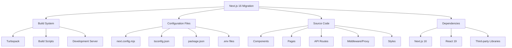

# Design Document: Next.js 16 Migration

## Overview

This design document outlines the comprehensive migration strategy for upgrading CredentialStudio from Next.js 15 to Next.js 16. The migration addresses critical Webpack minification issues by adopting Turbopack as the default bundler, while ensuring zero downtime and maintaining full backward compatibility with all existing features.

The migration follows a phased approach with extensive testing at each stage, leveraging automated codemods where possible and manual verification for critical components. The design prioritizes safety, rollback capability, and thorough documentation.

## Architecture

### Migration Phases

The migration is structured into six distinct phases, each with specific goals and validation criteria:

#### Phase 1: Pre-Migration Audit and Preparation
- Comprehensive codebase analysis
- Dependency compatibility verification
- Backup and rollback strategy establishment
- Performance baseline measurement

#### Phase 2: Dependency Upgrades
- Core framework updates (Next.js, React)
- Supporting library updates
- Type definition updates
- Dependency conflict resolution

#### Phase 3: Configuration Migration
- Next.js configuration updates
- Turbopack configuration
- Build script modifications
- Environment variable migration

#### Phase 4: Code Modernization
- Middleware to Proxy migration
- API route updates
- Component compatibility fixes
- Sass/CSS import updates

#### Phase 5: Testing and Validation
- Build verification
- Functional testing
- Performance benchmarking
- Integration testing

#### Phase 6: Cleanup and Documentation
- Legacy code removal
- Documentation updates
- Rollback procedure documentation
- Team knowledge transfer

### System Components Affected



### Turbopack Architecture

Turbopack replaces Webpack as the bundler with significant architectural differences:

**Key Differences:**
- Rust-based implementation for improved performance
- Incremental compilation with persistent caching
- Native support for modern JavaScript features
- Simplified configuration model
- Different loader and plugin system

**Compatibility Considerations:**
- Most Webpack loaders are not directly compatible
- Custom Webpack configurations need migration
- Some plugins may require alternatives
- Build output structure may differ

## Components and Interfaces

### 1. Build System Configuration

#### next.config.mjs Migration

**Current State (Next.js 15):**
```javascript
/** @type {import('next').NextConfig} */
const nextConfig = {
  reactStrictMode: true,
  images: {
    domains: ['images.unsplash.com', 'res.cloudinary.com'],
  },
  experimental: {
    turbopack: {
      // experimental settings
    },
  },
  // Potential webpack customizations
  webpack: (config, { isServer }) => {
    // Custom webpack config
    return config
  },
}

export default nextConfig
```

**Target State (Next.js 16):**
```javascript
/** @type {import('next').NextConfig} */
const nextConfig = {
  reactStrictMode: true,
  
  // Turbopack configuration (promoted from experimental)
  turbopack: {
    resolveAlias: {
      // Module aliases if needed
    },
    resolveExtensions: ['.mdx', '.tsx', '.ts', '.jsx', '.js', '.json'],
    rules: {
      // Custom loader rules if needed
    },
  },
  
  // Enable file system caching for development
  experimental: {
    turbopackFileSystemCacheForDev: true,
  },
  
  // Updated image configuration
  images: {
    remotePatterns: [
      {
        protocol: 'https',
        hostname: 'images.unsplash.com',
      },
      {
        protocol: 'https',
        hostname: 'res.cloudinary.com',
      },
    ],
    localPatterns: [
      {
        pathname: '/assets/**',
        search: '',
      },
    ],
    maximumRedirects: 3,
    imageSizes: [32, 48, 64, 96, 128, 256, 384], // 16 removed by default
  },
  
  // Webpack fallback (optional)
  // webpack: (config, { isServer }) => {
  //   return config
  // },
}

export default nextConfig
```

#### package.json Scripts

**Current State:**
```json
{
  "scripts": {
    "dev": "next dev",
    "build": "next build",
    "start": "next start",
    "lint": "next lint"
  }
}
```

**Target State:**
```json
{
  "scripts": {
    "dev": "next dev",
    "build": "next build",
    "build:webpack": "next build --webpack",
    "start": "next start",
    "lint": "next lint",
    "clean": "rm -rf .next"
  }
}
```

### 2. Middleware to Proxy Migration

**File Renaming:**
- `middleware.ts` → `proxy.ts`
- `middleware.js` → `proxy.js`

**Function Signature Update:**

**Before (Next.js 15):**
```typescript
import { NextResponse } from 'next/server'
import type { NextRequest } from 'next/server'

export function middleware(request: NextRequest) {
  // Middleware logic
  return NextResponse.next()
}

export const config = {
  matcher: '/api/:path*',
}
```

**After (Next.js 16):**
```typescript
import { NextResponse } from 'next/server'
import type { NextRequest } from 'next/server'

export function proxy(request: NextRequest) {
  // Proxy logic (unchanged)
  return NextResponse.next()
}

export const config = {
  matcher: '/api/:path*',
}
```

### 3. Environment Variable Migration

**Runtime Configuration Removal:**

**Before (Next.js 15):**
```javascript
// next.config.js
module.exports = {
  serverRuntimeConfig: {
    dbUrl: process.env.DATABASE_URL,
    apiSecret: process.env.API_SECRET,
  },
  publicRuntimeConfig: {
    apiUrl: '/api',
    cdnUrl: process.env.CDN_URL,
  },
}

// Usage in pages
import getConfig from 'next/config'

const { serverRuntimeConfig, publicRuntimeConfig } = getConfig()
const dbUrl = serverRuntimeConfig.dbUrl
```

**After (Next.js 16):**
```typescript
// Direct environment variable access
// Server-side (API routes, Server Components)
const dbUrl = process.env.DATABASE_URL
const apiSecret = process.env.API_SECRET

// Client-side (must use NEXT_PUBLIC_ prefix)
const cdnUrl = process.env.NEXT_PUBLIC_CDN_URL
const apiUrl = process.env.NEXT_PUBLIC_API_URL || '/api'
```

**Environment Variable Mapping:**
```
# .env.local
# Server-only variables (no prefix needed)
DATABASE_URL=...
API_SECRET=...
APPWRITE_API_KEY=...

# Client-accessible variables (NEXT_PUBLIC_ prefix required)
NEXT_PUBLIC_API_URL=/api
NEXT_PUBLIC_CDN_URL=...
NEXT_PUBLIC_APPWRITE_ENDPOINT=...
NEXT_PUBLIC_APPWRITE_PROJECT_ID=...
```

### 4. Sass/CSS Import Updates

**Tilde Import Removal:**

**Before:**
```scss
@import '~bootstrap/dist/css/bootstrap.min.css';
@import '~@/styles/variables';
```

**After (Option 1 - Preferred):**
```scss
@import 'bootstrap/dist/css/bootstrap.min.css';
@import '@/styles/variables';
```

**After (Option 2 - Compatibility Alias):**
```javascript
// next.config.mjs
export default {
  turbopack: {
    resolveAlias: {
      '~*': '*',
    },
  },
}
```

### 5. Image Configuration Updates

**Domain to Remote Patterns Migration:**

**Before:**
```javascript
images: {
  domains: ['images.unsplash.com', 'res.cloudinary.com'],
}
```

**After:**
```javascript
images: {
  remotePatterns: [
    {
      protocol: 'https',
      hostname: 'images.unsplash.com',
      port: '',
      pathname: '/**',
    },
    {
      protocol: 'https',
      hostname: 'res.cloudinary.com',
      port: '',
      pathname: '/**',
    },
  ],
}
```

### 6. TypeScript Configuration

**tsconfig.json Updates:**

```json
{
  "compilerOptions": {
    "target": "ES2017",
    "lib": ["dom", "dom.iterable", "esnext"],
    "allowJs": true,
    "skipLibCheck": true,
    "strict": true,
    "forceConsistentCasingInFileNames": true,
    "noEmit": true,
    "esModuleInterop": true,
    "module": "esnext",
    "moduleResolution": "bundler",
    "resolveJsonModule": true,
    "isolatedModules": true,
    "jsx": "preserve",
    "incremental": true,
    "plugins": [
      {
        "name": "next"
      }
    ],
    "paths": {
      "@/*": ["./src/*"]
    }
  },
  "include": ["next-env.d.ts", "**/*.ts", "**/*.tsx", ".next/types/**/*.ts"],
  "exclude": ["node_modules"]
}
```

## Data Models

### Migration State Tracking

```typescript
interface MigrationState {
  phase: 'audit' | 'dependencies' | 'configuration' | 'code' | 'testing' | 'cleanup'
  status: 'not_started' | 'in_progress' | 'completed' | 'failed'
  startTime: Date
  endTime?: Date
  errors: MigrationError[]
  warnings: MigrationWarning[]
  metrics: PerformanceMetrics
}

interface MigrationError {
  phase: string
  component: string
  message: string
  stack?: string
  severity: 'critical' | 'high' | 'medium' | 'low'
}

interface MigrationWarning {
  phase: string
  component: string
  message: string
  recommendation: string
}

interface PerformanceMetrics {
  before: {
    devServerStartup: number // milliseconds
    hmrSpeed: number // milliseconds
    buildTime: number // milliseconds
    bundleSize: number // bytes
  }
  after: {
    devServerStartup: number
    hmrSpeed: number
    buildTime: number
    bundleSize: number
  }
  improvement: {
    devServerStartup: number // percentage
    hmrSpeed: number // percentage
    buildTime: number // percentage
    bundleSize: number // percentage
  }
}
```

### Dependency Compatibility Matrix

```typescript
interface DependencyCompatibility {
  name: string
  currentVersion: string
  targetVersion: string
  compatible: boolean
  requiresUpdate: boolean
  breakingChanges: string[]
  migrationNotes: string
}

const compatibilityMatrix: DependencyCompatibility[] = [
  {
    name: 'next',
    currentVersion: '15.x',
    targetVersion: '16.x',
    compatible: true,
    requiresUpdate: true,
    breakingChanges: [
      'Turbopack is now default',
      'Middleware renamed to Proxy',
      'Runtime config removed',
    ],
    migrationNotes: 'Follow official upgrade guide',
  },
  {
    name: 'react',
    currentVersion: '18.x',
    targetVersion: '19.x',
    compatible: true,
    requiresUpdate: true,
    breakingChanges: ['New hooks behavior', 'Concurrent features'],
    migrationNotes: 'Update all React type definitions',
  },
  // Additional dependencies...
]
```

## Error Handling

### Migration Error Categories

#### 1. Build Errors
```typescript
class BuildError extends Error {
  constructor(
    message: string,
    public phase: string,
    public component: string,
    public recoverable: boolean
  ) {
    super(message)
    this.name = 'BuildError'
  }
}

// Example usage
try {
  await runBuild()
} catch (error) {
  if (error instanceof BuildError && error.recoverable) {
    // Attempt recovery
    await rollbackToWebpack()
  } else {
    // Critical error - full rollback
    await fullRollback()
  }
}
```

#### 2. Configuration Errors
```typescript
class ConfigurationError extends Error {
  constructor(
    message: string,
    public configFile: string,
    public invalidKeys: string[]
  ) {
    super(message)
    this.name = 'ConfigurationError'
  }
}

// Validation function
function validateNextConfig(config: any): ConfigurationError[] {
  const errors: ConfigurationError[] = []
  
  // Check for deprecated options
  if (config.serverRuntimeConfig) {
    errors.push(
      new ConfigurationError(
        'serverRuntimeConfig is deprecated',
        'next.config.mjs',
        ['serverRuntimeConfig']
      )
    )
  }
  
  if (config.images?.domains) {
    errors.push(
      new ConfigurationError(
        'images.domains is deprecated, use images.remotePatterns',
        'next.config.mjs',
        ['images.domains']
      )
    )
  }
  
  return errors
}
```

#### 3. Dependency Errors
```typescript
class DependencyError extends Error {
  constructor(
    message: string,
    public packageName: string,
    public requiredVersion: string,
    public currentVersion: string
  ) {
    super(message)
    this.name = 'DependencyError'
  }
}

// Dependency check
async function checkDependencies(): Promise<DependencyError[]> {
  const errors: DependencyError[] = []
  const packageJson = await readPackageJson()
  
  // Check Next.js version
  const nextVersion = packageJson.dependencies.next
  if (!nextVersion.startsWith('16.')) {
    errors.push(
      new DependencyError(
        'Next.js must be version 16.x',
        'next',
        '16.x',
        nextVersion
      )
    )
  }
  
  return errors
}
```

### Error Recovery Strategies

```typescript
interface RecoveryStrategy {
  errorType: string
  strategy: 'rollback' | 'retry' | 'skip' | 'manual'
  steps: string[]
  automaticRecovery: boolean
}

const recoveryStrategies: RecoveryStrategy[] = [
  {
    errorType: 'BuildError',
    strategy: 'rollback',
    steps: [
      'Stop build process',
      'Restore previous configuration',
      'Clear .next directory',
      'Rebuild with Webpack',
    ],
    automaticRecovery: true,
  },
  {
    errorType: 'DependencyConflict',
    strategy: 'manual',
    steps: [
      'Identify conflicting packages',
      'Check compatibility matrix',
      'Update or remove conflicting packages',
      'Retry installation',
    ],
    automaticRecovery: false,
  },
]
```

## Testing Strategy

### 1. Pre-Migration Testing

**Baseline Establishment:**
```bash
# Measure current performance
npm run build
# Record build time, bundle size

npm run dev
# Record dev server startup time

# Run existing tests
npx vitest --run
# Record test results
```

**Test Coverage Verification:**
- Ensure all critical paths have test coverage
- Identify untested areas that need manual verification
- Document test gaps for post-migration validation

### 2. Migration Testing Phases

#### Phase 1: Dependency Update Testing
```bash
# After updating dependencies
npm install
npm run build
npx vitest --run

# Verify no breaking changes
npm run dev
# Manual smoke test of key features
```

#### Phase 2: Configuration Testing
```bash
# After configuration changes
npm run clean
npm run build

# Verify Turbopack is being used
# Check build output for Turbopack indicators

# Test development mode
npm run dev
# Verify HMR works correctly
```

#### Phase 3: Code Migration Testing
```bash
# After code changes
npm run build
npx vitest --run

# Test specific migrations
# - Middleware/Proxy functionality
# - Environment variable access
# - Image optimization
# - Sass imports
```

### 3. Integration Testing

**Critical User Flows:**
1. Authentication
   - Login with email/password
   - Login with Google OAuth
   - Password reset
   - Session management

2. Attendee Management
   - Create attendee
   - Edit attendee
   - Delete attendee
   - Bulk operations
   - Photo upload
   - Credential generation

3. Event Configuration
   - Update event settings
   - Custom field management
   - Barcode configuration
   - Integration settings

4. Data Operations
   - Import attendees
   - Export attendees
   - Search and filter
   - Pagination

5. Role Management
   - Create/edit roles
   - Assign permissions
   - User assignment

**Test Matrix:**
```typescript
interface TestCase {
  feature: string
  scenario: string
  steps: string[]
  expectedResult: string
  actualResult?: string
  status: 'pass' | 'fail' | 'skip'
}

const testCases: TestCase[] = [
  {
    feature: 'Authentication',
    scenario: 'User login with email/password',
    steps: [
      'Navigate to /login',
      'Enter valid credentials',
      'Click login button',
      'Verify redirect to dashboard',
    ],
    expectedResult: 'User successfully logged in and redirected to dashboard',
    status: 'pass',
  },
  // Additional test cases...
]
```

### 4. Performance Testing

**Metrics to Measure:**
```typescript
interface PerformanceTest {
  metric: string
  before: number
  after: number
  unit: string
  improvement: number
  target: number
  passed: boolean
}

const performanceTests: PerformanceTest[] = [
  {
    metric: 'Dev Server Startup',
    before: 0, // To be measured
    after: 0, // To be measured
    unit: 'seconds',
    improvement: 0,
    target: 30, // 30% improvement target
    passed: false,
  },
  {
    metric: 'HMR Speed',
    before: 0,
    after: 0,
    unit: 'milliseconds',
    improvement: 0,
    target: 50, // 50% improvement target
    passed: false,
  },
  {
    metric: 'Production Build Time',
    before: 0,
    after: 0,
    unit: 'seconds',
    improvement: 0,
    target: 20, // 20% improvement target
    passed: false,
  },
  {
    metric: 'Bundle Size',
    before: 0,
    after: 0,
    unit: 'MB',
    improvement: 0,
    target: 0, // No regression
    passed: false,
  },
]
```

### 5. Rollback Testing

**Rollback Procedure Validation:**
```bash
# Test rollback capability
git checkout -b migration-test
# Perform migration
# ...
# Test rollback
git checkout main
npm install
npm run build
npm run dev
# Verify application works as before
```

## Rollback Strategy

### Rollback Triggers

Initiate rollback if any of the following occur:
1. Build fails after multiple retry attempts
2. Critical functionality is broken
3. Performance degrades significantly (>20% regression)
4. Third-party integrations fail
5. Data corruption or loss occurs
6. Security vulnerabilities are introduced

### Rollback Procedure

#### Step 1: Stop All Processes
```bash
# Stop development server
# Stop any running builds
# Close all terminals
```

#### Step 2: Restore Previous State
```bash
# Option A: Git rollback (if committed)
git reset --hard <pre-migration-commit>
git clean -fd

# Option B: Branch rollback
git checkout main
git branch -D migration-branch

# Option C: Backup restoration
cp -r ../backup/* .
```

#### Step 3: Reinstall Dependencies
```bash
# Clear node_modules and lock file
rm -rf node_modules package-lock.json

# Reinstall previous versions
npm install
```

#### Step 4: Verify Rollback
```bash
# Build application
npm run build

# Start development server
npm run dev

# Run tests
npx vitest --run

# Manual verification of key features
```

#### Step 5: Document Rollback
```markdown
# Rollback Report

## Date: [Date]
## Reason: [Reason for rollback]
## Phase: [Phase where rollback occurred]

### Issues Encountered:
1. [Issue 1]
2. [Issue 2]

### Rollback Steps Taken:
1. [Step 1]
2. [Step 2]

### Verification Results:
- Build: [Pass/Fail]
- Tests: [Pass/Fail]
- Manual Testing: [Pass/Fail]

### Next Steps:
1. [Action item 1]
2. [Action item 2]
```

## Migration Checklist

### Pre-Migration
- [ ] Create backup branch
- [ ] Document current state
- [ ] Measure baseline performance
- [ ] Run all existing tests
- [ ] Verify all features work
- [ ] Create rollback plan
- [ ] Notify team of migration

### Phase 1: Audit
- [ ] Audit all components
- [ ] Audit all pages
- [ ] Audit all API routes
- [ ] Audit all hooks
- [ ] Audit all utilities
- [ ] Check for deprecated patterns
- [ ] Document findings

### Phase 2: Dependencies
- [ ] Update Next.js to 16.x
- [ ] Update React to 19.x
- [ ] Update React-DOM to 19.x
- [ ] Update @types/react
- [ ] Update @types/react-dom
- [ ] Update eslint-config-next
- [ ] Check for dependency conflicts
- [ ] Run npm install
- [ ] Verify installation success

### Phase 3: Configuration
- [ ] Update next.config.mjs
- [ ] Configure Turbopack
- [ ] Migrate image configuration
- [ ] Remove runtime config
- [ ] Update environment variables
- [ ] Update package.json scripts
- [ ] Update tsconfig.json
- [ ] Verify configuration validity

### Phase 4: Code Migration
- [ ] Rename middleware to proxy
- [ ] Update middleware function
- [ ] Update Sass imports
- [ ] Migrate runtime config usage
- [ ] Update environment variable access
- [ ] Fix any TypeScript errors
- [ ] Update deprecated APIs

### Phase 5: Testing
- [ ] Run production build
- [ ] Run development build
- [ ] Run all tests
- [ ] Test authentication flows
- [ ] Test attendee management
- [ ] Test event configuration
- [ ] Test data operations
- [ ] Test role management
- [ ] Measure performance
- [ ] Compare with baseline

### Phase 6: Cleanup
- [ ] Remove old middleware file
- [ ] Remove Webpack configs
- [ ] Remove deprecated code
- [ ] Remove backup files
- [ ] Clean .next directory
- [ ] Update documentation
- [ ] Document changes
- [ ] Create migration guide

### Post-Migration
- [ ] Monitor production
- [ ] Gather team feedback
- [ ] Document lessons learned
- [ ] Update team knowledge base
- [ ] Archive migration artifacts

## Risk Assessment

### High Risk Areas

1. **Third-Party Integrations**
   - Risk: Appwrite SDK compatibility
   - Mitigation: Test thoroughly, have fallback plan
   - Impact: Critical - affects all backend operations

2. **Custom Webpack Configurations**
   - Risk: May not translate to Turbopack
   - Mitigation: Identify early, find alternatives
   - Impact: High - may block migration

3. **Image Optimization**
   - Risk: Cloudinary integration issues
   - Mitigation: Test image uploads extensively
   - Impact: High - affects credential generation

4. **Environment Variables**
   - Risk: Missing or incorrect variables
   - Mitigation: Comprehensive mapping and testing
   - Impact: Critical - affects all environments

### Medium Risk Areas

1. **Sass/CSS Imports**
   - Risk: Tilde imports may break
   - Mitigation: Use resolveAlias as fallback
   - Impact: Medium - affects styling

2. **TypeScript Compatibility**
   - Risk: Type conflicts with React 19
   - Mitigation: Update all type definitions
   - Impact: Medium - affects development experience

3. **Build Performance**
   - Risk: May not see expected improvements
   - Mitigation: Measure and optimize
   - Impact: Low - doesn't affect functionality

### Low Risk Areas

1. **Component Updates**
   - Risk: React 19 breaking changes
   - Mitigation: Most changes are backward compatible
   - Impact: Low - minimal changes expected

2. **API Routes**
   - Risk: Compatibility issues
   - Mitigation: Pages Router is stable
   - Impact: Low - well-tested pattern

## Success Criteria

The migration is considered successful when:

1. **Build Success**
   - Production build completes without errors
   - Development server starts without errors
   - All TypeScript compilation succeeds

2. **Functional Parity**
   - All existing features work as before
   - No regressions in functionality
   - All tests pass

3. **Performance Improvement**
   - Dev server startup time improves by ≥20%
   - HMR speed improves by ≥30%
   - Build time improves by ≥15%
   - Bundle size does not increase

4. **Code Quality**
   - No new linting errors
   - No new TypeScript errors
   - Code follows Next.js 16 best practices

5. **Documentation**
   - All changes documented
   - Migration guide created
   - Rollback procedure tested
   - Team trained on changes

## Timeline Estimate

- **Phase 1 (Audit)**: 1-2 days
- **Phase 2 (Dependencies)**: 1 day
- **Phase 3 (Configuration)**: 1-2 days
- **Phase 4 (Code Migration)**: 2-3 days
- **Phase 5 (Testing)**: 2-3 days
- **Phase 6 (Cleanup)**: 1 day

**Total Estimated Time**: 8-12 days

**Note**: Timeline assumes no major blockers. Complex issues may extend timeline.
