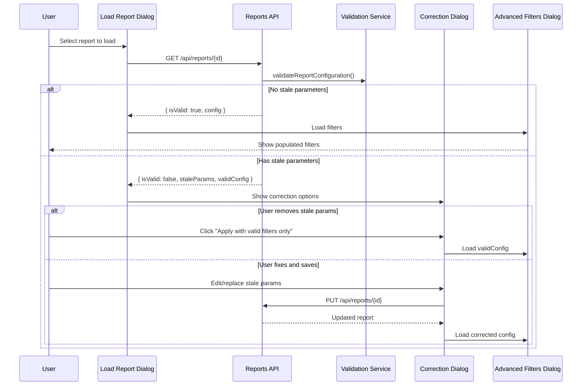

# Design Document: Saved Reports Feature

## Overview

The Saved Reports feature enables users to persist, recall, and manage complex search filter configurations within the Advanced Filters dialog. This design integrates seamlessly with the existing filter infrastructure, Appwrite database, and role-based permissions system.

The feature follows a "saved filters" paradigm where a report is fundamentally a serialized filter configuration that can be loaded back into the Advanced Filters dialog. This approach maintains a clear separation of concerns: reports handle filter persistence, while the existing Export dialog handles data extraction.

Key design goals:
- Minimal disruption to existing Advanced Filters dialog workflow
- Robust error handling for stale parameters (deleted custom fields)
- Integration with existing permissions system
- Clean data model that supports future enhancements

## Architecture

```mermaid
flowchart TB
    subgraph UI["UI Layer"]
        AFD[Advanced Filters Dialog]
        SRD[Save Report Dialog]
        LRD[Load Report Dialog]
        RCD[Report Correction Dialog]
    end
    
    subgraph Hooks["React Hooks"]
        UR[useReports Hook]
    end
    
    subgraph Utils["Utilities"]
        VRC[validateReportConfiguration]
    end
    
    subgraph API["API Layer"]
        RA[/api/reports/]
        RAI[/api/reports/[id]/]
    end
    
    subgraph Services["Service Layer"]
        RS[ReportService]
        RVS[ReportValidationService]
    end
    
    subgraph Data["Data Layer"]
        AW[(Appwrite Database)]
        RC[Reports Collection]
    end
    
    AFD --> SRD
    AFD --> LRD
    LRD --> RCD
    
    SRD --> UR
    LRD --> UR
    RCD --> VRC
    
    UR --> RA
    UR --> RAI
    VRC --> RAI
    
    RA --> RS
    RAI --> RS
    RS --> RVS
    
    RS --> AW
    AW --> RC
```

### Component Responsibilities

1. **UI Components**: Handle user interactions and display
2. **React Hooks**: Manage state and API communication
3. **API Routes**: Handle HTTP requests and authorization
4. **Services**: Business logic for report operations and validation
5. **Data Layer**: Appwrite database operations

## Components and Interfaces

### Data Types

```typescript
// src/types/reports.ts

/**
 * Saved report entity stored in the database
 */
export interface SavedReport {
  $id: string;                          // Appwrite document ID
  name: string;                         // User-provided report name
  description?: string;                 // Optional description
  userId: string;                       // Owner's user ID
  filterConfiguration: string;          // JSON-serialized AdvancedSearchFilters
  createdAt: string;                    // ISO timestamp
  updatedAt: string;                    // ISO timestamp
  lastAccessedAt?: string;              // ISO timestamp of last load
}

/**
 * Report creation payload
 */
export interface CreateReportPayload {
  name: string;
  description?: string;
  filterConfiguration: AdvancedSearchFilters;
}

/**
 * Report update payload
 */
export interface UpdateReportPayload {
  name?: string;
  description?: string;
  filterConfiguration?: AdvancedSearchFilters;
}

/**
 * Stale parameter information for error correction
 */
export interface StaleParameter {
  type: 'customField' | 'customFieldValue';
  fieldId: string;
  fieldName: string;                    // Original name for display
  originalValue?: string | string[];    // Original filter value
  reason: 'field_deleted' | 'value_deleted';
}

/**
 * Report validation result
 */
export interface ReportValidationResult {
  isValid: boolean;
  staleParameters: StaleParameter[];
  validConfiguration: AdvancedSearchFilters;  // Config with stale params removed
}
```

### React Hooks

```typescript
// src/hooks/useReports.ts

export interface UseReportsReturn {
  reports: SavedReport[];
  isLoading: boolean;
  error: Error | null;
  
  // CRUD operations
  createReport: (payload: CreateReportPayload) => Promise<SavedReport>;
  updateReport: (id: string, payload: UpdateReportPayload) => Promise<SavedReport>;
  deleteReport: (id: string) => Promise<void>;
  loadReport: (id: string) => Promise<ReportValidationResult>;
  
  // Refresh
  refreshReports: () => Promise<void>;
}

export function useReports(): UseReportsReturn;
```

### API Routes

```typescript
// src/pages/api/reports/index.ts
// GET: List reports for current user
// POST: Create new report

// src/pages/api/reports/[id].ts
// GET: Get single report with validation
// PUT: Update report
// DELETE: Delete report
```

### UI Components

```typescript
// src/components/AdvancedFiltersDialog/components/SaveReportDialog.tsx
interface SaveReportDialogProps {
  open: boolean;
  onOpenChange: (open: boolean) => void;
  filters: AdvancedSearchFilters;
  onSave: (name: string, description?: string) => Promise<void>;
}

// src/components/AdvancedFiltersDialog/components/LoadReportDialog.tsx
interface LoadReportDialogProps {
  open: boolean;
  onOpenChange: (open: boolean) => void;
  onLoad: (report: SavedReport) => void;
}

// src/components/AdvancedFiltersDialog/components/ReportCorrectionDialog.tsx
interface ReportCorrectionDialogProps {
  open: boolean;
  onOpenChange: (open: boolean) => void;
  report: SavedReport;
  validationResult: ReportValidationResult;
  eventSettings: EventSettings | null;
  onApplyWithRemoval: (validConfig: AdvancedSearchFilters) => void;
  onSaveCorrections: (correctedConfig: AdvancedSearchFilters) => Promise<void>;
}
```

## Data Models

### Appwrite Collection Schema

```typescript
// Collection: reports
// Database: credentialstudio

const REPORTS_COLLECTION_SCHEMA = {
  collectionId: 'reports',
  name: 'Reports',
  attributes: [
    { key: 'name', type: 'string', size: 255, required: true },
    { key: 'description', type: 'string', size: 1000, required: false },
    { key: 'userId', type: 'string', size: 255, required: true },
    { key: 'filterConfiguration', type: 'string', size: 50000, required: true },
    { key: 'createdAt', type: 'datetime', required: true },
    { key: 'updatedAt', type: 'datetime', required: true },
    { key: 'lastAccessedAt', type: 'datetime', required: false },
  ],
  indexes: [
    { key: 'userId_idx', type: 'key', attributes: ['userId'] },
    { key: 'name_idx', type: 'key', attributes: ['name'] },
    { key: 'createdAt_idx', type: 'key', attributes: ['createdAt'] },
  ],
  permissions: [
    'read("users")',
    'create("users")',
    'update("users")',
    'delete("users")',
  ],
};
```

### Filter Configuration Serialization

The `filterConfiguration` field stores a JSON-serialized `AdvancedSearchFilters` object:

```typescript
// Example serialized filter configuration
{
  "firstName": { "value": "John", "operator": "contains" },
  "lastName": { "value": "", "operator": "contains" },
  "barcode": { "value": "", "operator": "contains" },
  "notes": { "value": "", "operator": "contains", "hasNotes": false },
  "photoFilter": "with",
  "credentialFilter": "all",
  "customFields": {
    "field_abc123": { "value": "VIP", "operator": "equals" }
  },
  "accessControl": {
    "accessStatus": "active",
    "validFromStart": "",
    "validFromEnd": "",
    "validUntilStart": "",
    "validUntilEnd": ""
  },
  "matchMode": "all"
}
```

### Permissions Integration

Reports permissions integrate with the existing role permissions structure:

```typescript
// Addition to UserPermissions interface in src/lib/permissions.ts
interface UserPermissions {
  // ... existing permissions
  reports?: {
    create?: boolean;
    read?: boolean;
    update?: boolean;
    delete?: boolean;
  };
}
```


## Stale Parameter Detection Algorithm

The validation service detects stale parameters by comparing the saved filter configuration against the current event settings:

```typescript
// src/lib/reportValidation.ts

export function validateReportConfiguration(
  savedConfig: AdvancedSearchFilters,
  eventSettings: EventSettings | null
): ReportValidationResult {
  const staleParameters: StaleParameter[] = [];
  const validConfiguration = { ...savedConfig };
  
  // Get current custom field IDs
  const currentFieldIds = new Set(
    eventSettings?.customFields?.map(f => f.id) || []
  );
  
  // Get current field options for select/multiselect fields
  const fieldOptionsMap = new Map<string, Set<string>>();
  eventSettings?.customFields?.forEach(field => {
    if (field.fieldType === 'select' || field.fieldType === 'multiselect') {
      const options = field.fieldOptions?.split(',').map(o => o.trim()) || [];
      fieldOptionsMap.set(field.id, new Set(options));
    }
  });
  
  // Check each custom field filter
  const validCustomFields: Record<string, CustomFieldFilter> = {};
  
  Object.entries(savedConfig.customFields || {}).forEach(([fieldId, filter]) => {
    // Check if field still exists
    if (!currentFieldIds.has(fieldId)) {
      const fieldName = getOriginalFieldName(fieldId, savedConfig);
      staleParameters.push({
        type: 'customField',
        fieldId,
        fieldName,
        originalValue: filter.value,
        reason: 'field_deleted',
      });
      return; // Skip this field in valid config
    }
    
    // Check if select/multiselect values still exist
    const validOptions = fieldOptionsMap.get(fieldId);
    if (validOptions && filter.value) {
      const values = Array.isArray(filter.value) ? filter.value : [filter.value];
      const invalidValues = values.filter(v => !validOptions.has(v));
      
      if (invalidValues.length > 0) {
        staleParameters.push({
          type: 'customFieldValue',
          fieldId,
          fieldName: eventSettings?.customFields?.find(f => f.id === fieldId)?.fieldName || fieldId,
          originalValue: invalidValues,
          reason: 'value_deleted',
        });
        
        // Keep only valid values
        const validValues = values.filter(v => validOptions.has(v));
        if (validValues.length > 0) {
          validCustomFields[fieldId] = {
            ...filter,
            value: Array.isArray(filter.value) ? validValues : validValues[0],
          };
        }
        return;
      }
    }
    
    // Field and values are valid
    validCustomFields[fieldId] = filter;
  });
  
  validConfiguration.customFields = validCustomFields;
  
  return {
    isValid: staleParameters.length === 0,
    staleParameters,
    validConfiguration,
  };
}
```

## Report Correction Flow




## Correctness Properties

*A property is a characteristic or behavior that should hold true across all valid executions of a system—essentially, a formal statement about what the system should do. Properties serve as the bridge between human-readable specifications and machine-verifiable correctness guarantees.*

### Property 1: Filter Configuration Round-Trip Consistency

*For any* valid `AdvancedSearchFilters` configuration, saving it as a report and then loading that report should produce an equivalent filter configuration (all values, operators, and match mode preserved).

**Validates: Requirements 1.4, 2.2, 2.3, 6.5**

### Property 2: Empty Name Validation

*For any* string composed entirely of whitespace (including empty string), attempting to save a report with that name should be rejected with a validation error, and no report should be created.

**Validates: Requirements 1.3**

### Property 3: User Association Invariant

*For any* saved report, the `userId` field should equal the ID of the user who created the report, and this association should never change after creation.

**Validates: Requirements 1.5**

### Property 4: Timestamp Recording

*For any* report creation, the `createdAt` timestamp should be set to a time within a reasonable tolerance of the save operation. *For any* report load, the `lastAccessedAt` timestamp should be updated. *For any* report update, the `updatedAt` timestamp should be updated to reflect the modification time.

**Validates: Requirements 1.6, 2.4, 3.5**

### Property 5: Report Deletion Completeness

*For any* report that is deleted, subsequent queries for that report by ID should return a "not found" result, and the report should not appear in any user's report list.

**Validates: Requirements 3.4**

### Property 6: Stale Parameter Detection

*For any* saved report containing custom field filters that reference non-existent field IDs or non-existent dropdown/select values, the validation service should identify all such stale parameters and return them with their original field names and values.

**Validates: Requirements 4.2, 4.4, 4.9**

### Property 7: Stale Parameter Removal on Apply

*For any* report with stale parameters, when a user chooses to apply with stale parameters removed, the resulting filter configuration loaded into the dialog should contain only valid parameters (no references to deleted fields or values).

**Validates: Requirements 4.8**

### Property 8: Stale Parameter Fix Persistence

*For any* report where a user fixes stale parameters through the correction dialog, the saved report should be updated with the corrected configuration, and subsequent loads should not detect those parameters as stale.

**Validates: Requirements 4.7**

### Property 9: Permission Enforcement

*For any* user without the required permission for a reports operation (create, read, update, delete), attempting that operation should fail with a permission error and the operation should not be performed.

**Validates: Requirements 5.2, 5.3, 5.4, 5.5**

### Property 10: User-Scoped Report Listing

*For any* non-administrative user, listing reports should return only reports where `userId` matches the requesting user's ID. *For any* administrative user, listing reports should return all reports regardless of `userId`.

**Validates: Requirements 5.7, 5.8**

### Property 11: Save Button Disabled State

*For any* filter state where `hasActiveFilters()` returns false, the "Save Report" button should be disabled and clicking it should have no effect.

**Validates: Requirements 7.2**

### Property 12: Export Integration

*For any* loaded report with applied filters, when the Export dialog is opened, the filtered attendee count should match the count from the applied filters, and the active filters description should accurately reflect the report's filter criteria.

**Validates: Requirements 8.1, 8.2, 8.4**

### Property 13: Report List Display Completeness

*For any* report in the list view, the rendered output should include the report name, description (if present), creation date, and last accessed date (if present).

**Validates: Requirements 3.1**

### Property 14: Schema Completeness

*For any* saved report document, it should contain all required fields: `$id`, `name`, `userId`, `filterConfiguration`, `createdAt`, and `updatedAt`.

**Validates: Requirements 6.2**

## Error Handling

### API Error Responses

| Error Condition | HTTP Status | Error Code | User Message |
|-----------------|-------------|------------|--------------|
| Report not found | 404 | `REPORT_NOT_FOUND` | "The requested report could not be found." |
| Permission denied | 403 | `PERMISSION_DENIED` | "You don't have permission to perform this action." |
| Invalid report name | 400 | `INVALID_NAME` | "Report name is required and cannot be empty." |
| Duplicate report name | 409 | `DUPLICATE_NAME` | "A report with this name already exists." |
| Invalid filter configuration | 400 | `INVALID_CONFIGURATION` | "The filter configuration is invalid." |
| Database error | 500 | `DATABASE_ERROR` | "An error occurred while saving the report." |

### Stale Parameter Error Handling

When stale parameters are detected, the system provides a structured response:

```typescript
interface StaleParameterError {
  code: 'STALE_PARAMETERS_DETECTED';
  message: string;
  staleParameters: StaleParameter[];
  validConfiguration: AdvancedSearchFilters;
  options: {
    applyValid: boolean;    // Can apply with valid params only
    canFix: boolean;        // Can fix and save
  };
}
```

### Client-Side Error Handling

```typescript
// Error handling in useReports hook
const handleLoadReport = async (reportId: string) => {
  try {
    const result = await loadReport(reportId);
    
    if (!result.isValid) {
      // Show correction dialog
      setShowCorrectionDialog(true);
      setValidationResult(result);
      return;
    }
    
    // Load valid configuration
    onFiltersChange(result.validConfiguration);
    success('Report Loaded', `"${report.name}" has been loaded.`);
  } catch (error) {
    if (error.code === 'PERMISSION_DENIED') {
      showError('Permission Denied', error.message);
    } else if (error.code === 'REPORT_NOT_FOUND') {
      showError('Report Not Found', error.message);
      refreshReports(); // Refresh list to remove stale entry
    } else {
      showError('Error', 'Failed to load report. Please try again.');
    }
  }
};
```

## Testing Strategy

### Unit Tests

Unit tests focus on specific examples and edge cases:

1. **Validation Service Tests**
   - Empty filter configuration validation
   - Single stale custom field detection
   - Multiple stale parameters detection
   - Stale dropdown value detection
   - Mixed valid and stale parameters

2. **Serialization Tests**
   - Filter configuration JSON serialization
   - Deserialization with missing optional fields
   - Handling of special characters in filter values

3. **Permission Helper Tests**
   - Permission check for each operation type
   - Admin vs non-admin user scenarios

### Property-Based Tests

Property tests verify universal properties across generated inputs using `fast-check`:

```typescript
// Example property test structure
import * as fc from 'fast-check';

describe('Report Filter Configuration', () => {
  // Feature: saved-reports, Property 1: Filter Configuration Round-Trip Consistency
  it('should preserve filter configuration through save/load cycle', async () => {
    await fc.assert(
      fc.asyncProperty(
        arbitraryAdvancedSearchFilters(),
        async (filters) => {
          const report = await createReport({ name: 'Test', filterConfiguration: filters });
          const loaded = await loadReport(report.$id);
          expect(loaded.validConfiguration).toEqual(filters);
        }
      ),
      { numRuns: 100 }
    );
  });
});
```

### Test Configuration

- **Framework**: Vitest with fast-check for property-based testing
- **Minimum iterations**: 100 per property test
- **Test location**: `src/__tests__/lib/reportValidation.test.ts`, `src/__tests__/api/reports/`
- **Mocking**: Appwrite database operations mocked for unit tests

### Integration Tests

Integration tests verify end-to-end workflows:

1. **Save and Load Flow**
   - Create report with complex filters
   - Load report and verify filter state
   - Verify timestamps are set correctly

2. **Stale Parameter Correction Flow**
   - Create report with custom field filter
   - Delete the custom field
   - Load report and verify stale detection
   - Apply correction and verify result

3. **Permission Flow**
   - Test CRUD operations with various permission levels
   - Verify admin can see all reports
   - Verify non-admin sees only own reports

