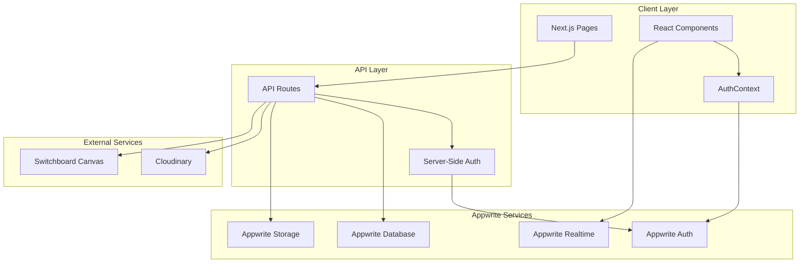
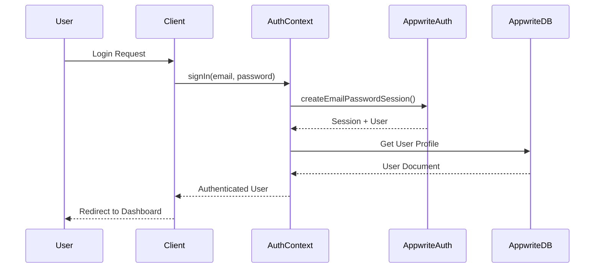
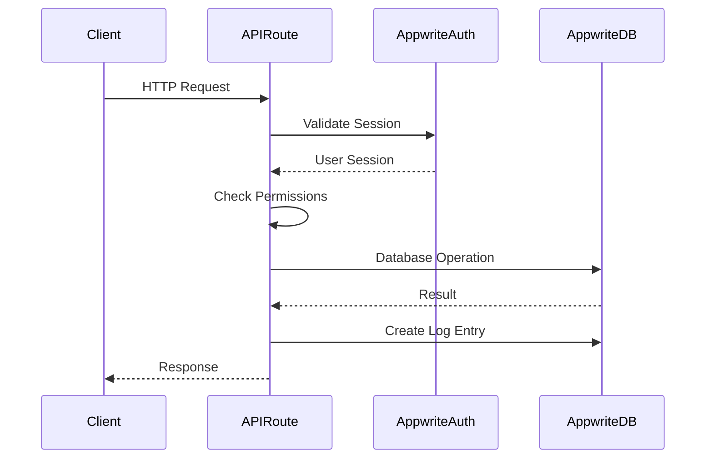

# Design Document

## Overview

This design document outlines the architecture and implementation strategy for migrating CredentialStudio from Supabase/Prisma to Appwrite. The migration will replace three core systems: authentication (Supabase Auth → Appwrite Auth), database operations (Prisma/PostgreSQL → Appwrite Database), and real-time functionality (Supabase Realtime → Appwrite Realtime).

The migration follows a systematic approach that preserves all existing functionality while leveraging Appwrite's integrated platform. The design ensures data integrity, maintains security through proper permission models, and provides a clear migration path for existing production data.

## Architecture

### High-Level Architecture



### Authentication Flow



### Database Operation Flow



## Components and Interfaces

### 1. Appwrite Client Configuration

**File**: `src/lib/appwrite.ts`

The existing file will be enhanced to support both client-side and server-side operations with proper session handling.

```typescript
// Client-side instance (browser)
export const createBrowserClient = () => {
  const client = new Client()
    .setEndpoint(process.env.NEXT_PUBLIC_APPWRITE_ENDPOINT!)
    .setProject(process.env.NEXT_PUBLIC_APPWRITE_PROJECT_ID!);
  
  return {
    client,
    account: new Account(client),
    databases: new Databases(client),
    storage: new Storage(client),
  };
};

// Server-side instance with API key (admin operations)
export const createAdminClient = () => {
  const client = new Client()
    .setEndpoint(process.env.NEXT_PUBLIC_APPWRITE_ENDPOINT!)
    .setProject(process.env.NEXT_PUBLIC_APPWRITE_PROJECT_ID!)
    .setKey(process.env.APPWRITE_API_KEY!);
  
  return {
    client,
    account: new Account(client),
    databases: new Databases(client),
    storage: new Storage(client),
    users: new Users(client),
  };
};

// Server-side instance with user session (API routes)
export const createSessionClient = (req: NextApiRequest) => {
  const client = new Client()
    .setEndpoint(process.env.NEXT_PUBLIC_APPWRITE_ENDPOINT!)
    .setProject(process.env.NEXT_PUBLIC_APPWRITE_PROJECT_ID!);
  
  // Extract session from cookies
  const session = req.cookies['appwrite-session'];
  if (session) {
    client.setSession(session);
  }
  
  return {
    client,
    account: new Account(client),
    databases: new Databases(client),
    storage: new Storage(client),
  };
};
```

### 2. Authentication Context

**File**: `src/contexts/AuthContext.tsx`

Complete rewrite to use Appwrite Auth instead of Supabase Auth.

**Key Changes**:
- Replace `supabase.auth` calls with `account` methods
- Use Appwrite session management
- Store session in cookies for SSR compatibility
- Implement Appwrite OAuth flow
- Use Appwrite magic URL for passwordless login

**Interface**:
```typescript
interface AuthContextType {
  user: Models.User<Models.Preferences> | null;
  userProfile: UserProfile | null; // From database
  signIn: (email: string, password: string) => Promise<void>;
  signUp: (email: string, password: string) => Promise<void>;
  signInWithMagicLink: (email: string) => Promise<void>;
  signInWithGoogle: () => Promise<void>;
  signOut: () => Promise<void>;
  resetPassword: (email: string) => Promise<void>;
  updatePassword: (newPassword: string) => Promise<void>;
  initializing: boolean;
}
```

### 3. Database Collections

Appwrite collections will mirror the Prisma schema structure:

#### Collection: `users`
- **Attributes**:
  - `userId` (string, required) - Maps to Appwrite Auth user ID
  - `email` (string, required, unique)
  - `name` (string, optional)
  - `roleId` (string, optional) - Relationship to roles collection
  - `isInvited` (boolean, default: false)
- **Indexes**:
  - Unique index on `email`
  - Index on `roleId` for faster lookups
  - Index on `userId` for auth mapping
- **Permissions**:
  - Read: User (own document), Role:admin
  - Write: Role:admin
  - Create: Role:admin
  - Delete: Role:admin

#### Collection: `roles`
- **Attributes**:
  - `name` (string, required, unique)
  - `description` (string, optional)
  - `permissions` (string, JSON) - Serialized permissions object
- **Indexes**:
  - Unique index on `name`
- **Permissions**:
  - Read: Any authenticated user
  - Write: Role:admin
  - Create: Role:admin
  - Delete: Role:admin

#### Collection: `attendees`
- **Attributes**:
  - `firstName` (string, required)
  - `lastName` (string, required)
  - `barcodeNumber` (string, required, unique)
  - `photoUrl` (string, optional)
  - `credentialUrl` (string, optional)
  - `credentialGeneratedAt` (datetime, optional)
  - `customFieldValues` (string, JSON) - Denormalized custom field data
- **Indexes**:
  - Unique index on `barcodeNumber`
  - Index on `lastName` for sorting
  - Index on `firstName` for sorting
- **Permissions**:
  - Read: Any authenticated user with read permission
  - Write: Users with write permission
  - Create: Users with create permission
  - Delete: Users with delete permission

#### Collection: `custom_fields`
- **Attributes**:
  - `eventSettingsId` (string, required)
  - `fieldName` (string, required)
  - `internalFieldName` (string, optional)
  - `fieldType` (string, required) - enum: text, number, date, select, checkbox
  - `fieldOptions` (string, JSON, optional)
  - `required` (boolean, default: false)
  - `order` (integer, required) - Field ordering for display
- **Indexes**:
  - Index on `eventSettingsId`
  - Index on `order`
- **Permissions**:
  - Read: Any authenticated user
  - Write: Users with admin permission
  - Create: Users with admin permission
  - Delete: Users with admin permission

#### Collection: `event_settings`
- **Attributes**:
  - All fields from Prisma schema as appropriate Appwrite attribute types
  - `switchboardFieldMappings` (string, JSON)
- **Permissions**:
  - Read: Any authenticated user
  - Write: Users with admin permission

#### Collection: `logs`
- **Attributes**:
  - `userId` (string, required)
  - `attendeeId` (string, optional)
  - `action` (string, required)
  - `details` (string, JSON, optional)
- **Indexes**:
  - Index on `userId`
  - Index on `attendeeId`
  - Index on `createdAt` (descending)
- **Permissions**:
  - Read: Users with logs read permission
  - Write: Any authenticated user (for creating logs)
  - Create: Any authenticated user
  - Delete: Users with logs delete permission

#### Collection: `log_settings`
- **Attributes**:
  - All boolean fields from Prisma schema
- **Permissions**:
  - Read: Any authenticated user
  - Write: Users with admin permission

#### Collection: `invitations`
- **Attributes**:
  - `userId` (string, required)
  - `token` (string, required, unique)
  - `expiresAt` (datetime, required)
  - `usedAt` (datetime, optional)
  - `createdBy` (string, required)
- **Indexes**:
  - Unique index on `token`
  - Index on `userId`
  - Index on `expiresAt`
- **Permissions**:
  - Read: Creator and admin
  - Write: Admin only
  - Create: Users with invite permission
  - Delete: Admin only

### 4. API Route Pattern

All API routes will follow this pattern:

```typescript
import type { NextApiRequest, NextApiResponse } from 'next';
import { createSessionClient, createAdminClient } from '@/lib/appwrite';
import { Query } from 'appwrite';

export default async function handler(
  req: NextApiRequest,
  res: NextApiResponse
) {
  try {
    // Create session client
    const { account, databases } = createSessionClient(req);
    
    // Verify authentication
    const user = await account.get();
    
    // Get user profile with role
    const userDocs = await databases.listDocuments(
      process.env.NEXT_PUBLIC_APPWRITE_DATABASE_ID!,
      process.env.NEXT_PUBLIC_APPWRITE_USERS_COLLECTION_ID!,
      [Query.equal('userId', user.$id)]
    );
    
    if (userDocs.documents.length === 0) {
      return res.status(404).json({ error: 'User profile not found' });
    }
    
    const userProfile = userDocs.documents[0];
    
    // Get role if exists
    let role = null;
    if (userProfile.roleId) {
      role = await databases.getDocument(
        process.env.NEXT_PUBLIC_APPWRITE_DATABASE_ID!,
        process.env.NEXT_PUBLIC_APPWRITE_ROLES_COLLECTION_ID!,
        userProfile.roleId
      );
    }
    
    // Check permissions
    const permissions = role ? JSON.parse(role.permissions) : {};
    
    // Perform operation based on method
    switch (req.method) {
      case 'GET':
        // Handle GET
        break;
      case 'POST':
        // Handle POST
        break;
      // ... other methods
    }
    
  } catch (error) {
    console.error('API Error:', error);
    res.status(500).json({ error: 'Internal server error' });
  }
}
```

### 5. Query Translation Layer

Create a utility to help translate Prisma-style queries to Appwrite queries:

**File**: `src/lib/appwriteQueries.ts`

```typescript
import { Query } from 'appwrite';

export const buildQueries = {
  equal: (field: string, value: any) => Query.equal(field, value),
  notEqual: (field: string, value: any) => Query.notEqual(field, value),
  lessThan: (field: string, value: any) => Query.lessThan(field, value),
  greaterThan: (field: string, value: any) => Query.greaterThan(field, value),
  search: (field: string, value: string) => Query.search(field, value),
  orderAsc: (field: string) => Query.orderAsc(field),
  orderDesc: (field: string) => Query.orderDesc(field),
  limit: (value: number) => Query.limit(value),
  offset: (value: number) => Query.offset(value),
};

// Helper for pagination
export const paginate = (page: number, pageSize: number) => [
  Query.limit(pageSize),
  Query.offset((page - 1) * pageSize),
];

// Helper for sorting
export const sort = (field: string, direction: 'asc' | 'desc' = 'asc') => {
  return direction === 'asc' ? Query.orderAsc(field) : Query.orderDesc(field);
};
```

### 6. Real-time Subscriptions

**File**: `src/hooks/useRealtimeSubscription.ts`

```typescript
import { useEffect, useState } from 'react';
import { client } from '@/lib/appwrite';
import { Models } from 'appwrite';

export function useRealtimeSubscription<T extends Models.Document>(
  channels: string[],
  callback: (payload: any) => void
) {
  useEffect(() => {
    const unsubscribe = client.subscribe(channels, callback);
    
    return () => {
      unsubscribe();
    };
  }, [channels, callback]);
}

// Usage example:
// useRealtimeSubscription(
//   [`databases.${dbId}.collections.${collectionId}.documents`],
//   (response) => {
//     if (response.events.includes('databases.*.collections.*.documents.*.create')) {
//       // Handle new document
//     }
//   }
// );
```

## Data Models

### Prisma to Appwrite Mapping

| Prisma Type | Appwrite Attribute Type | Notes |
|-------------|------------------------|-------|
| String | string | Direct mapping |
| Int | integer | Direct mapping |
| Boolean | boolean | Direct mapping |
| DateTime | datetime | Direct mapping |
| Json | string | Store as JSON string, parse on read |
| @id @default(cuid()) | Auto-generated ID | Appwrite auto-generates document IDs |
| @id @db.Uuid | string | Store as string attribute |
| @unique | Unique index | Configure in collection settings |
| @relation | string (document ID) | Store related document ID |
| @default(now()) | Auto-managed | Use Appwrite's $createdAt |
| @updatedAt | Auto-managed | Use Appwrite's $updatedAt |

### Custom Field Values Strategy

**Challenge**: Prisma uses a separate `AttendeeCustomFieldValue` table with foreign keys. Appwrite doesn't support traditional joins.

**Solution**: Denormalize custom field values into the attendee document as a JSON object:

```typescript
// Attendee document structure
{
  $id: "attendee123",
  firstName: "John",
  lastName: "Doe",
  barcodeNumber: "12345",
  customFieldValues: {
    "customField1Id": "value1",
    "customField2Id": "value2"
  },
  $createdAt: "2024-01-01T00:00:00.000Z",
  $updatedAt: "2024-01-01T00:00:00.000Z"
}
```

**Benefits**:
- Single query to get attendee with all custom fields
- Better performance for reads
- Simpler query logic

**Trade-offs**:
- Slightly more complex updates
- Need to validate custom field IDs exist
- Document size increases with more custom fields

## Error Handling

### Authentication Errors

```typescript
try {
  await account.createEmailPasswordSession(email, password);
} catch (error: any) {
  if (error.code === 401) {
    throw new Error('Invalid credentials');
  } else if (error.code === 429) {
    throw new Error('Too many attempts. Please try again later.');
  } else {
    throw new Error('Authentication failed');
  }
}
```

### Database Errors

```typescript
try {
  await databases.createDocument(dbId, collectionId, ID.unique(), data);
} catch (error: any) {
  if (error.code === 409) {
    throw new Error('Document already exists');
  } else if (error.code === 401) {
    throw new Error('Unauthorized');
  } else if (error.code === 404) {
    throw new Error('Collection not found');
  } else {
    throw new Error('Database operation failed');
  }
}
```

### Transaction Simulation

Since Appwrite doesn't support transactions, implement compensating logic:

```typescript
async function bulkDeleteAttendees(attendeeIds: string[]) {
  const deleted: string[] = [];
  const errors: Array<{ id: string; error: string }> = [];
  
  for (const id of attendeeIds) {
    try {
      await databases.deleteDocument(dbId, collectionId, id);
      deleted.push(id);
    } catch (error: any) {
      errors.push({ id, error: error.message });
    }
  }
  
  return { deleted, errors };
}
```

## Testing Strategy

### Unit Tests

1. **Authentication Functions**
   - Test sign in/sign up flows
   - Test session management
   - Test OAuth flows
   - Test password reset

2. **Database Operations**
   - Test CRUD operations for each collection
   - Test query builders
   - Test pagination helpers
   - Test JSON serialization/deserialization

3. **Permission Checks**
   - Test role-based access control
   - Test permission validation
   - Test unauthorized access handling

### Integration Tests

1. **API Routes**
   - Test each endpoint with valid authentication
   - Test unauthorized access
   - Test invalid data handling
   - Test bulk operations

2. **Real-time Subscriptions**
   - Test subscription setup
   - Test event handling
   - Test unsubscribe cleanup

### Migration Tests

1. **Data Migration Script**
   - Test with sample data
   - Verify data integrity
   - Test relationship preservation
   - Test error handling

2. **Schema Validation**
   - Verify all collections created
   - Verify all attributes configured
   - Verify indexes created
   - Verify permissions set

## Security Considerations

### 1. API Key Management

- Store `APPWRITE_API_KEY` securely in environment variables
- Never expose API key to client-side code
- Use API key only in server-side operations
- Rotate API keys periodically

### 2. Session Management

- Store sessions in HTTP-only cookies
- Set appropriate cookie expiration
- Implement session refresh logic
- Clear sessions on logout

### 3. Permission Model

- Implement collection-level permissions in Appwrite
- Validate permissions in API routes
- Use role-based access control
- Audit permission changes

### 4. Data Validation

- Validate all input data before database operations
- Sanitize user input
- Validate custom field values against field definitions
- Implement rate limiting for sensitive operations

### 5. Logging

- Log all authentication events
- Log all data modifications
- Exclude sensitive data from logs
- Implement log retention policies

## Migration Strategy

### Phase 1: Setup Appwrite Infrastructure

1. Create Appwrite project
2. Configure authentication providers
3. Create all database collections
4. Configure collection attributes and indexes
5. Set up collection permissions
6. Configure environment variables

### Phase 2: Implement Core Services

1. Update Appwrite client configuration
2. Implement authentication context
3. Create query helper utilities
4. Implement real-time hooks
5. Create permission checking utilities

### Phase 3: Migrate API Routes

1. Start with read-only endpoints (GET)
2. Migrate authentication endpoints
3. Migrate user management endpoints
4. Migrate attendee endpoints
5. Migrate custom field endpoints
6. Migrate event settings endpoints
7. Migrate role endpoints
8. Migrate log endpoints
9. Migrate invitation endpoints

### Phase 4: Update Client Components

1. Update AuthContext usage
2. Update protected routes
3. Update forms and data fetching
4. Implement real-time subscriptions
5. Update error handling

### Phase 5: Data Migration

1. Export data from Supabase
2. Transform data to Appwrite format
3. Create Appwrite Auth users
4. Import data to Appwrite collections
5. Verify data integrity
6. Test application with migrated data

### Phase 6: Cleanup

1. Remove Prisma client usage
2. Remove Supabase client usage
3. Delete Prisma schema files
4. Remove Supabase utility files
5. Update package.json
6. Update documentation
7. Remove environment variables
8. Update build scripts

## Environment Variables

### Required Variables

```env
# Appwrite Configuration
NEXT_PUBLIC_APPWRITE_ENDPOINT=https://cloud.appwrite.io/v1
NEXT_PUBLIC_APPWRITE_PROJECT_ID=your_project_id
APPWRITE_API_KEY=your_api_key

# Appwrite Database IDs
NEXT_PUBLIC_APPWRITE_DATABASE_ID=your_database_id
NEXT_PUBLIC_APPWRITE_USERS_COLLECTION_ID=users_collection_id
NEXT_PUBLIC_APPWRITE_ROLES_COLLECTION_ID=roles_collection_id
NEXT_PUBLIC_APPWRITE_ATTENDEES_COLLECTION_ID=attendees_collection_id
NEXT_PUBLIC_APPWRITE_CUSTOM_FIELDS_COLLECTION_ID=custom_fields_collection_id
NEXT_PUBLIC_APPWRITE_EVENT_SETTINGS_COLLECTION_ID=event_settings_collection_id
NEXT_PUBLIC_APPWRITE_LOGS_COLLECTION_ID=logs_collection_id
NEXT_PUBLIC_APPWRITE_LOG_SETTINGS_COLLECTION_ID=log_settings_collection_id
NEXT_PUBLIC_APPWRITE_INVITATIONS_COLLECTION_ID=invitations_collection_id

# External Services (unchanged)
CLOUDINARY_CLOUD_NAME=your_cloud_name
CLOUDINARY_API_KEY=your_api_key
CLOUDINARY_API_SECRET=your_api_secret
```

### Variables to Remove

```env
# Remove these Supabase variables
DATABASE_URL
DIRECT_URL
NEXT_PUBLIC_SUPABASE_URL
NEXT_PUBLIC_SUPABASE_ANON_KEY
SUPABASE_SERVICE_ROLE_KEY
```

## Performance Considerations

### 1. Query Optimization

- Use indexes for frequently queried fields
- Limit result sets with pagination
- Cache frequently accessed data (roles, event settings)
- Use Appwrite's built-in caching

### 2. Real-time Optimization

- Subscribe only to necessary channels
- Unsubscribe when components unmount
- Debounce rapid updates
- Use selective field updates

### 3. Batch Operations

- Group multiple operations when possible
- Implement retry logic for failed operations
- Use Promise.all for parallel operations
- Handle partial failures gracefully

### 4. Client-Side Caching

- Cache user profile and role data
- Cache event settings
- Implement stale-while-revalidate pattern
- Use React Query or SWR for data fetching

## Rollback Plan

In case of critical issues during migration:

1. **Immediate Rollback**:
   - Revert to previous deployment
   - Switch environment variables back to Supabase
   - Restore Prisma client usage

2. **Data Rollback**:
   - Keep Supabase database active during migration
   - Maintain parallel writes if necessary
   - Export Appwrite data if needed

3. **Gradual Migration**:
   - Implement feature flags for Appwrite vs Supabase
   - Migrate users gradually
   - Monitor error rates and performance
   - Roll back specific features if needed
