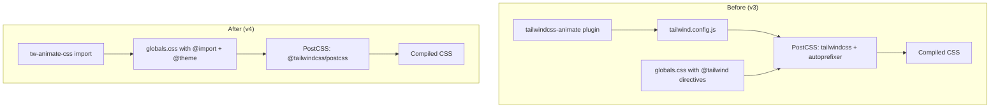

# Design Document: Tailwind CSS v4 Migration

## Overview

This design covers migrating credential.studio from Tailwind CSS v3.4.x to v4.x. The migration touches three layers: the build toolchain (PostCSS plugin swap, autoprefixer removal), the configuration system (JavaScript config → CSS-first `@theme`), and the component layer (utility class renames, shadcn/ui component updates, animation plugin swap). The goal is zero visual regressions while adopting v4 conventions.

The migration will be executed in phases: toolchain first, then CSS config, then component-level changes. This ordering ensures each phase can be validated independently before moving to the next.

## Architecture

The migration does not change the application architecture. It changes how styles are configured and compiled.



### Migration Phases

1. **Phase 1 - Toolchain**: Swap packages, update `postcss.config.js`, update `package.json`
2. **Phase 2 - CSS Config**: Rewrite `globals.css` with `@import "tailwindcss"`, `@theme inline`, CSS variable format changes, container utility, dark mode variant
3. **Phase 3 - Animation Plugin**: Replace `tailwindcss-animate` with `tw-animate-css`
4. **Phase 4 - Utility Renames**: Find-and-replace renamed classes across all `.tsx` files
5. **Phase 5 - shadcn/ui Updates**: Remove `forwardRef`, update prop types, fix arbitrary value syntax in chart component
6. **Phase 6 - Visual Regression Fixes**: Default border color, ring width, button cursor, hover behavior
7. **Phase 7 - Cleanup**: Remove `tailwind.config.js`, update `components.json`, verify build

## Components and Interfaces

### Files Modified

| File | Change Type | Description |
|------|------------|-------------|
| `package.json` | Dependency swap | Remove `tailwindcss` v3, `autoprefixer`, `tailwindcss-animate`. Add `tailwindcss` v4, `@tailwindcss/postcss`, `tw-animate-css` |
| `postcss.config.js` | Rewrite | Replace `tailwindcss` + `autoprefixer` plugins with `@tailwindcss/postcss` |
| `tailwind.config.js` | Delete | All config moves to CSS |
| `src/styles/globals.css` | Major rewrite | New import structure, `@theme inline` block, CSS variable format, `@utility` directives |
| `src/styles/sweetalert-custom.css` | Update | Change `hsl(var(--...))` references to `var(--...)` since variables now contain full `hsl()` values |
| `components.json` | Update | Remove `tailwind.config` reference, update for v4 format |
| `src/components/ui/*.tsx` (45 files) | Update | Utility class renames, `forwardRef` removal, prop type updates |
| `src/components/*.tsx` + `src/pages/*.tsx` | Update | Utility class renames across ~490 files |
| `src/components/ui/chart.tsx` | Update | Arbitrary value syntax: `bg-[--color-bg]` → `bg-(--color-bg)` |

### PostCSS Config (After)

```javascript
module.exports = {
  plugins: {
    "@tailwindcss/postcss": {},
  },
};
```

### globals.css Structure (After)

```css
@import "tailwindcss";
@import "tw-animate-css";
@import "./sweetalert-custom.css";

@variant dark (&:where(.dark, .dark *));

@theme inline {
  --color-background: var(--background);
  --color-foreground: var(--foreground);
  --color-card: var(--card);
  --color-card-foreground: var(--card-foreground);
  --color-popover: var(--popover);
  --color-popover-foreground: var(--popover-foreground);
  --color-primary: var(--primary);
  --color-primary-foreground: var(--primary-foreground);
  --color-secondary: var(--secondary);
  --color-secondary-foreground: var(--secondary-foreground);
  --color-muted: var(--muted);
  --color-muted-foreground: var(--muted-foreground);
  --color-accent: var(--accent);
  --color-accent-foreground: var(--accent-foreground);
  --color-destructive: var(--destructive);
  --color-destructive-foreground: var(--destructive-foreground);
  --color-border: var(--border);
  --color-input: var(--input);
  --color-ring: var(--ring);
  --color-chart-1: var(--chart-1);
  --color-chart-2: var(--chart-2);
  --color-chart-3: var(--chart-3);
  --color-chart-4: var(--chart-4);
  --color-chart-5: var(--chart-5);
  --color-success: var(--success);
  --color-success-foreground: var(--success-foreground);
  --color-info: var(--info);
  --color-info-foreground: var(--info-foreground);
  --color-warning: var(--warning);
  --color-warning-foreground: var(--warning-foreground);
  --color-surface: var(--surface);
  --color-surface-variant: var(--surface-variant);
  --radius-lg: var(--radius);
  --radius-md: calc(var(--radius) - 2px);
  --radius-sm: calc(var(--radius) - 4px);
  --animate-accordion-down: accordion-down 0.2s ease-out;
  --animate-accordion-up: accordion-up 0.2s ease-out;

  @keyframes accordion-down {
    from { height: 0; }
    to { height: var(--radix-accordion-content-height); }
  }
  @keyframes accordion-up {
    from { height: var(--radix-accordion-content-height); }
    to { height: 0; }
  }
}

@layer base {
  :root {
    --background: hsl(0 0% 100%);
    --foreground: hsl(224 71.4% 4.1%);
    --card: hsl(0 0% 100%);
    --card-foreground: hsl(224 71.4% 4.1%);
    --popover: hsl(0 0% 100%);
    --popover-foreground: hsl(224 71.4% 4.1%);
    --primary: hsl(262.1 83.3% 57.8%);
    --primary-foreground: hsl(210 20% 98%);
    --secondary: hsl(220 14.3% 95.9%);
    --secondary-foreground: hsl(220.9 39.3% 11%);
    --muted: hsl(220 14.3% 95.9%);
    --muted-foreground: hsl(220 8.9% 46.1%);
    --accent: hsl(220 14.3% 95.9%);
    --accent-foreground: hsl(220.9 39.3% 11%);
    --destructive: hsl(0 84.2% 60.2%);
    --destructive-foreground: hsl(210 20% 98%);
    --border: hsl(220 13% 91%);
    --input: hsl(220 13% 91%);
    --ring: hsl(262.1 83.3% 57.8%);
    --chart-1: hsl(12 76% 61%);
    --chart-2: hsl(173 58% 39%);
    --chart-3: hsl(197 37% 24%);
    --chart-4: hsl(43 74% 66%);
    --chart-5: hsl(27 87% 67%);
    --radius: 0.5rem;
    --success: hsl(142 76% 36%);
    --success-foreground: hsl(355 100% 97%);
    --info: hsl(199 89% 48%);
    --info-foreground: hsl(210 20% 98%);
    --warning: hsl(38 92% 50%);
    --warning-foreground: hsl(48 96% 89%);
    --surface: hsl(220 14.3% 97%);
    --surface-variant: hsl(220 14.3% 95%);
  }

  .dark {
    --background: hsl(224 71.4% 4.1%);
    --foreground: hsl(210 20% 98%);
    /* ... remaining dark mode variables with hsl() wrappers ... */
  }
}

/* Base styles */
@layer base {
  * {
    @apply border-border;
  }
  body {
    @apply bg-background text-foreground;
  }
}

/* Container utility replacement */
@utility container {
  margin-inline: auto;
  padding-inline: 2rem;
  @media (width >= 1400px) {
    max-width: 1400px;
  }
}

/* Button cursor restoration */
@layer base {
  button:not(:disabled) {
    cursor: pointer;
  }
}

/* Custom utilities migrated from @layer utilities */
/* Cloudinary z-index, glass-effect, date input styling, etc. preserved as-is */
```

### Utility Class Rename Map

| v3 Class | v4 Class | Files Affected (approx) |
|----------|----------|------------------------|
| `shadow-sm` | `shadow-xs` | ~15 files (UI components + pages) |
| `shadow` (bare) | `shadow-sm` | ~10 files |
| `outline-none` | `outline-hidden` | ~25 files |
| `rounded-sm` | `rounded-xs` | ~20 files (context-menu, dropdown, select, etc.) |
| `rounded` (bare) | `rounded-sm` | ~5 files |
| `ring` (bare, no width) | `ring-3` | 0 files (all existing usages already have explicit widths like `ring-1`, `ring-2`) |
| `blur-sm` | `blur-xs` | 0 files (not used) |
| `blur` (bare) | `blur-sm` | 0 files (not used) |
| `bg-[--var]` | `bg-(--var)` | 1 file (chart.tsx) |
| `border-[--var]` | `border-(--var)` | 1 file (chart.tsx) |

### shadcn/ui forwardRef Removal Pattern

Before (v3):
```tsx
const Button = React.forwardRef<HTMLButtonElement, ButtonProps>(
  ({ className, variant, size, asChild = false, ...props }, ref) => {
    const Comp = asChild ? Slot : "button";
    return <Comp className={cn(buttonVariants({ variant, size, className }))} ref={ref} {...props} />;
  }
);
Button.displayName = "Button";
```

After (v4 + React 19):
```tsx
function Button({ className, variant, size, asChild = false, ref, ...props }: ButtonProps & { ref?: React.Ref<HTMLButtonElement> }) {
  const Comp = asChild ? Slot : "button";
  return <Comp className={cn(buttonVariants({ variant, size, className }))} ref={ref} {...props} />;
}
```

### SweetAlert CSS Variable Update

The `sweetalert-custom.css` file uses `hsl(var(--destructive))`, `hsl(var(--success))`, etc. After migration, CSS variables will contain full `hsl()` values, so these references become `var(--destructive)`, `var(--success)`, etc.

## Data Models

No data model changes. This migration is purely a styling/build toolchain change. All Appwrite database schemas, TypeScript interfaces, and API contracts remain unchanged.

## Correctness Properties

*A property is a characteristic or behavior that should hold true across all valid executions of a system — essentially, a formal statement about what the system should do. Properties serve as the bridge between human-readable specifications and machine-verifiable correctness guarantees.*

### Property 1: All color CSS variables have hsl() wrappers

*For any* CSS custom property that represents a color in both `:root` and `.dark` selectors of `globals.css`, the variable value should be wrapped in `hsl()` (e.g., `--primary: hsl(262.1 83.3% 57.8%)` not `--primary: 262.1 83.3% 57.8%`). This applies to all theme colors, semantic colors (success, info, warning), and chart colors.

**Validates: Requirements 3.1, 3.2, 3.4, 3.5**

### Property 2: No double hsl() wrapping in @theme inline

*For any* color token reference in the `@theme inline` block, the value should use `var(--variable-name)` directly without an additional `hsl()` wrapper. Since the CSS variables already contain `hsl()` values (Property 1), wrapping again would produce invalid `hsl(hsl(...))`.

**Validates: Requirements 3.3**

### Property 3: All v3 theme keys migrated to v4 CSS config

*For any* color, border-radius, keyframe, or animation key defined in the old `tailwind.config.js` theme extension, there should be a corresponding entry in the `@theme inline` block of `globals.css`. No theme configuration should be lost during migration.

**Validates: Requirements 2.6**

### Property 4: No deprecated v3 utility class names in source files

*For any* `.tsx` file in the `src/` directory, the file should not contain any of the deprecated v3 utility class names: `shadow-sm` (should be `shadow-xs`), bare `shadow` (should be `shadow-sm`), `outline-none` (should be `outline-hidden`), `rounded-sm` (should be `rounded-xs`), bare `rounded` (should be `rounded-sm`), bare `ring` without width (should be `ring-3`), `blur-sm` (should be `blur-xs`), bare `blur` (should be `blur-sm`).

**Validates: Requirements 4.1, 4.2, 4.3, 4.4, 4.5, 4.6, 4.7, 4.8**

### Property 5: No React.forwardRef in shadcn/ui components

*For any* component file in `src/components/ui/`, the file should not contain `React.forwardRef`. All components should use direct `ref` prop passing compatible with React 19.

**Validates: Requirements 5.1, 5.2**

### Property 6: Bare border classes have explicit color

*For any* `.tsx` file that uses the `border` utility class without an explicit color modifier (e.g., `border-red-500`, `border-border`, `border-primary`), the element should also have `border-border` or another explicit border color class to prevent the v4 default border color change from `gray-200` to `currentColor` causing visual regressions.

**Validates: Requirements 5.5, 9.1**

## Error Handling

This migration does not introduce new runtime error handling. The primary error scenarios are build-time:

1. **CSS compilation errors**: If `@theme inline` syntax is incorrect or CSS variables are malformed, the PostCSS build step will fail with descriptive errors. Fix by correcting the CSS syntax.
2. **Missing utility classes**: If a renamed utility class is missed, Tailwind v4 will silently ignore it (no CSS generated). Detected by visual inspection or Property 4 automated checks.
3. **forwardRef type errors**: If `forwardRef` removal is incomplete, TypeScript will flag type mismatches. Detected by `npm run build`.
4. **Import resolution failures**: If `tw-animate-css` or `@tailwindcss/postcss` packages are missing, the build will fail immediately with a clear "module not found" error.

## Testing Strategy

### Dual Testing Approach

This migration uses both unit tests and property-based tests:

- **Property-based tests**: Validate universal properties across all source files (utility renames, forwardRef removal, CSS variable format). These use `fast-check` (already installed as a devDependency) with Vitest.
- **Unit tests**: Validate specific configuration file contents (postcss.config.js structure, globals.css imports, components.json format, package.json dependencies).
- **Build verification**: Run `npm run build` to confirm the entire application compiles correctly after migration.

### Property-Based Testing Configuration

- Library: `fast-check` v4.5.3 (already in devDependencies)
- Runner: Vitest (already configured)
- Minimum iterations: 100 per property test
- Test location: `src/__tests__/lib/tailwind-v4-migration.test.ts`
- Tag format: `Feature: tailwind-v4-migration, Property N: <property_text>`

### Test Scope

Properties 1–3 (CSS variable format, theme inline, theme key completeness) are best validated as unit tests that parse the CSS files, since the input space is the fixed set of CSS variables — not a random domain.

Properties 4–6 (utility renames, forwardRef removal, border color) are well-suited for property-based testing because they assert universal rules across a large set of files (~490 .tsx files). The generator produces random file paths from the source tree, and the property checks each file's content.

### Test Plan

| Property | Test Type | What It Checks |
|----------|-----------|---------------|
| P1: hsl() wrappers | Unit test | Parse globals.css, verify all color vars in :root and .dark have hsl() |
| P2: No double hsl() | Unit test | Parse @theme inline block, verify no hsl(var(...)) patterns |
| P3: Theme key completeness | Unit test | Compare old tailwind.config.js keys against @theme inline entries |
| P4: No deprecated classes | Property test | For random .tsx files, grep for deprecated class names |
| P5: No forwardRef | Property test | For random ui/*.tsx files, check for React.forwardRef |
| P6: Border color safety | Property test | For random .tsx files with bare border, check for explicit color |
| Build verification | Integration | Run `npm run build` and verify exit code 0 |

