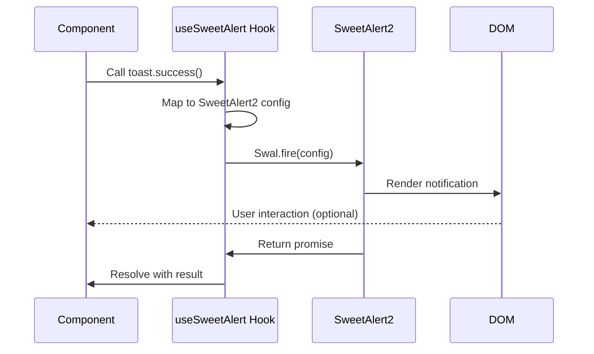

# Design Document: Toast to SweetAlert2 Migration

## Overview

This design document outlines the technical approach for migrating CredentialStudio's notification system from shadcn/ui Toast (based on Radix UI) to SweetAlert2. The migration will enhance the user experience with more visually appealing, feature-rich notifications while maintaining backward compatibility with existing code patterns.

### Goals
- Replace the current toast notification system with SweetAlert2
- Maintain API compatibility to minimize code changes
- Enhance visual design with modern, animated notifications
- Support light/dark mode theming
- Improve accessibility and user experience
- Provide confirmation dialogs for destructive actions

### Non-Goals
- Changing the notification behavior or timing
- Modifying the application's core functionality
- Implementing real-time notification streaming
- Adding notification history or persistence

## Architecture

### High-Level Architecture

```
┌─────────────────────────────────────────────────────────────┐
│                     Application Layer                        │
│  (Components using notifications)                            │
└────────────────────┬────────────────────────────────────────┘
                     │
                     │ useSweetAlert() hook
                     │
┌────────────────────▼────────────────────────────────────────┐
│              SweetAlert2 Wrapper Layer                       │
│  - useSweetAlert hook                                        │
│  - Notification type handlers (success, error, warning...)   │
│  - Theme configuration                                       │
│  - API compatibility layer                                   │
└────────────────────┬────────────────────────────────────────┘
                     │
                     │ Swal.fire()
                     │
┌────────────────────▼────────────────────────────────────────┐
│                    SweetAlert2 Library                       │
│  - Core notification engine                                  │
│  - DOM manipulation                                          │
│  - Animation handling                                        │
└─────────────────────────────────────────────────────────────┘
```

### Component Interaction Flow



## Components and Interfaces

### 1. SweetAlert2 Configuration Module

**File:** `src/lib/sweetalert-config.ts`

This module provides the base configuration for SweetAlert2, including theme customization and default settings.

```typescript
import Swal from 'sweetalert2';

export interface SweetAlertTheme {
  popup: string;
  title: string;
  htmlContainer: string;
  confirmButton: string;
  cancelButton: string;
  icon: string;
}

export const getSweetAlertTheme = (isDark: boolean): Partial<SweetAlertTheme> => {
  return {
    popup: isDark 
      ? 'bg-card text-card-foreground border border-border' 
      : 'bg-card text-card-foreground border border-border',
    title: 'text-foreground font-semibold',
    htmlContainer: 'text-muted-foreground',
    confirmButton: 'bg-primary text-primary-foreground hover:bg-primary/90',
    cancelButton: 'bg-secondary text-secondary-foreground hover:bg-secondary/90',
  };
};

export const defaultSweetAlertConfig = {
  customClass: getSweetAlertTheme(false),
  buttonsStyling: false,
  showClass: {
    popup: 'animate-in fade-in-0 zoom-in-95 duration-200',
  },
  hideClass: {
    popup: 'animate-out fade-out-0 zoom-out-95 duration-150',
  },
  position: 'top-end' as const,
  timer: 3000,
  timerProgressBar: true,
  showConfirmButton: false,
  toast: true,
};
```

**Key Design Decisions:**
- Use Tailwind CSS classes for styling to maintain consistency
- Support dynamic theme switching based on dark mode
- Provide sensible defaults that match the application's design system
- Use toast mode by default for non-blocking notifications

### 2. SweetAlert Hook

**File:** `src/hooks/useSweetAlert.ts`

This hook provides a React-friendly API for SweetAlert2 that mimics the original `useToast` interface.

```typescript
import { useCallback, useEffect, useState } from 'react';
import Swal, { SweetAlertIcon, SweetAlertResult } from 'sweetalert2';
import { defaultSweetAlertConfig, getSweetAlertTheme } from '@/lib/sweetalert-config';

export interface ToastOptions {
  title?: string;
  description?: string;
  variant?: 'default' | 'success' | 'error' | 'warning' | 'info' | 'destructive';
  action?: {
    label: string;
    onClick: () => void;
  };
  duration?: number;
}

export interface ConfirmOptions {
  title: string;
  text?: string;
  confirmButtonText?: string;
  cancelButtonText?: string;
  icon?: SweetAlertIcon;
  showCancelButton?: boolean;
}

export interface LoadingOptions {
  title: string;
  text?: string;
}

export const useSweetAlert = () => {
  const [isDark, setIsDark] = useState(false);

  useEffect(() => {
    // Detect dark mode
    const checkDarkMode = () => {
      setIsDark(document.documentElement.classList.contains('dark'));
    };
    
    checkDarkMode();
    
    // Watch for theme changes
    const observer = new MutationObserver(checkDarkMode);
    observer.observe(document.documentElement, {
      attributes: true,
      attributeFilter: ['class'],
    });
    
    return () => observer.disconnect();
  }, []);

  const toast = useCallback((options: ToastOptions) => {
    const icon = getIconFromVariant(options.variant);
    const customClass = getSweetAlertTheme(isDark);

    return Swal.fire({
      ...defaultSweetAlertConfig,
      customClass,
      icon,
      title: options.title,
      html: options.description,
      timer: options.duration || 3000,
      didOpen: (popup) => {
        if (options.action) {
          const actionButton = document.createElement('button');
          actionButton.textContent = options.action.label;
          actionButton.className = 'swal2-styled swal2-confirm mt-2';
          actionButton.onclick = () => {
            options.action?.onClick();
            Swal.close();
          };
          popup.appendChild(actionButton);
        }
      },
    });
  }, [isDark]);

  const success = useCallback((title: string, description?: string) => {
    return toast({ title, description, variant: 'success' });
  }, [toast]);

  const error = useCallback((title: string, description?: string) => {
    return toast({ title, description, variant: 'error' });
  }, [toast]);

  const warning = useCallback((title: string, description?: string) => {
    return toast({ title, description, variant: 'warning' });
  }, [toast]);

  const info = useCallback((title: string, description?: string) => {
    return toast({ title, description, variant: 'info' });
  }, [toast]);

  const confirm = useCallback(async (options: ConfirmOptions): Promise<boolean> => {
    const customClass = getSweetAlertTheme(isDark);
    
    const result: SweetAlertResult = await Swal.fire({
      title: options.title,
      text: options.text,
      icon: options.icon || 'warning',
      showCancelButton: options.showCancelButton !== false,
      confirmButtonText: options.confirmButtonText || 'Confirm',
      cancelButtonText: options.cancelButtonText || 'Cancel',
      customClass: {
        ...customClass,
        confirmButton: 'bg-destructive text-destructive-foreground hover:bg-destructive/90 px-4 py-2 rounded-md',
        cancelButton: 'bg-secondary text-secondary-foreground hover:bg-secondary/90 px-4 py-2 rounded-md ml-2',
      },
      buttonsStyling: false,
      showClass: {
        popup: 'animate-in fade-in-0 zoom-in-95 duration-200',
      },
      hideClass: {
        popup: 'animate-out fade-out-0 zoom-out-95 duration-150',
      },
    });

    return result.isConfirmed;
  }, [isDark]);

  const loading = useCallback((options: LoadingOptions) => {
    const customClass = getSweetAlertTheme(isDark);
    
    return Swal.fire({
      title: options.title,
      text: options.text,
      customClass,
      allowOutsideClick: false,
      allowEscapeKey: false,
      showConfirmButton: false,
      didOpen: () => {
        Swal.showLoading();
      },
    });
  }, [isDark]);

  const close = useCallback(() => {
    Swal.close();
  }, []);

  return {
    toast,
    success,
    error,
    warning,
    info,
    confirm,
    loading,
    close,
  };
};

function getIconFromVariant(variant?: string): SweetAlertIcon | undefined {
  switch (variant) {
    case 'success':
      return 'success';
    case 'error':
    case 'destructive':
      return 'error';
    case 'warning':
      return 'warning';
    case 'info':
      return 'info';
    default:
      return undefined;
  }
}
```

**Key Design Decisions:**
- Provide both generic `toast()` and specific methods (`success()`, `error()`, etc.)
- Support action buttons for interactive notifications
- Automatically detect and respond to theme changes
- Return promises for async operations (confirm dialogs, loading states)
- Maintain similar API to original `useToast` for easy migration

### 3. Custom CSS Styling

**File:** `src/styles/sweetalert-custom.css`

Custom CSS to ensure SweetAlert2 integrates seamlessly with the application's design system.

```css
/* SweetAlert2 Custom Styling */

/* Toast positioning and sizing */
.swal2-container.swal2-top-end {
  top: 1rem;
  right: 1rem;
}

.swal2-popup.swal2-toast {
  padding: 1rem;
  border-radius: var(--radius);
  box-shadow: 0 10px 15px -3px rgb(0 0 0 / 0.1), 0 4px 6px -4px rgb(0 0 0 / 0.1);
  min-width: 300px;
  max-width: 400px;
}

/* Icon styling */
.swal2-icon {
  margin: 0 0.5rem 0 0;
  width: 1.5rem;
  height: 1.5rem;
  border: none;
}

.swal2-icon.swal2-success [class^='swal2-success-line'] {
  background-color: hsl(var(--success));
}

.swal2-icon.swal2-success .swal2-success-ring {
  border-color: hsl(var(--success));
}

.swal2-icon.swal2-error {
  border-color: hsl(var(--destructive));
  color: hsl(var(--destructive));
}

.swal2-icon.swal2-warning {
  border-color: hsl(var(--warning));
  color: hsl(var(--warning));
}

.swal2-icon.swal2-info {
  border-color: hsl(var(--info));
  color: hsl(var(--info));
}

/* Title and content */
.swal2-title {
  font-size: 1rem;
  font-weight: 600;
  padding: 0;
  margin: 0;
}

.swal2-html-container {
  font-size: 0.875rem;
  margin: 0.25rem 0 0 0;
  padding: 0;
}

/* Button styling */
.swal2-styled {
  padding: 0.5rem 1rem;
  border-radius: calc(var(--radius) - 2px);
  font-size: 0.875rem;
  font-weight: 500;
  transition: all 0.2s;
}

.swal2-styled:focus {
  outline: 2px solid hsl(var(--ring));
  outline-offset: 2px;
}

/* Timer progress bar */
.swal2-timer-progress-bar {
  background: hsl(var(--primary));
}

/* Loading spinner */
.swal2-loader {
  border-color: hsl(var(--primary)) transparent hsl(var(--primary)) transparent;
}

/* Confirmation dialog specific styles */
.swal2-popup:not(.swal2-toast) {
  padding: 1.5rem;
  border-radius: var(--radius);
}

.swal2-popup:not(.swal2-toast) .swal2-title {
  font-size: 1.25rem;
  margin-bottom: 0.5rem;
}

.swal2-popup:not(.swal2-toast) .swal2-html-container {
  font-size: 1rem;
  margin: 0.5rem 0 1rem 0;
}

/* Animation classes */
@keyframes swal2-show {
  0% {
    transform: scale(0.7);
    opacity: 0;
  }
  45% {
    transform: scale(1.05);
    opacity: 1;
  }
  80% {
    transform: scale(0.95);
  }
  100% {
    transform: scale(1);
  }
}

@keyframes swal2-hide {
  0% {
    transform: scale(1);
    opacity: 1;
  }
  100% {
    transform: scale(0.5);
    opacity: 0;
  }
}
```

**Key Design Decisions:**
- Use CSS custom properties (HSL color variables) for theme consistency
- Maintain Tailwind's design tokens (radius, spacing, shadows)
- Provide smooth animations that match the application's feel
- Ensure proper focus states for accessibility
- Style both toast and modal variants appropriately

## Data Models

### Toast Options Interface

```typescript
interface ToastOptions {
  title?: string;              // Main notification message
  description?: string;        // Additional details
  variant?: NotificationVariant; // Visual style
  action?: ActionButton;       // Optional action button
  duration?: number;           // Auto-dismiss time (ms)
}

type NotificationVariant = 
  | 'default' 
  | 'success' 
  | 'error' 
  | 'warning' 
  | 'info' 
  | 'destructive';

interface ActionButton {
  label: string;               // Button text
  onClick: () => void;         // Click handler
}
```

### Confirmation Dialog Options

```typescript
interface ConfirmOptions {
  title: string;                    // Dialog title
  text?: string;                    // Dialog description
  confirmButtonText?: string;       // Confirm button label
  cancelButtonText?: string;        // Cancel button label
  icon?: SweetAlertIcon;           // Icon type
  showCancelButton?: boolean;      // Show/hide cancel button
}
```

### Loading State Options

```typescript
interface LoadingOptions {
  title: string;                    // Loading message
  text?: string;                    // Additional context
}
```

## Error Handling

### Error Scenarios and Handling

1. **SweetAlert2 Not Loaded**
   - **Scenario:** Library fails to load or import
   - **Handling:** Fallback to browser's native `alert()` with console warning
   - **Recovery:** Retry on next notification attempt

2. **Theme Detection Failure**
   - **Scenario:** Cannot detect dark/light mode
   - **Handling:** Default to light theme
   - **Recovery:** Continue monitoring for theme changes

3. **Invalid Configuration**
   - **Scenario:** Malformed options passed to notification methods
   - **Handling:** Use default configuration and log warning
   - **Recovery:** Display notification with defaults

4. **DOM Manipulation Errors**
   - **Scenario:** Cannot append custom elements (action buttons)
   - **Handling:** Display notification without custom elements
   - **Recovery:** Log error for debugging

### Error Handling Implementation

```typescript
const safeToast = async (options: ToastOptions) => {
  try {
    return await toast(options);
  } catch (error) {
    console.error('SweetAlert2 notification error:', error);
    // Fallback to native alert for critical messages
    if (options.variant === 'error' || options.variant === 'destructive') {
      alert(`${options.title}${options.description ? '\n' + options.description : ''}`);
    }
  }
};
```

## Testing Strategy

### Unit Testing

**Test Coverage Areas:**
1. Hook initialization and cleanup
2. Theme detection and switching
3. Notification type mapping (variant to icon)
4. Configuration merging
5. Promise resolution for confirm dialogs

**Example Test Cases:**
```typescript
describe('useSweetAlert', () => {
  it('should detect dark mode correctly', () => {
    document.documentElement.classList.add('dark');
    const { result } = renderHook(() => useSweetAlert());
    // Assert dark theme is applied
  });

  it('should show success notification', async () => {
    const { result } = renderHook(() => useSweetAlert());
    await act(async () => {
      await result.current.success('Success!', 'Operation completed');
    });
    // Assert Swal.fire was called with correct config
  });

  it('should handle confirm dialog', async () => {
    const { result } = renderHook(() => useSweetAlert());
    const promise = result.current.confirm({
      title: 'Are you sure?',
      text: 'This action cannot be undone',
    });
    // Simulate user clicking confirm
    // Assert promise resolves to true
  });
});
```

### Integration Testing

**Test Scenarios:**
1. Notification display in actual components
2. Theme switching during active notifications
3. Multiple notifications in sequence
4. Confirm dialog with actual user interaction
5. Loading state transitions

### Manual Testing Checklist

- [ ] Success notifications display correctly
- [ ] Error notifications display correctly
- [ ] Warning notifications display correctly
- [ ] Info notifications display correctly
- [ ] Notifications auto-dismiss after specified duration
- [ ] Action buttons work correctly
- [ ] Confirm dialogs show and respond to user input
- [ ] Loading states display and can be dismissed
- [ ] Notifications work in light mode
- [ ] Notifications work in dark mode
- [ ] Theme switching updates active notifications
- [ ] Notifications are responsive on mobile
- [ ] Keyboard navigation works (Tab, Enter, Escape)
- [ ] Screen readers announce notifications
- [ ] Multiple notifications stack properly
- [ ] Notifications don't block critical UI elements

## Migration Path

### Phase 1: Setup and Configuration
1. Install SweetAlert2 dependency
2. Create configuration module
3. Create custom CSS file
4. Import CSS in global styles

### Phase 2: Hook Development
1. Create `useSweetAlert` hook
2. Implement basic notification methods
3. Add theme detection
4. Add confirm dialog support
5. Add loading state support

### Phase 3: Component Migration
1. Identify all components using `useToast`
2. Create migration script/checklist
3. Update components one by one:
   - Replace `useToast` import with `useSweetAlert`
   - Update method calls if needed
   - Test functionality
4. Update `_app.tsx` to remove old Toaster

### Phase 4: Cleanup
1. Remove old toast components
2. Uninstall `@radix-ui/react-toast`
3. Remove unused imports
4. Run linter and fix any issues

### Phase 5: Testing and Documentation
1. Run full test suite
2. Perform manual testing
3. Create usage documentation
4. Update component examples

## Performance Considerations

### Optimization Strategies

1. **Lazy Loading**
   - SweetAlert2 is loaded on-demand when first notification is triggered
   - Reduces initial bundle size

2. **Theme Caching**
   - Cache theme configuration to avoid recalculation
   - Update only when theme actually changes

3. **Event Listener Cleanup**
   - Properly cleanup MutationObserver on unmount
   - Prevent memory leaks

4. **Animation Performance**
   - Use CSS transforms for animations (GPU-accelerated)
   - Avoid layout thrashing

### Bundle Size Impact

- **Current:** `@radix-ui/react-toast` (~15KB gzipped)
- **New:** `sweetalert2` (~20KB gzipped)
- **Net Impact:** +5KB gzipped
- **Justification:** Enhanced features and better UX justify the small increase

## Accessibility

### ARIA Support

SweetAlert2 provides built-in ARIA support:
- `role="alert"` for toast notifications
- `role="dialog"` for confirmation dialogs
- `aria-labelledby` and `aria-describedby` for proper labeling
- Focus management for keyboard navigation

### Keyboard Navigation

- **Escape:** Close notification/dialog
- **Tab:** Navigate between buttons
- **Enter:** Activate focused button
- **Space:** Activate focused button

### Screen Reader Support

- Notifications are announced when displayed
- Confirmation dialogs announce title and description
- Button labels are properly announced
- Loading states announce progress

## Security Considerations

### XSS Prevention

- Sanitize HTML content in descriptions
- Use `text` property instead of `html` when possible
- Validate user input before displaying in notifications

### Content Security Policy

- SweetAlert2 uses inline styles (requires `style-src 'unsafe-inline'`)
- Consider using nonce-based CSP if strict policy is required

## Deployment Strategy

### Rollout Plan

1. **Development Environment**
   - Deploy to dev environment
   - Internal testing by development team
   - Fix any issues found

2. **Staging Environment**
   - Deploy to staging
   - QA testing
   - User acceptance testing
   - Performance monitoring

3. **Production Environment**
   - Deploy during low-traffic period
   - Monitor error logs
   - Monitor user feedback
   - Rollback plan ready if needed

### Rollback Plan

If critical issues are discovered:
1. Revert to previous commit
2. Redeploy old toast system
3. Investigate and fix issues
4. Re-test before next deployment attempt

## Future Enhancements

Potential improvements for future iterations:

1. **Notification Queue**
   - Queue multiple notifications
   - Display them sequentially
   - Prevent notification spam

2. **Notification History**
   - Store recent notifications
   - Allow users to review missed notifications
   - Provide notification center UI

3. **Custom Animations**
   - Add more animation options
   - Allow per-notification animation customization
   - Support entrance/exit animation preferences

4. **Sound Effects**
   - Optional sound for different notification types
   - User preference for sound on/off
   - Respect system sound settings

5. **Notification Persistence**
   - Option to keep notifications until dismissed
   - Sticky notifications for critical messages
   - User-controlled auto-dismiss timing

## Conclusion

This design provides a comprehensive approach to migrating from the current toast system to SweetAlert2. The migration will enhance the user experience with better-looking, more feature-rich notifications while maintaining backward compatibility and following best practices for accessibility, performance, and security.
