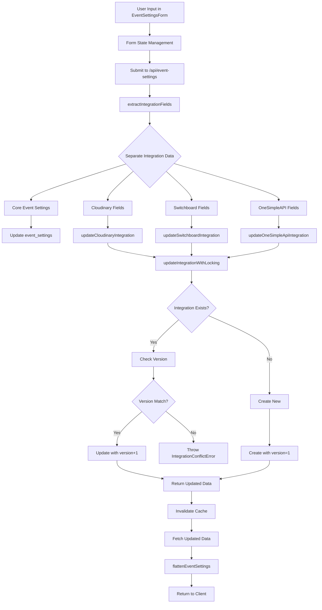
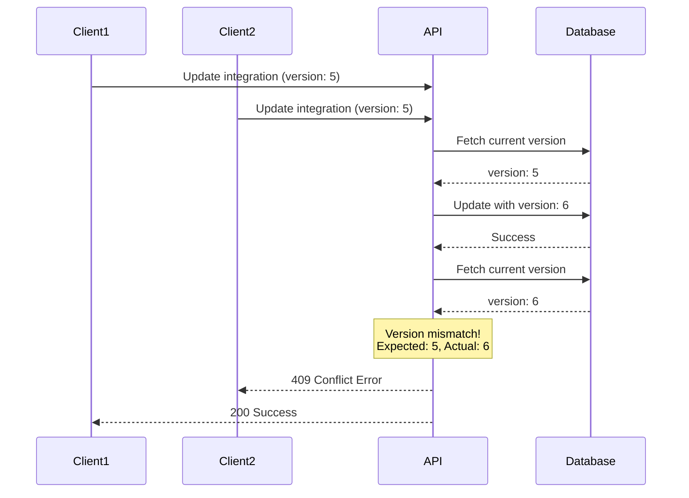

# Integration Architecture Guide

## Overview

credential.studio uses a **normalized database architecture** for third-party integrations. This design separates integration-specific configuration from core event settings, providing better scalability, maintainability, and security.

This guide explains the complete integration system architecture, including:
- Database schema and normalized collections
- Data flow from UI to database
- Optimistic locking for concurrency control
- Security patterns for API credentials
- File organization and responsibilities

## Key Architectural Principles

### 1. Normalized Database Design

Each integration type has its own Appwrite collection:
- `cloudinary_integrations` - Photo upload service configuration
- `switchboard_integrations` - Credential printing service configuration
- `onesimpleapi_integrations` - Webhook notification configuration

All integration collections link to the main `event_settings` collection via `eventSettingsId`.

### 2. Optimistic Locking

Every integration document includes a `version` field that increments with each update. This prevents concurrent modification conflicts using optimistic locking.

### 3. Security-First Design

API credentials (API keys, secrets) are **NEVER** stored in the database. They are read from environment variables at runtime on the server side only.

### 4. Backward Compatibility

The `flattenEventSettings()` helper provides a denormalized view for legacy code that expects all fields in one object.

## Database Schema

### Integration Collection Pattern

All integration collections follow this standard schema:

```typescript
interface IntegrationCollection {
  $id: string;                    // Appwrite document ID (auto-generated)
  eventSettingsId: string;        // Foreign key to event_settings
  version: number;                // Optimistic locking version (starts at 1)
  enabled: boolean;               // Integration enable/disable toggle
  // ... integration-specific fields
  $createdAt: string;             // Appwrite auto-generated timestamp
  $updatedAt: string;             // Appwrite auto-generated timestamp
}
```


### Cloudinary Integration Schema

```typescript
interface CloudinaryIntegration {
  $id: string;
  eventSettingsId: string;
  version: number;
  enabled: boolean;
  cloudName: string;              // Cloudinary cloud name
  uploadPreset: string;           // Upload preset name
  autoOptimize: boolean;          // Enable automatic optimization
  generateThumbnails: boolean;    // Generate thumbnails on upload
  disableSkipCrop: boolean;       // Force crop step in upload widget
  cropAspectRatio: string;        // Aspect ratio for cropping (e.g., "1", "16:9")
}
```

**Security Note:** API credentials (`apiKey`, `apiSecret`) are NOT stored in the database. They must be configured as environment variables:
- `CLOUDINARY_API_KEY`
- `CLOUDINARY_API_SECRET`

### Switchboard Integration Schema

```typescript
interface SwitchboardIntegration {
  $id: string;
  eventSettingsId: string;
  version: number;
  enabled: boolean;
  apiEndpoint: string;            // Switchboard API endpoint URL
  authHeaderType: string;         // Authorization header type (e.g., "Bearer")
  requestBody: string;            // JSON template with placeholders
  templateId: string;             // Switchboard template ID
  fieldMappings: string;          // JSON string of field mappings
}
```

**Security Note:** API key is NOT stored in the database. It must be configured as an environment variable:
- `SWITCHBOARD_API_KEY`

**Field Mappings Format:**
```json
[
  {
    "fieldId": "custom_field_id",
    "jsonVariable": "variable_name_in_template"
  }
]
```


### OneSimpleAPI Integration Schema

```typescript
interface OneSimpleApiIntegration {
  $id: string;
  eventSettingsId: string;
  version: number;
  enabled: boolean;
  url: string;                    // Webhook endpoint URL
  formDataKey: string;            // Form data key name
  formDataValue: string;          // Template with placeholders
  recordTemplate: string;         // Record template with placeholders
}
```

**Template Placeholders:**
Templates support placeholders like `{{firstName}}`, `{{lastName}}`, `{{custom_field_name}}` that are replaced with actual attendee data at runtime.

## Data Flow Architecture

### Complete Data Flow Diagram




### Step-by-Step Data Flow

1. **User Input (UI Layer)**
   - User configures integration in `EventSettingsForm` component
   - Form state managed by `useEventSettingsForm` hook
   - Integration tabs organized in `IntegrationsTab` component

2. **Form Submission**
   - Form data submitted to `POST /api/event-settings`
   - Includes both core settings and integration fields in flattened format

3. **Field Extraction**
   - `extractIntegrationFields()` separates integration data from core settings
   - Filters out `undefined` values to avoid overwriting with undefined
   - Groups fields by integration type (cloudinary, switchboard, oneSimpleApi)

4. **Parallel Updates**
   - Core event settings updated in `event_settings` collection
   - Integration updates executed in parallel using `Promise.all()`
   - Each integration uses optimistic locking for concurrency control

5. **Optimistic Locking**
   - `updateIntegrationWithLocking()` handles version checking
   - Fetches existing integration to get current version
   - Updates with incremented version or creates with version=1
   - Throws `IntegrationConflictError` if version mismatch detected

6. **Cache Invalidation**
   - `eventSettingsCache.invalidate()` clears cached data
   - Ensures subsequent reads get fresh data

7. **Response Preparation**
   - Fetches updated event settings and all integrations
   - Uses `Promise.allSettled()` to handle partial failures gracefully
   - `flattenEventSettings()` denormalizes data for backward compatibility
   - Returns combined response to client

## Optimistic Locking Mechanism

### How It Works

Optimistic locking prevents concurrent modification conflicts without using database locks:

1. **Version Field**: Each integration document has a `version` field (integer)
2. **Read Version**: When updating, read the current version
3. **Check Version**: Compare expected version with current version
4. **Update or Fail**: 
   - If versions match: Update with `version + 1`
   - If versions don't match: Throw `IntegrationConflictError`


### Optimistic Locking Flow Diagram



### Conflict Error Response

When a conflict is detected, the API returns a 409 status with detailed information:

```json
{
  "error": "Conflict",
  "message": "Integration conflict: Cloudinary for event abc123. Expected version 5, but found version 6.",
  "integrationType": "Cloudinary",
  "eventSettingsId": "abc123",
  "expectedVersion": 5,
  "actualVersion": 6,
  "resolution": "Please refresh the page and try again. Another user may have modified these settings."
}
```

### Concurrent Create Handling

When multiple requests try to create the same integration simultaneously:

1. **First Request**: Creates document with version=1
2. **Second Request**: Gets 409 conflict from database
3. **Retry Logic**: Automatically retries as an update operation
4. **Exponential Backoff**: Waits 50ms, 100ms, 200ms between retries
5. **Max Retries**: Attempts up to 3 times before failing


## Security Architecture

### Separation of Configuration and Credentials

**Database-Stored Configuration:**
- Integration enable/disable toggles
- Service-specific settings (cloud names, endpoints, templates)
- Field mappings and templates
- UI preferences

**Environment Variable Credentials:**
- API keys
- API secrets
- Authentication tokens
- Any sensitive authentication data

### Why This Separation?

1. **Security**: Credentials never exposed to client-side code
2. **Compliance**: Meets security audit requirements
3. **Flexibility**: Easy to rotate credentials without database changes
4. **Deployment**: Different credentials per environment (dev, staging, prod)

### Environment Variables Required

```bash
# Cloudinary (Photo Upload Service)
CLOUDINARY_API_KEY=your_api_key_here
CLOUDINARY_API_SECRET=your_api_secret_here

# Switchboard Canvas (Credential Printing)
SWITCHBOARD_API_KEY=your_api_key_here

# OneSimpleAPI (Webhook Notifications)
# No credentials required - uses public webhooks
```

### Security Best Practices

1. **Never log credentials**: Ensure logging doesn't capture API keys
2. **Server-side only**: Credentials accessed only in API routes
3. **Environment validation**: Validate credentials exist at startup
4. **Rotation support**: Design for easy credential rotation
5. **Least privilege**: Use read-only keys where possible


## File Organization

### Core Integration Files

#### Backend Files

**`src/lib/appwrite-integrations.ts`** (Primary Integration Module)
- Purpose: Core integration logic and database operations
- Exports:
  - Interface definitions for all integration types
  - Getter functions (`getCloudinaryIntegration`, etc.)
  - Update functions with optimistic locking
  - `flattenEventSettings()` helper for backward compatibility
  - `IntegrationConflictError` class
- Key Functions:
  - `updateIntegrationWithLocking()` - Generic update with version control
  - `getEventSettingsWithIntegrations()` - Fetch all integrations in parallel

**`src/pages/api/event-settings/index.ts`** (API Handler)
- Purpose: HTTP endpoint for event settings and integrations
- Responsibilities:
  - Validate incoming data
  - Extract integration fields from request
  - Update core settings and integrations
  - Handle optimistic locking conflicts
  - Return flattened response
- Key Functions:
  - `extractIntegrationFields()` - Separate integration data
  - `handleEventSettingsUpdateWithTransactions()` - Atomic updates

#### Frontend Files

**`src/components/EventSettingsForm/IntegrationsTab.tsx`**
- Purpose: Main integration UI container
- Features:
  - Tab navigation between integrations
  - LocalStorage persistence of active tab
  - Integration enable/disable toggles
  - Wrapper for individual integration tabs

**`src/components/EventSettingsForm/CloudinaryTab.tsx`**
- Purpose: Cloudinary-specific configuration UI
- Fields: Cloud name, upload preset, optimization settings, crop settings

**`src/components/EventSettingsForm/SwitchboardTab.tsx`**
- Purpose: Switchboard Canvas configuration UI
- Fields: API endpoint, auth type, request body template, field mappings

**`src/components/EventSettingsForm/OneSimpleApiTab.tsx`**
- Purpose: OneSimpleAPI webhook configuration UI
- Fields: Webhook URL, form data configuration, record template

**`src/components/EventSettingsForm/IntegrationTabContent.tsx`**
- Purpose: Reusable wrapper for integration tab content
- Features: Enable/disable toggle, placeholder text, consistent layout

**`src/components/EventSettingsForm/IntegrationStatusIndicator.tsx`**
- Purpose: Visual indicator of integration readiness
- Shows: Ready/Not Ready status with color-coded badges


#### Type Definitions

**`src/components/EventSettingsForm/types.ts`**
- Purpose: TypeScript interfaces for form data
- Includes: Flattened EventSettings interface with all integration fields
- Pattern: Integration fields prefixed with integration name (e.g., `cloudinaryEnabled`)

#### Utility Files

**`src/lib/validation.ts`**
- Purpose: Validation functions for integration data
- Functions:
  - `validateSwitchboardRequestBody()` - JSON template validation
  - `validateEventSettings()` - Overall settings validation

**`src/lib/sanitization.ts`**
- Purpose: Input sanitization for templates
- Functions:
  - `sanitizeHTMLTemplate()` - Sanitize HTML in templates

### Database Setup Files

**`scripts/setup-appwrite.ts`**
- Purpose: Initial database and collection creation
- Note: Does NOT create integration collections (created via migration)

**`src/scripts/archive/legacy-migration/migrate-with-integration-collections.ts`**
- Purpose: Reference for integration collection schema
- Contains: Complete attribute definitions for all integration collections
- Status: Legacy migration script, kept as reference

### Test Files

**`src/lib/__tests__/appwrite-integrations.test.ts`**
- Purpose: Unit tests for integration functions
- Coverage: Getter functions, update functions, optimistic locking

**`src/lib/__tests__/appwrite-integrations.integration.test.ts`**
- Purpose: Integration tests with real Appwrite instance
- Coverage: End-to-end integration workflows

**`src/__tests__/api/event-settings/integration-update-error-handling.test.ts`**
- Purpose: API error handling tests
- Coverage: Conflict errors, validation errors, partial failures


## Integration Examples

### Example 1: Cloudinary (Photo Upload Service)

**Purpose:** Manage attendee photo uploads with automatic optimization and cropping.

**Configuration Fields:**
- `cloudName`: Your Cloudinary cloud name (e.g., "my-event-photos")
- `uploadPreset`: Upload preset name configured in Cloudinary dashboard
- `autoOptimize`: Enable automatic image optimization
- `generateThumbnails`: Generate thumbnail versions
- `disableSkipCrop`: Force users to crop photos before upload
- `cropAspectRatio`: Aspect ratio for cropping (e.g., "1" for square, "16:9" for landscape)

**Environment Variables:**
```bash
CLOUDINARY_API_KEY=123456789012345
CLOUDINARY_API_SECRET=abcdefghijklmnopqrstuvwxyz123456
```

**Use Case:**
When an attendee uploads a photo in the AttendeeForm, the Cloudinary widget uses the configured settings to:
1. Upload to the specified cloud
2. Apply the upload preset transformations
3. Enforce cropping if enabled
4. Store the resulting URL in the attendee record

**Security Note:** API credentials are used server-side only for signed uploads and admin operations. The upload widget uses the upload preset for client-side uploads.


### Example 2: Switchboard Canvas (Credential Printing)

**Purpose:** Generate professional credential badges with custom layouts and attendee data.

**Configuration Fields:**
- `apiEndpoint`: Switchboard API endpoint URL
- `authHeaderType`: Authorization header type (typically "Bearer")
- `requestBody`: JSON template with placeholders for attendee data
- `templateId`: Switchboard template ID for credential design
- `fieldMappings`: Maps custom fields to template variables

**Environment Variables:**
```bash
SWITCHBOARD_API_KEY=your_switchboard_api_key_here
```

**Request Body Template Example:**
```json
{
  "template": "{{templateId}}",
  "data": {
    "firstName": "{{firstName}}",
    "lastName": "{{lastName}}",
    "company": "{{company}}",
    "title": "{{job_title}}",
    "photo": "{{photoUrl}}"
  }
}
```

**Field Mappings Example:**
```json
[
  {
    "fieldId": "custom_field_123",
    "jsonVariable": "company"
  },
  {
    "fieldId": "custom_field_456",
    "jsonVariable": "title"
  }
]
```

**Use Case:**
When generating a credential:
1. System fetches attendee data including custom fields
2. Replaces placeholders in request body template
3. Applies field mappings to include custom field values
4. Sends request to Switchboard API with Bearer token
5. Receives credential URL and stores in attendee record


### Example 3: OneSimpleAPI (Webhook Notifications)

**Purpose:** Send attendee data to external systems via webhooks when events occur.

**Configuration Fields:**
- `url`: Webhook endpoint URL
- `formDataKey`: Key name for form data
- `formDataValue`: Template with placeholders for the value
- `recordTemplate`: Template for the complete record structure

**Template Examples:**

**Form Data Value:**
```
Name: {{firstName}} {{lastName}}, Email: {{email}}, Barcode: {{barcodeNumber}}
```

**Record Template:**
```json
{
  "attendee": {
    "name": "{{firstName}} {{lastName}}",
    "email": "{{email}}",
    "barcode": "{{barcodeNumber}}",
    "custom_fields": {
      "credential_type": "{{credential_type}}",
      "notes": "{{notes}}"
    }
  }
}
```

**Use Case:**
When an attendee is created or updated:
1. System checks if OneSimpleAPI is enabled
2. Replaces placeholders with actual attendee data
3. Sends POST request to configured webhook URL
4. External system receives and processes the data

**No Credentials Required:** OneSimpleAPI uses public webhooks, so no API keys are needed.


## Backward Compatibility

### The flattenEventSettings() Helper

For code that expects all settings in one object (legacy format), the `flattenEventSettings()` function provides a denormalized view:

```typescript
// Input: Normalized format
const normalized = {
  $id: "event123",
  eventName: "Tech Conference 2025",
  // ... core fields
  cloudinary: {
    enabled: true,
    cloudName: "my-cloud",
    uploadPreset: "event-photos"
  },
  switchboard: {
    enabled: true,
    apiEndpoint: "https://api.switchboard.com"
  }
};

// Output: Flattened format
const flattened = flattenEventSettings(normalized);
// {
//   id: "event123",
//   eventName: "Tech Conference 2025",
//   cloudinaryEnabled: true,
//   cloudinaryCloudName: "my-cloud",
//   cloudinaryUploadPreset: "event-photos",
//   switchboardEnabled: true,
//   switchboardApiEndpoint: "https://api.switchboard.com",
//   ...
// }
```

### Naming Convention

Integration fields in the flattened format use a prefix pattern:
- Cloudinary: `cloudinary*` (e.g., `cloudinaryEnabled`, `cloudinaryCloudName`)
- Switchboard: `switchboard*` (e.g., `switchboardEnabled`, `switchboardApiEndpoint`)
- OneSimpleAPI: `oneSimpleApi*` (e.g., `oneSimpleApiEnabled`, `oneSimpleApiUrl`)

### When to Use

- **Frontend Forms**: Use flattened format for form state management
- **API Responses**: Return flattened format for client consumption
- **Legacy Code**: Use when migrating from old single-table design
- **New Code**: Prefer normalized format with separate integration objects


## Performance Considerations

### Parallel Integration Fetching

Integrations are fetched in parallel using `Promise.allSettled()`:

```typescript
const [cloudinaryResult, switchboardResult, oneSimpleApiResult] = 
  await Promise.allSettled([
    getCloudinaryIntegration(databases, eventSettingsId),
    getSwitchboardIntegration(databases, eventSettingsId),
    getOneSimpleApiIntegration(databases, eventSettingsId),
  ]);
```

**Benefits:**
- Faster overall response time (parallel vs sequential)
- Partial failure tolerance (one integration failure doesn't block others)
- Better user experience (failed integrations return null, not error)

### Caching Strategy

The `eventSettingsCache` provides in-memory caching:

```typescript
// Cache invalidation after updates
eventSettingsCache.invalidate('event-settings');

// Cache is automatically used on subsequent reads
const settings = await getEventSettingsWithIntegrations(databases, eventSettingsId);
```

**Cache Invalidation Triggers:**
- Event settings update
- Integration update
- Custom field changes

### Database Indexes

Integration collections should have indexes on:
- `eventSettingsId` - For fast lookups by event
- `enabled` - For filtering active integrations (optional)


## Error Handling

### Integration Conflict Errors

When optimistic locking detects a conflict:

```typescript
try {
  await updateCloudinaryIntegration(databases, eventSettingsId, data, expectedVersion);
} catch (error) {
  if (error instanceof IntegrationConflictError) {
    // Handle conflict - typically by refreshing and retrying
    return res.status(409).json({
      error: 'Conflict',
      message: error.message,
      integrationType: error.integrationType,
      expectedVersion: error.expectedVersion,
      actualVersion: error.actualVersion
    });
  }
  throw error;
}
```

### Partial Integration Failures

When some integrations fail to update:

```typescript
const integrationResults = await Promise.all(integrationUpdates);
const integrationErrors = integrationResults.filter(r => r && 'error' in r);

if (integrationErrors.length > 0) {
  // Core settings updated successfully, but some integrations failed
  return res.status(200).json({
    ...updatedSettings,
    warnings: {
      integrations: integrationErrors,
      message: 'Some integration updates failed. Core event settings were updated successfully.'
    }
  });
}
```

### Validation Errors

Switchboard request body validation:

```typescript
if (data.requestBody) {
  try {
    JSON.parse(data.requestBody);
  } catch (error) {
    throw new Error(
      `Invalid JSON in Switchboard requestBody template. ${error.message}`
    );
  }
}
```


## Design Decisions and Rationale

### Why Normalized Collections?

**Advantages:**
1. **Scalability**: Easy to add new integrations without modifying existing collections
2. **Performance**: Smaller documents, faster queries
3. **Flexibility**: Each integration can have different fields and validation rules
4. **Maintainability**: Changes to one integration don't affect others
5. **Security**: Easier to audit and control access per integration type

**Trade-offs:**
- More database queries (mitigated by parallel fetching)
- More complex data fetching logic (abstracted in helper functions)
- Need for denormalization helper (provided by `flattenEventSettings()`)

### Why Optimistic Locking?

**Advantages:**
1. **No Database Locks**: Better performance and scalability
2. **Conflict Detection**: Prevents lost updates from concurrent modifications
3. **User-Friendly**: Clear error messages guide users to resolution
4. **Simple Implementation**: Just a version field and comparison logic

**Alternative Considered:**
- Pessimistic locking (database locks) - Rejected due to performance concerns and complexity

### Why Environment Variables for Credentials?

**Advantages:**
1. **Security**: Credentials never exposed to client-side code
2. **Compliance**: Meets security audit requirements (SOC2, PCI-DSS)
3. **Flexibility**: Different credentials per environment
4. **Rotation**: Easy to rotate without database changes
5. **Separation of Concerns**: Configuration vs. secrets

**Alternative Considered:**
- Encrypted database storage - Rejected due to key management complexity and client-side exposure risk


## Common Patterns

### Pattern 1: Fetching Integration Data

```typescript
// Get single integration
const cloudinary = await getCloudinaryIntegration(databases, eventSettingsId);

// Get all integrations with event settings
const fullSettings = await getEventSettingsWithIntegrations(databases, eventSettingsId);

// Get flattened format for UI
const flattened = flattenEventSettings(fullSettings);
```

### Pattern 2: Updating Integration Data

```typescript
// Update with optimistic locking
await updateCloudinaryIntegration(
  databases,
  eventSettingsId,
  {
    enabled: true,
    cloudName: 'my-cloud',
    uploadPreset: 'event-photos'
  },
  currentVersion // Optional: for optimistic locking
);
```

### Pattern 3: Handling Integration Conflicts

```typescript
try {
  await updateIntegration(databases, eventSettingsId, data, expectedVersion);
} catch (error) {
  if (error instanceof IntegrationConflictError) {
    // Refresh data and retry
    const fresh = await getIntegration(databases, eventSettingsId);
    await updateIntegration(databases, eventSettingsId, data, fresh.version);
  }
}
```

### Pattern 4: Creating New Integration

```typescript
// First update creates the integration
await updateCloudinaryIntegration(
  databases,
  eventSettingsId,
  { enabled: true, cloudName: 'my-cloud' }
  // No version parameter - will create with version=1
);
```


## Testing Strategy

### Unit Tests

Test individual integration functions in isolation:

```typescript
describe('getCloudinaryIntegration', () => {
  it('should return integration when it exists', async () => {
    // Mock databases.listDocuments to return a document
    // Assert that the function returns the correct data
  });
  
  it('should return null when integration does not exist', async () => {
    // Mock databases.listDocuments to return empty array
    // Assert that the function returns null
  });
});
```

### Integration Tests

Test the complete flow with a real Appwrite instance:

```typescript
describe('Integration Update Flow', () => {
  it('should create and update integration with version control', async () => {
    // Create integration
    const created = await updateCloudinaryIntegration(databases, eventId, data);
    expect(created.version).toBe(1);
    
    // Update integration
    const updated = await updateCloudinaryIntegration(databases, eventId, newData, 1);
    expect(updated.version).toBe(2);
  });
  
  it('should throw conflict error on version mismatch', async () => {
    // Create integration
    await updateCloudinaryIntegration(databases, eventId, data);
    
    // Try to update with wrong version
    await expect(
      updateCloudinaryIntegration(databases, eventId, newData, 999)
    ).rejects.toThrow(IntegrationConflictError);
  });
});
```

### API Tests

Test the HTTP endpoint behavior:

```typescript
describe('POST /api/event-settings', () => {
  it('should update integration settings', async () => {
    const response = await fetch('/api/event-settings', {
      method: 'POST',
      body: JSON.stringify({
        cloudinaryEnabled: true,
        cloudinaryCloudName: 'test-cloud'
      })
    });
    
    expect(response.status).toBe(200);
    const data = await response.json();
    expect(data.cloudinaryEnabled).toBe(true);
  });
});
```


## Migration Guide

### From Single-Table to Normalized Design

If you're migrating from a single-table design (all integration fields in `event_settings`):

1. **Create Integration Collections**
   - Run migration script to create `cloudinary_integrations`, `switchboard_integrations`, `onesimpleapi_integrations`
   - Add `version` field to each collection

2. **Migrate Data**
   - For each event settings record:
     - Extract integration fields
     - Create corresponding integration documents
     - Link via `eventSettingsId`
     - Set initial `version` to 1

3. **Update Code**
   - Replace direct field access with integration getters
   - Use `flattenEventSettings()` for backward compatibility
   - Update API handlers to use new update functions

4. **Remove Old Fields**
   - After verifying migration, remove integration fields from `event_settings` collection
   - Update TypeScript interfaces

### Example Migration Script Structure

```typescript
async function migrateToNormalizedIntegrations() {
  // 1. Create integration collections
  await createIntegrationCollections();
  
  // 2. Fetch all event settings
  const allSettings = await fetchAllEventSettings();
  
  // 3. For each event settings
  for (const settings of allSettings) {
    // Extract integration data
    const cloudinaryData = extractCloudinaryFields(settings);
    const switchboardData = extractSwitchboardFields(settings);
    const oneSimpleApiData = extractOneSimpleApiFields(settings);
    
    // Create integration documents
    if (hasCloudinaryData(cloudinaryData)) {
      await createCloudinaryIntegration(settings.$id, cloudinaryData);
    }
    if (hasSwitchboardData(switchboardData)) {
      await createSwitchboardIntegration(settings.$id, switchboardData);
    }
    if (hasOneSimpleApiData(oneSimpleApiData)) {
      await createOneSimpleApiIntegration(settings.$id, oneSimpleApiData);
    }
  }
  
  // 4. Verify migration
  await verifyMigration();
}
```


## Troubleshooting

### Issue: Integration Conflict Errors

**Symptom:** 409 Conflict error when updating integration settings

**Cause:** Another user or process modified the integration between your read and write

**Solution:**
1. Refresh the page to get latest data
2. Retry the update with the new version
3. Consider implementing automatic retry with exponential backoff

### Issue: Integration Not Found

**Symptom:** Integration returns `null` when fetching

**Cause:** Integration document doesn't exist yet (not created)

**Solution:**
- First update will automatically create the integration
- No need to explicitly create before updating

### Issue: Credentials Not Working

**Symptom:** Integration fails with authentication errors

**Cause:** Environment variables not set or incorrect

**Solution:**
1. Verify environment variables are set in `.env.local`
2. Restart development server after adding variables
3. Check variable names match exactly (case-sensitive)
4. Verify credentials are valid in the service dashboard

### Issue: Partial Integration Failures

**Symptom:** Some integrations update successfully, others fail

**Cause:** Individual integration validation or network errors

**Solution:**
- Check response for `warnings` object
- Review failed integration error messages
- Fix validation issues and retry
- Core settings are still saved successfully


## Future Enhancements

### Potential Improvements

1. **Integration Versioning**
   - Track schema versions for each integration type
   - Support migration between schema versions
   - Backward compatibility for old integration formats

2. **Integration Health Monitoring**
   - Periodic health checks for each integration
   - Dashboard showing integration status
   - Alerts for integration failures

3. **Integration Marketplace**
   - Pre-built integration templates
   - Community-contributed integrations
   - One-click installation

4. **Webhook Events**
   - Emit events when integrations are updated
   - Allow external systems to react to changes
   - Support for custom webhooks per integration

5. **Integration Testing Tools**
   - Built-in test mode for integrations
   - Mock data generation
   - Integration validation before save

6. **Audit Trail**
   - Track all integration changes
   - Show who made changes and when
   - Rollback capability

## Related Documentation

- [Adding New Integration Guide](./ADDING_NEW_INTEGRATION_GUIDE.md) - Step-by-step procedure for adding integrations
- [Integration Patterns Reference](./INTEGRATION_PATTERNS_REFERENCE.md) - Code templates and patterns
- [Photo Service Integration Guide](./PHOTO_SERVICE_INTEGRATION_GUIDE.md) - Specific guidance for photo services
- [Integration Security Guide](./INTEGRATION_SECURITY_GUIDE.md) - Security best practices
- [Integration Troubleshooting Guide](./INTEGRATION_TROUBLESHOOTING_GUIDE.md) - Common issues and solutions

## Conclusion

The integration architecture in credential.studio provides a scalable, secure, and maintainable foundation for third-party service integrations. By using normalized collections, optimistic locking, and environment-based credential management, the system ensures data integrity, security, and performance.

Key takeaways:
- Each integration has its own collection linked by `eventSettingsId`
- Optimistic locking prevents concurrent modification conflicts
- API credentials are stored in environment variables, never in the database
- The `flattenEventSettings()` helper provides backward compatibility
- Parallel fetching and caching optimize performance

For questions or contributions, please refer to the project documentation or contact the development team.

